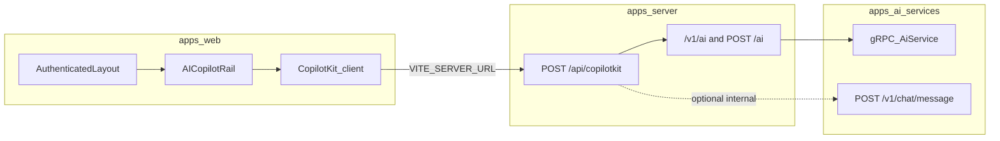

# AI Copilot Panel — implementation plan

## Current codebase reality (constraints)

- **CopilotKit is already a dependency** in [`apps/web/package.json`](d:\Github\GDGO-2026\GDGO-2026.Servexa-Warranty-AI\servexa-warranty-ai\apps\web\package.json); global styles are imported in [`apps/web/src/main.tsx`](d:\Github\GDGO-2026\GDGO-2026.Servexa-Warranty-AI\servexa-warranty-ai\apps\web\src\main.tsx). There is **no** root `CopilotKit` provider today.
- **Example route** [`apps/web/src/features/example/ai/index.tsx`](d:\Github\GDGO-2026\GDGO-2026.Servexa-Warranty-AI\servexa-warranty-ai\apps\web\src\features\example\ai\index.tsx) sets `runtimeUrl` to a **relative** `/api/copilotkit/...`, but [`apps/web/vite.config.ts`](d:\Github\GDGO-2026\GDGO-2026.Servexa-Warranty-AI\servexa-warranty-ai\apps\web\vite.config.ts) has **no dev proxy** and [`packages/env/src/web.ts`](d:\Github\GDGO-2026\GDGO-2026.Servexa-Warranty-AI\servexa-warranty-ai\packages\env\src\web.ts) already requires `VITE_SERVER_URL`. **`apps/server` has no `/api/copilotkit` handler** (grep is empty). The example path is not end-to-end wired.
- **Authenticated shell** is [`apps/web/src/components/layout/authenticated-layout.tsx`](d:\Github\GDGO-2026\GDGO-2026.Servexa-Warranty-AI\servexa-warranty-ai\apps\web\src\components\layout\authenticated-layout.tsx): `SidebarProvider` → `AppSidebar` + `SidebarInset` + [`apps/web/src/features/ai-search/index.tsx`](d:\Github\GDGO-2026\GDGO-2026.Servexa-Warranty-AI\servexa-warranty-ai\apps\web\src\features\ai-search\index.tsx) (`AISearchDialog`). This is the correct insertion point for a **persistent right rail** (your choice: **all authenticated pages**).
- **Broken / orphaned frontend hook**: [`apps/web/src/features/ai/components/ai-command-search.tsx`](d:\Github\GDGO-2026\GDGO-2026.Servexa-Warranty-AI\servexa-warranty-ai\apps\web\src\features\ai\components\ai-command-search.tsx) imports `../hooks/use-copilot`, but **no such file exists** and nothing imports `AICommandSearch`. Either implement the hook + wire it into the command palette, or delete/replace to avoid dead code.
- **Server AI paths today**: top-level [`POST /ai`](d:\Github\GDGO-2026\GDGO-2026.Servexa-Warranty-AI\servexa-warranty-ai\apps\server\src\core\infra\bootstrap.ts) (AI SDK / `streamText` + optional Python gRPC) and versioned [`/v1/ai/*`](d:\Github\GDGO-2026\GDGO-2026.Servexa-Warranty-AI\servexa-warranty-ai\apps\server\src\modules\route-version-api.ts) under [`apps/server/src/modules/v1/ai`](d:\Github\GDGO-2026\GDGO-2026.Servexa-Warranty-AI\servexa-warranty-ai\apps\server\src\modules\v1\ai). Policy: [`documents/ai-runtime-policy.md`](d:\Github\GDGO-2026\GDGO-2026.Servexa-Warranty-AI\servexa-warranty-ai\documents\ai-runtime-policy.md) — Node gateway, Python orchestration; avoid duplicating orchestration in Node once Python carries full context.
- **Python surface**: gRPC [`GrpcBridgeService`](d:\Github\GDGO-2026\GDGO-2026.Servexa-Warranty-AI\servexa-warranty-ai\apps\ai-services\src\modules\v1\grpc\services\grpc_bridge_service.py) → coordinator; HTTP [`POST /v1/chat/message`](d:\Github\GDGO-2026\GDGO-2026.Servexa-Warranty-AI\servexa-warranty-ai\apps\ai-services\src\modules\v1\chat\routers.py) (API key + rate limit) is a simpler unary shape for future gateway experiments.

## Architecture decisions (aligned with proposal + repo)

1. **Three-column authenticated layout**: keep existing sidebar + `SidebarInset` for primary content; add a **dedicated right column** (fixed width, `min-w-0`, scroll inside panel) so the main workspace does not reflow unpredictably. Use existing tokens / [`packages/ui`](d:\Github\GDGO-2026\GDGO-2026.Servexa-Warranty-AI\servexa-warranty-ai\packages\ui) primitives for borders, focus rings, and motion ([building-components](d:\Github\GDGO-2026\GDGO-2026.Servexa-Warranty-AI\servexa-warranty-ai\.agents\skills\building-components\SKILL.md): composable shell, keyboard focus, `aria` for collapse).
2. **CopilotKit provider placement**: wrap **only** the authenticated subtree (not `sign-in`), so signed-out routes do not load CopilotKit JS. Combine with **`React.lazy` / `import()`** for the panel shell so the initial authenticated chunk stays smaller ([bundle-splitting](d:\Github\GDGO-2026\GDGO-2026.Servexa-Warranty-AI\servexa-warranty-ai\.claude\skills\bundle-splitting\SKILL.md) + `bundle-dynamic-imports` / `bundle-conditional` from [vercel-react-best-practices](d:\Github\GDGO-2026\GDGO-2026.Servexa-Warranty-AI\servexa-warranty-ai\.claude\skills\vercel-react-best-practices\SKILL.md)).
3. **Runtime URL**: always build from `env.VITE_SERVER_URL` (e.g. `${env.VITE_SERVER_URL}/api/copilotkit/${integrationId}`) so dev/prod behave the same; optionally add a Vite `server.proxy` for `/api` later for cookie/SameSite edge cases — not required if requests are same-origin to API host in deployment.
4. **Backend boundary**: mount CopilotKit’s official **Express** adapter — prefer **`createCopilotEndpointSingleRouteExpress`** from `@copilotkit/runtime/express` at **`/api/copilotkit`** with a **`CopilotRuntime`** (`beforeRequestMiddleware` for auth). Client must set **`useSingleEndpoint`** when using this factory. **Do not** expose raw provider keys or LangGraph deployment details to the browser. First milestone: **`BuiltInAgent`** (or equivalent) mock; then swap agent implementation for gRPC-backed completion while keeping the same endpoint.
5. **Python**: for hackathon speed, **reuse** `GrpcBridgeService` / coordinator rather than inventing a parallel orchestration HTTP stack. If you later need a dedicated “copilot query” HTTP handler in Python, add it under `modules/v1/...` with `Annotated` deps, return types, and router-level auth per [fastapi](d:\Github\GDGO-2026\GDGO-2026.Servexa-Warranty-AI\servexa-warranty-ai\.cursor\skills\fastapi\SKILL.md) — only when Node gateway needs a non-gRPC path.

## CopilotKit + AG-UI alignment (`.agents/skills/copilotkit*`)

Reference: [copilotkit](d:\Github\GDGO-2026\GDGO-2026.Servexa-Warranty-AI\servexa-warranty-ai\.agents\skills\copilotkit\SKILL.md) → setup / develop / ag-ui routing; use **MCP `copilotkit-docs`** (`search-docs`, `search-code`, `search-ag-ui-docs`) during implementation for version-accurate APIs.

### Stack (v2 / AG-UI)

Per [copilotkit-develop](d:\Github\GDGO-2026\GDGO-2026.Servexa-Warranty-AI\servexa-warranty-ai\.agents\skills\copilotkit-develop\SKILL.md): **Runtime** (`@copilotkit/runtime`) hosts agents and SSE transport; **React** layer provides `CopilotKitProvider`, `CopilotChat`, and hooks (`useAgentContext`, `useFrontendTool`, `useRenderTool`, `useConfigureSuggestions`, `useInterrupt`, …). CopilotKit v2 is built on **AG-UI** (`@ag-ui/client` / `@ag-ui/core`): the client applies streamed events to UI state.

**Repo gap:** [`apps/web/package.json`](d:\Github\GDGO-2026\GDGO-2026.Servexa-Warranty-AI\servexa-warranty-ai\apps\web\package.json) uses `@copilotkit/react-core` + `@copilotkit/react-ui` and the example imports **`@copilotkit/react-core/v2`**. [copilotkit-setup](d:\Github\GDGO-2026\GDGO-2026.Servexa-Warranty-AI\servexa-warranty-ai\.agents\skills\copilotkit-setup\SKILL.md) recommends **`@copilotkit/react`** (+ `@copilotkit/core`) for new UI. **Decision for implementation:** either (a) migrate the rail + example to `@copilotkit/react` for a single canonical import surface, or (b) stay on `react-core/v2` until a dedicated upgrade pass — but **avoid mixing** three surfaces (`react-ui`, `react-core`, `react-core/v2`) without a documented split (e.g. legacy example vs new rail only).

### Express runtime (standalone server)

[`apps/server`](d:\Github\GDGO-2026\GDGO-2026.Servexa-Warranty-AI\servexa-warranty-ai\apps\server\package.json) does **not** yet depend on `@copilotkit/runtime` — add it (and **`@copilotkit/agent`** if using `BuiltInAgent` for mock / dev).

Per [copilotkit-setup / runtime-architecture](d:\Github\GDGO-2026\GDGO-2026.Servexa-Warranty-AI\servexa-warranty-ai\.agents\skills\copilotkit-setup\references\runtime-architecture.md) for **standalone Express**: prefer **`createCopilotEndpointSingleRouteExpress`** from `@copilotkit/runtime/express`:

- Mount: `app.use("/api/copilotkit", createCopilotEndpointSingleRouteExpress({ runtime, basePath: "/" }))` so all Copilot operations multiplex through one mounted tree (no Express catch-all).
- **Client:** set provider **`useSingleEndpoint`** when using single-route Express ([framework-detection](d:\Github\GDGO-2026\GDGO-2026.Servexa-Warranty-AI\servexa-warranty-ai\.agents\skills\copilotkit-setup\references\framework-detection.md)).

**Multi-route alternative:** `createCopilotEndpointExpress` exposes paths like `POST /agent/:agentId/run`, `GET /info`, etc. Use only if you need **thread / Intelligence** endpoints (not available on single-route per setup docs).

**Auth:** prefer `CopilotRuntime` **`beforeRequestMiddleware`** (and optional `afterRequestMiddleware`) from runtime-architecture so every Copilot request is validated in one place; keep existing Express `userContextMiddleware` for session, but ensure the copilot router runs **after** the same auth assumptions as `/v1/ai`.

### AG-UI protocol (when debugging or custom-bridging)

Per [copilotkit-agui](d:\Github\GDGO-2026\GDGO-2026.Servexa-Warranty-AI\servexa-warranty-ai\.agents\skills\copilotkit-agui\SKILL.md):

- Runs must begin with **`RUN_STARTED`** and end with **`RUN_FINISHED`** or **`RUN_ERROR`**.
- Text streaming uses **`TEXT_MESSAGE_START` / `TEXT_MESSAGE_CONTENT` / `TEXT_MESSAGE_END`**; **`TEXT_MESSAGE_CONTENT.delta` must be non-empty** (watch when bridging short gRPC replies).
- Tool calls correlate by **`toolCallId`**; chunk convenience events expand to Start/Content/End.
- Wire format: SSE lines `data: {json}\n\n`.

**Implication for Milestone C:** you normally **do not** hand-author SSE if you stay inside `CopilotRuntime` + registered agents; if you add a **custom** Node bridge that emits AG-UI manually, use `@ag-ui/encoder` / ordered events and add tests for empty-delta edge cases.

### Agents: mock → real

- **Mock / demo:** `BuiltInAgent` + tools from `@copilotkit/agent` (see setup skill `express-runtime.ts` asset pattern) — fast hackathon path.
- **Production-shaped:** register a **LangGraph** (or other) agent via [copilotkit-integrations](d:\Github\GDGO-2026\GDGO-2026.Servexa-Warranty-AI\servexa-warranty-ai\.agents\skills\copilotkit-integrations\SKILL.md) patterns, or keep **one thin “gateway agent”** in Node that forwards `execution_context_json` + user message into existing **`completeUnaryPrompt`** / gRPC (policy-compliant) while CopilotKit still drives the AG-UI stream from the runtime.

## Phased delivery

### Milestone A — Visible enterprise shell (highest demo impact)

- Add feature folder [`apps/web/src/features/ai-copilot/`](d:\Github\GDGO-2026\GDGO-2026.Servexa-Warranty-AI\servexa-warranty-ai\apps\web\src\features) (or extend [`apps/web/src/features/ai`](d:\Github\GDGO-2026\GDGO-2026.Servexa-Warranty-AI\servexa-warranty-ai\apps\web\src\features\ai) if you prefer one module; pick one to avoid duplication).
- **Layout**: update [`authenticated-layout.tsx`](d:\Github\GDGO-2026\GDGO-2026.Servexa-Warranty-AI\servexa-warranty-ai\apps\web\src\components\layout\authenticated-layout.tsx) to a flex row: `AppSidebar` | `SidebarInset` (flex-1 `min-w-0`) | **lazy** `AICopilotRail`.
- **Provider**: `AuthenticatedAiProviders` wraps the tree with **`CopilotKitProvider`** (or equivalent from chosen package: `CopilotKit` from `react-core` vs `CopilotKitProvider` from `@copilotkit/react` — pick one line per alignment section). Set **`runtimeUrl`** to `${env.VITE_SERVER_URL}/api/copilotkit` (no relative URL). If the server uses **`createCopilotEndpointSingleRouteExpress`**, set **`useSingleEndpoint`** on the provider ([copilotkit-setup framework-detection](d:\Github\GDGO-2026\GDGO-2026.Servexa-Warranty-AI\servexa-warranty-ai\.agents\skills\copilotkit-setup\references\framework-detection.md)). Pass **`agentId`** matching `CopilotRuntime`’s `agents` map key (align with [`example`](d:\Github\GDGO-2026\GDGO-2026.Servexa-Warranty-AI\servexa-warranty-ai\apps\web\src\features\example\ai\index.tsx) `agent` / `agentId` naming after consolidation).
- **UI inside rail**: `<CopilotChat agentId="…" />` (or `CopilotChatView` + slots if you need tighter layout control per [copilotkit-develop](d:\Github\GDGO-2026\GDGO-2026.Servexa-Warranty-AI\servexa-warranty-ai\.agents\skills\copilotkit-develop\SKILL.md)) + collapsible **Evidence** section + `useConfigureSuggestions` / suggestion views. Share route + domain context via **`useAgentContext`**; optional **`useInterrupt`** / **`useHumanInTheLoop`** if you demo approval flows later.
- **Mock contracts**: TypeScript types mirroring proposal `CopilotResponse` under `features/ai-copilot/mock/`; mock responder on the **server** first (keeps UI dumb) or client-only for fastest UI iteration — prefer **server mock** so Milestone B is a swap-in.

**React perf checklist ([vercel-react-best-practices](d:\Github\GDGO-2026\GDGO-2026.Servexa-Warranty-AI\servexa-warranty-ai\.claude\skills\vercel-react-best-practices\SKILL.md))**: lazy provider/panel; avoid inline component factories in layout; keep router subscriptions narrow; use `startTransition` for opening/closing heavy subpanels if needed.

### Milestone B — Express CopilotKit runtime (single-route, mock agent)

- Add dependencies to [`apps/server/package.json`](d:\Github\GDGO-2026\GDGO-2026.Servexa-Warranty-AI\servexa-warranty-ai\apps\server\package.json): `@copilotkit/runtime`, and **`@copilotkit/agent`** for `BuiltInAgent` / `defineTool` mock ([copilotkit-setup assets/express-runtime.ts](d:\Github\GDGO-2026\GDGO-2026.Servexa-Warranty-AI\servexa-warranty-ai\.agents\skills\copilotkit-setup\assets\express-runtime.ts)).
- Instantiate **`CopilotRuntime`** with `agents: { <agentId>: agent }` and mount **`createCopilotEndpointSingleRouteExpress`** from `@copilotkit/runtime/express` at **`/api/copilotkit`** (see alignment section for exact mount/`basePath` pattern).
- Register **`beforeRequestMiddleware`** on `CopilotRuntime` for auth / tenant / trace enrichment (per [runtime-architecture](d:\Github\GDGO-2026\GDGO-2026.Servexa-Warranty-AI\servexa-warranty-ai\.agents\skills\copilotkit-setup\references\runtime-architecture.md)); align with existing JWT/session middleware order in [`bootstrap.ts`](d:\Github\GDGO-2026\GDGO-2026.Servexa-Warranty-AI\servexa-warranty-ai\apps\server\src\core\infra\bootstrap.ts).
- **CORS:** runtime may ship permissive defaults — still verify **`CORS_ORIGIN`** + credentials against the Vite origin; override via factory `cors` options or outer middleware if needed.
- **Web:** enable **`useSingleEndpoint`** on the client provider; remove or update the example’s **`/api/copilotkit/${integrationId}`** URL unless you intentionally add a multi-tenant path segment **and** mirror it on the server router.

### Milestone C — Real AI path (architecture-safe)

- Replace or branch **`BuiltInAgent`** with an agent implementation that delegates to existing **Node** helpers (`completeUnaryPrompt`, streaming helpers) and passes **`execution_context_json`** built from `useAgentContext` payload + server user context — still emitting a valid AG-UI run (handled by the agent adapter, not raw hand-written SSE, unless you intentionally build a custom emitter).
- **Empty-delta / short replies:** when mapping gRPC unary text to stream chunks, ensure AG-UI **`TEXT_MESSAGE_CONTENT`** deltas are non-empty ([copilotkit-agui](d:\Github\GDGO-2026\GDGO-2026.Servexa-Warranty-AI\servexa-warranty-ai\.agents\skills\copilotkit-agui\SKILL.md)); coalesce or synthesize a minimal token if the model returns one shot.
- **LangGraph remote:** prefer **`LangGraphAgent`** from `@ag-ui/langgraph` / CopilotKit integrations when you outgrow the gateway-agent pattern; keep orchestration authority in Python per [`documents/ai-runtime-policy.md`](d:\Github\GDGO-2026\GDGO-2026.Servexa-Warranty-AI\servexa-warranty-ai\documents\ai-runtime-policy.md).

### Milestone D — Cleanup + command palette integration

- **Fix** [`ai-command-search.tsx`](d:\Github\GDGO-2026\GDGO-2026.Servexa-Warranty-AI\servexa-warranty-ai\apps\web\src\features\ai\components\ai-command-search.tsx): implement `useCopilot` **or** remove file; if implementing, connect `send` to CopilotKit’s send API / a thin `copilot-context` so CMD+K can inject prompts into the rail conversation.
- Reconcile with [`packages/ui` SearchProvider](d:\Github\GDGO-2026\GDGO-2026.Servexa-Warranty-AI\servexa-warranty-ai\packages\ui\src\contexts\search-provider.tsx) + `AISearchDialog` so users have one mental model: palette for navigation + “push to copilot”.

### Milestone E — Proposal follow-ons (post-demo)

- Enterprise-only UX from proposal Phase 6–8: suggested actions as real mutations (behind RBAC), explainability drawer, semantic global search upgrades ([`ai-search`](d:\Github\GDGO-2026\GDGO-2026.Servexa-Warranty-AI\servexa-warranty-ai\apps\web\src\features\ai-search)), multi-agent switching keyed by business `integrationId`s.

## Testing / acceptance

- Authenticated: panel visible, collapse/expand, no horizontal overflow on narrow widths; focus trap does not break main content Tab order ([accessibility](d:\Github\GDGO-2026\GDGO-2026.Servexa-Warranty-AI\servexa-warranty-ai\.agents\skills\building-components\references\accessibility.mdx) principles).
- Network: browser calls `VITE_SERVER_URL/api/copilotkit` with **`useSingleEndpoint`** when using `createCopilotEndpointSingleRouteExpress`; verify runs complete (AG-UI **`RUN_STARTED` → `RUN_FINISHED`** or **`RUN_ERROR`**, no stuck streams — [copilotkit-agui](d:\Github\GDGO-2026\GDGO-2026.Servexa-Warranty-AI\servexa-warranty-ai\.agents\skills\copilotkit-agui\SKILL.md)).
- Policy: heavy workloads still route through Redis/async when you flip from mock to real job types — verify against [`ai-runtime-routing.ts`](d:\Github\GDGO-2026\GDGO-2026.Servexa-Warranty-AI\servexa-warranty-ai\apps\server\src\modules\v1\ai\runtime\ai-runtime-routing.ts).
- CopilotKit: for ambiguous runtime/provider API shapes, confirm against **MCP `copilotkit-docs`** search results for the installed catalog version ([copilotkit](d:\Github\GDGO-2026\GDGO-2026.Servexa-Warranty-AI\servexa-warranty-ai\.agents\skills\copilotkit\SKILL.md)).

## Out of scope for first PR (explicit)

- Hand-rolled AG-UI SSE server (prefer `CopilotRuntime` + registered agents unless debugging with [copilotkit-agui](d:\Github\GDGO-2026\GDGO-2026.Servexa-Warranty-AI\servexa-warranty-ai\.agents\skills\copilotkit-agui\SKILL.md) patterns).
- Full LangGraph remote + custom AG-UI event parity (treat as Phase 5 hardening; use **`LangGraphAgent`** when you pick this up — [copilotkit-develop](d:\Github\GDGO-2026\GDGO-2026.Servexa-Warranty-AI\servexa-warranty-ai\.agents\skills\copilotkit-develop\SKILL.md)).
- New Prisma tables for conversational memory (policy defers).
- Replacing [`/ai` + `useChat`](d:\Github\GDGO-2026\GDGO-2026.Servexa-Warranty-AI\servexa-warranty-ai\apps\web\src\routes\ai.tsx) unless you explicitly decide to consolidate chat surfaces later.
