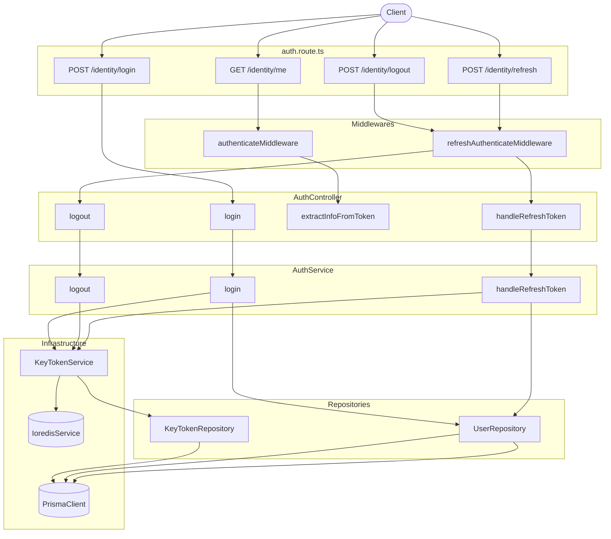

# Auth Identity Implementation Plan

## Architecture Overview



## Schema Adaptations (vs. reference)

The Prisma `User` model differs from the reference in two ways that require adaptation:

- No single `email` field — use `companyEmail ?? personalEmail` as effective email
- `role` is a relation (`Role` model) — use `role.name` for the role string in token payloads

## Files to Create

### 1. `apps/server/src/types/jwt.ts`
JWT payload types (`AccessTokenPayload`, `RefreshTokenPayload`, `KeyStoreForJWT`, `PairToken`) — mirrors `saoviet-api/src/types/jwt.ts` but without `roleScope`/`permissions` for now.

### 2. `apps/server/src/core/constants/key-cache.constant.ts`
```ts
export const KEY_CACHE = {
  KEY_STORE: 'keyStore',
  BLACKLIST: 'blacklist',
}
```

### 3. `apps/server/src/core/constants/token.constant.ts`
```ts
export const VALUE_TOKEN = {
  MAX_AGE_ACCESS_TOKEN: 60 * 60 * 10,    // 10h
  MAX_AGE_REFRESH_TOKEN: 60 * 60 * 24 * 3, // 3d
}
```

### 4. `apps/server/src/core/services/key-token.service.ts`
Standalone class (not NestJS injectable) wrapping:
- RSA key pair generation (`crypto.generateKeyPairSync`)
- `createKeyToken` — upsert single-session `KeyToken` via `KeyTokenRepository`
- `createTokenPair` — `JWT.sign` with RS256, decode iat/exp, return `PairToken`
- `verifyJWT(token, key)` — `JWT.verify` RS256
- `requireKeyStore(userId)` — Redis cache-aside → DB lookup
- `addTokenToBlacklist(token, ttl)` / `decodeJWT`
- `validateToken(decoded, maxAge)`
- `removeKeyById` / `deleteKeyByUserId` / cache helpers

Depends on: `KeyTokenRepository`, `IoredisService` (injected via constructor).

### 5. `apps/server/src/modules/v1/identity/key-token/key-token.repository.ts`
Thin Prisma wrapper — mirrors reference exactly:
- `findOneById`, `findOneByUserId`, `findManyByFilter`, `createOne`, `updateOneById`, `updateRefreshTokenById`, `deleteById`, `deleteByUserId`, `deleteManyByFilter`
- `saveSessionToRedis` (hset + expire via IoredisService)

### 6. `apps/server/src/modules/v1/identity/user/user.repository.ts`
Prisma wrapper adapted for this schema:
- `findOneByUsername(username, options)` — `findUnique({ where: { username } })`
- `findOneById(id, options)` — `findUnique({ where: { id } })`
- No `findOneByEmail` (schema has no unique email field)

### 7. `apps/server/src/middlewares/authenticate.middleware.ts`
Express `RequestHandler`. Reads `x-client-id` + `authorization` Bearer, checks blacklist in Redis, loads `keyStore`, verifies JWT RS256, validates token age, sets `req.user` + `req.keyStore`.

### 8. `apps/server/src/middlewares/refresh-authenticate.middleware.ts`
Express `RequestHandler`. Reads `x-client-id` + `x-refresh-token`, loads `keyStore`, verifies JWT RS256 using `privateKey`, validates token age, sets `req.refresh` + `req.refreshToken` + `req.keyStore`.

## Files to Modify

### `packages/env/src/server.ts`
Add:
```ts
TEMP_REFRESH_TOKEN_SECRET: z.string().min(1),
PUBLIC_KEY_TYPE: z.enum(['spki', 'pkcs1']).default('pkcs1'),
```

### `apps/server/.env`
Add:
```
TEMP_REFRESH_TOKEN_SECRET=<random-hex>
PUBLIC_KEY_TYPE=pkcs1
```

### `apps/server/src/types/express.d.ts`
Replace broken `@repo/shared` imports with local `./jwt` types. Add `KeyStoreForJWT` to `src/types/common.ts` or inline from `./jwt`.

### `apps/server/src/core/constants/headers.ts`
Add `REFRESH_TOKEN = 'x-refresh-token'`.

### `apps/server/src/modules/v1/identity/services/auth.service.ts`
Full implementation of `login`, `logout`, `handleRefreshToken` — adapted from reference:
- `login`: bcrypt compare → RSA keygen → `createKeyToken` → `createTokenPair` → update `refreshToken` field → return tokens + safe user fields
- `logout`: delete keyStore + cache → blacklist access token
- `handleRefreshToken`: check `refreshTokenUsed` replay → verify → `findOneByUsername` → new token pair → update `refreshToken` + `refreshTokenUsed[]`

Depends on: `KeyTokenService`, `KeyTokenRepository`, `UserRepository`, all created above.

### `apps/server/src/modules/v1/identity/controllers/auth.controller.ts`
Wire each handler:
- `extractInfoFromToken` — parse `req.user` via `currentUserQuerySchema`, return 200
- `login` — validate body with `requestAuthLoginSchema`, call `authService.login`, return 200
- `logout` — requires `refreshAuthenticateMiddleware`, call `authService.logout`, return 200
- `handleRefreshToken` — requires `refreshAuthenticateMiddleware`, call `authService.handleRefreshToken`, return 200

### `apps/server/src/modules/v1/identity/router/auth.route.ts`
```ts
authRoute.post('/login',   validateBody(requestAuthLoginSchema), authController.login)
authRoute.post('/logout',  refreshAuthMiddleware, authController.logout)
authRoute.get('/me',       authenticateMiddleware, authController.extractInfoFromToken)
authRoute.post('/refresh', refreshAuthMiddleware, authController.handleRefreshToken)
```

## Dependency injection note
The project does not use a DI container. `KeyTokenService` receives `KeyTokenRepository` and `IoredisService` via constructor. `AuthService` receives `KeyTokenService`, `KeyTokenRepository`, and `UserRepository` via constructor. These are instantiated in the route file or a small factory.
