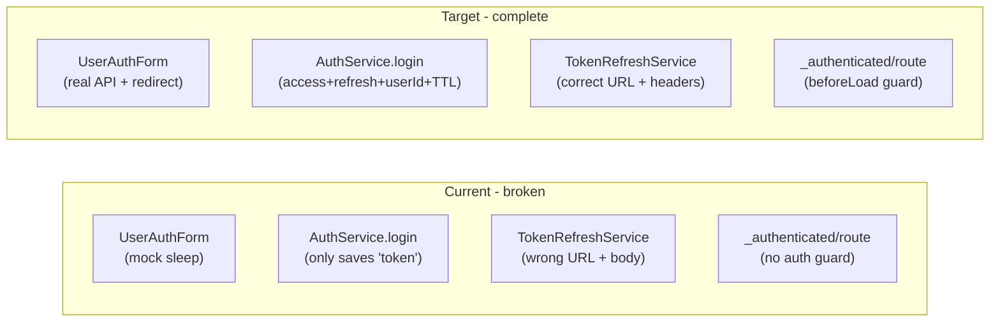

# Authentication & Authorization Implementation Plan

## Current State vs Target



## Server Contract (read-only reference)

- `POST /v1/identity/auth/login` — no auth, body: `{ username, password }`, returns `{ user, accessToken, refreshToken, expiresInAccessToken, expiresInRefreshToken }`
- `POST /v1/identity/auth/logout` — headers: `x-client-id`, `x-refresh-token`, `Authorization: Bearer`
- `POST /v1/identity/auth/refresh` — headers: `x-client-id`, `x-refresh-token`
- `GET /v1/identity/auth/me` — headers: `x-client-id`, `Authorization: Bearer`

## Files to Modify (in order)

### 1. [`libs/api/auth/data-transfer-object/index.ts`](servexa-warranty-ai/apps/web/src/libs/api/auth/data-transfer-object/index.ts)

Fix `ResponseLoginDto` to match actual server response. Current type has `{ id, token }` but server returns `{ user, accessToken, refreshToken, expiresIn* }`:

```typescript
export type ResponseAuthTokensDto = {
  user: { id: string; username: string; fullName: string; email: string; role: string; permissions: string[] }
  accessToken: string
  refreshToken: string
  expiresInAccessToken: number  // seconds
  expiresInRefreshToken: number // seconds
}
export type ResponseLoginDto = BaseApiResponse<ResponseAuthTokensDto>
export type ResponseRefreshTokenDto = BaseApiResponse<ResponseAuthTokensDto>
```

Remove the duplicate/mismatched `ResponseRefreshTokenDto` that currently has extra `iat*` fields.

### 2. [`libs/api/auth/api.ts`](servexa-warranty-ai/apps/web/src/libs/api/auth/api.ts)

Replace the stub with a full `AuthAPI`. Two issues in the current file: URL is `/auth/login` (missing `/v1/identity/` prefix) and missing `logout`, `refresh`, `me` methods. Pass custom headers per method so the global interceptor does not conflict:

```typescript
class AuthAPI extends BaseApi {
  login(username: string, password: string) {
    return this.tryPost<ResponseLoginDto, RequestLoginDto>('/v1/identity/auth/login', { username, password })
  }
  logout(userId: string, accessToken: string, refreshToken: string) {
    return this.tryPost<ResponseLogoutDto, object>('/v1/identity/auth/logout', {}, {
      headers: { 'x-client-id': userId, 'x-refresh-token': refreshToken, Authorization: `Bearer ${accessToken}` },
    })
  }
  refresh(userId: string, refreshToken: string) {
    return this.tryPost<ResponseRefreshTokenDto, object>('/v1/identity/auth/refresh', {}, {
      headers: { 'x-client-id': userId, 'x-refresh-token': refreshToken },
    })
  }
  me(userId: string, accessToken: string) {
    return this.tryGet<ResponseVerifyDto>('/v1/identity/auth/me', {
      headers: { 'x-client-id': userId, Authorization: `Bearer ${accessToken}` },
    })
  }
}
```

### 3. [`libs/axios.ts`](servexa-warranty-ai/apps/web/src/libs/axios.ts)

The server's `authenticateMiddleware` requires BOTH `Authorization: Bearer` AND `x-client-id` on every protected request. The interceptor only sends `Authorization`. Add `x-client-id` from cookie, but only if not already set (so explicit per-method headers in `authAPI` are not overridden):

```typescript
// In setupInterceptors → request interceptor
const token = await TokenService.getToken()
const userId = getCookie(KEY_COOKIE.AUTH_CLIENT_ID)
if (token && !config.headers['Authorization']) {
  config.headers.Authorization = `Bearer ${token}`
}
if (userId && !config.headers['x-client-id']) {
  config.headers['x-client-id'] = userId
}
```

Import `getCookie` from `@servexa-warranty-ai/ui/lib/cookie` and `KEY_COOKIE` from `@/constants`.

### 4. [`stores/services/service-auth.ts`](servexa-warranty-ai/apps/web/src/stores/services/service-auth.ts)

Four fixes:

- **`AuthService.login()`** — currently only stores `token`. Must store `accessToken`, `refreshToken`, and `user.id` (as `AUTH_CLIENT_ID`) using TTL from `expiresInAccessToken / 86400` and `expiresInRefreshToken / 86400` days. Return `user` data to caller.
- **`AuthService.logout()`** — currently just clears cookies. Must first call `authAPI.logout(userId, accessToken, refreshToken)`. Swallow errors so local cleanup always runs.
- **`AuthService.initializeAuth()`** — currently only checks cookie presence. Must call `authAPI.me()` to verify the token is still valid on the server and return `user` data. If the call fails (401), treat as unauthenticated.
- **`TokenRefreshService.refreshAccessToken()`** — currently calls `axios.post('/api/auth/refresh', { refreshToken })` (wrong URL + sends token in body). Must call `authAPI.refresh(userId, refreshToken)` with headers instead. Update stored tokens using TTL from response.

Also remove all `console.log` statements that print tokens.

### 5. [`stores/auth-store.ts`](servexa-warranty-ai/apps/web/src/stores/auth-store.ts)

Three fixes:

- **`login()`** — after `AuthService.login()` succeeds, call `set({ user: result.data.user })` to hydrate user state. Currently leaves `user: null` after login.
- **`logout()`** — make async, call `await AuthService.logout()` (which now revokes server-side) before clearing state.
- **`initializeAuth()`** — after `AuthService.initializeAuth()` succeeds, call `set({ user: result.user })` to rehydrate user on page reload.

Add `BroadcastChannel` for multi-tab logout: after `logout()` completes, broadcast a `'logout'` message. In `initializeAuth()`, listen for the channel and call `auth.logout()` if a message arrives.

### 6. [`routes/__root.tsx`](servexa-warranty-ai/apps/web/src/routes/__root.tsx)

Add a root `loader` so auth is initialized before any child route's `beforeLoad` runs (anti-flicker):

```typescript
export const Route = createRootRouteWithContext<RouterAppContext>()({
  loader: async () => {
    await useAuthStore.getState().auth.initializeAuth()
  },
  pendingComponent: () => <Loader />,
  ...
})
```

Also update `RouterAppContext` to include `queryClient: QueryClient` (it is currently empty but `main.tsx` passes it).

### 7. [`routes/_authenticated/route.tsx`](servexa-warranty-ai/apps/web/src/routes/_authenticated/route.tsx)

Add `beforeLoad` auth guard. Since the root `loader` already calls `initializeAuth()`, `isAuthenticated` is ready at this point:

```typescript
export const Route = createFileRoute('/_authenticated')({
  beforeLoad: ({ location }) => {
    const { isAuthenticated } = useAuthStore.getState()
    if (!isAuthenticated) {
      throw redirect({
        to: '/sign-in',
        search: { redirect: location.href },
      })
    }
    return { title: 'Home' }
  },
  component: AuthenticatedLayout,
})
```

### 8. [`routes/(auth)/sign-in.tsx`](servexa-warranty-ai/apps/web/src/routes/(auth)/sign-in.tsx)

Add `validateSearch` so the `redirect` query param is typed:

```typescript
export const Route = createFileRoute('/(auth)/sign-in')({
  validateSearch: z.object({ redirect: z.string().optional() }),
  component: SignIn,
})
```

### 9. [`features/auth/sign-in/components/user-auth-form.tsx`](servexa-warranty-ai/apps/web/src/features/auth/sign-in/components/user-auth-form.tsx)

Four changes:

- Replace `sleep(2000)` mock with `auth.login(username, password)` real call.
- Rename the form field from `email` (which uses `z.email()`) to `username` (which uses `z.string().min(1)`) to match the server's `requestAuthLoginSchema`. Update the label and placeholder accordingly.
- Read `redirectTo` from `useSearch()` via the typed route API instead of prop.
- Map server error messages to user-friendly strings: "Authentication error" → "Incorrect username or password", HTTP 403 → "Account suspended", etc.

## Checklist Coverage

| # | Item | Covered by |
|---|---|---|
| 1 | JWT access + refresh, TTL from server | Steps 1, 4 |
| 2 | Login flow with real API and errors | Steps 2, 9 |
| 3 | Auto refresh via axios interceptor + queue | Step 5 (existing queue kept), Step 4 fix |
| 4 | Logout with server revocation | Steps 2, 4, 5 |
| 5 | Route protection | Steps 6, 7 |
| 6 | Persist state on reload via `/me` | Steps 4, 5, 6 |
| 7 | No console.log tokens, HTTPS enforced by server | Step 4 |
| 8 | Multi-tab logout via BroadcastChannel | Step 5 |
| 9 | Loading state via pendingComponent, redirect restore | Steps 6, 7, 8 |
