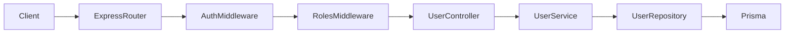

# Implement Identity User Module (Express)

## Goal
Add admin CRUD endpoints equivalent to [`saoviet-api` `UserController`](file:///D:/Github/SAOVIET/saoviet-api/src/modules/v1/identity/user/user.controller.ts) but adapted to this repo’s stack:
- Mount under [`servexa-warranty-ai/apps/server/src/modules/route-version-api.ts`](servexa-warranty-ai/apps/server/src/modules/route-version-api.ts) → `/${VERSION_API.V1}/identity` → new `users` router.
- Reuse existing response shape via [`SuccessResponse`](servexa-warranty-ai/apps/server/src/utils/success-response.ts) and error pattern via [`createOperationalError`](servexa-warranty-ai/apps/server/src/middlewares/error-middleware.ts) + [`ErrorHandler.asyncHandler`](servexa-warranty-ai/apps/server/src/core/helpers/error-handling.helper.ts) (same style as [`auth.controller.ts`](servexa-warranty-ai/apps/server/src/modules/v1/identity/controllers/auth.controller.ts)).

## Key differences vs saoviet (must adapt, not copy)
- **Prisma `User` fields**: Servexa uses `companyEmail` / `personalEmail` (not a single `email`), and relates roles via **`roleId` + `role` relation** (see [`identity.prisma`](servexa-warranty-ai/packages/db/prisma/schema/models/identity.prisma)).
  - **List/search**: mirror saoviet OR-search across `username`, `fullName`, `phone`, and **both email fields** (`companyEmail`, `personalEmail`).
  - **Uniqueness checks**:
    - Username remains unique (`findOneByUsername` already exists in [`user.repository.ts`](servexa-warranty-ai/apps/server/src/modules/v1/identity/repositories/user.repository.ts)).
    - Email conflicts should check **both** company/personal emails (two targeted `findUnique` queries or one `findFirst` with OR) — do **not** assume a single `email` column.
  - **Create/update payloads**: accept a **role reference** in a way that maps cleanly to Prisma:
    - Preferred: `roleId: uuid` (explicit) **or** `roleName: string` (resolve via `prisma.role.findUnique({ where: { name } })`).
    - Store `role: { connect: { id } }` on create and `roleId` / `role: { connect }` on update.

## HTTP surface (parity with saoviet)
Implement these routes on `routeIdentityV1`:
- `GET /users` — paginated list + filters (`page`, `limit`, `search`, `sortBy`, `sortOrder`, `status`)
- `GET /users/:userId` — details
- `POST /users` — create (hash password with bcrypt like [`UserService` in saoviet](file:///D:/Github/SAOVIET/saoviet-api/src/modules/v1/identity/user/user.service.ts))
- `PATCH /users/:userId` — update (no password change unless you explicitly add it later)
- `DELETE /users/:userId` — soft delete (`isDelete: true`)
- `PATCH /users/:userId/restore` — restore (`isDelete: false`)

**Ordering note (Express):** register `/users/:userId/restore` before `/users/:userId` if you structure nested routers, or keep a dedicated `restore` route path to avoid conflicts.

## AuthZ (new middleware)
`saoviet` uses `@UseGuards(JwtAuthenticateGuard, RolesGuard)` + `@Roles(ADMIN)`.

This repo currently has JWT verification in [`authenticateMiddleware`](servexa-warranty-ai/apps/server/src/middlewares/authenticate.middleware.ts) but **no role guard**.

Add `requireRoles(allowed: Roles[])` middleware:
- Runs **after** `authenticateMiddleware`.
- Reads `req.user.role` from [`AccessTokenPayload`](servexa-warranty-ai/apps/server/src/types/jwt.ts).
- Default allow-list (configurable constant): **`Roles.ADMIN`** to match saoviet; optionally include `Roles.SUPER_ADMIN` if you want “break-glass” access without changing tokens.

Wire routes like:
- `router.use(authenticateMiddleware, requireRoles([Roles.ADMIN]))` on the users router.

## Validation (Zod v4)
Create `servexa-warranty-ai/apps/server/src/modules/v1/identity/validations/user/*.ts` by translating saoviet schemas:
- [`find-all-users-schema.ts`](file:///D:/Github/SAOVIET/saoviet-api/src/modules/v1/identity/user/validations/find-all-users-schema.ts)
- [`find-by-id-schema.ts`](file:///D:/Github/SAOVIET/saoviet-api/src/modules/v1/identity/user/validations/find-by-id-schema.ts)
- [`create-user-schema.ts`](file:///D:/Github/SAOVIET/saoviet-api/src/modules/v1/identity/user/validations/create-user-schema.ts)
- [`update-user-schema.ts`](file:///D:/Github/SAOVIET/saoviet-api/src/modules/v1/identity/user/validations/update-user-schema.ts)

Adjust fields to Servexa:
- Replace single `email` with **`companyEmail` / `personalEmail`** (both optional on create; validate formats independently).
- Replace `role: z.string()` with **`roleId`** and/or **`roleName`** using `z.union` / refinements (“exactly one provided”).
- `status`: `z.enum(UserStatus)` using Prisma enum (via `@servexa-warranty-ai/db/prisma/enum` export path in [`packages/db/package.json`](servexa-warranty-ai/packages/db/package.json)).

Parse in controllers with `schema.parse(req.query|req.body|req.params)` inside `asyncHandler` blocks (same approach as auth uses `currentUserQuerySchema.parse`).

## Service/repository layering
- Expand [`UserRepository`](servexa-warranty-ai/apps/server/src/modules/v1/identity/repositories/user.repository.ts) to parity with saoviet [`user.repository.ts`](file:///D:/Github/SAOVIET/saoviet-api/src/modules/v1/identity/user/user.repository.ts): `findMany`, `count`, `findOneByEmail` (implemented as OR across email fields), `createOne`, `updateOneById`, `softDeleteById`, `restoreById`.
- Add `UserService` with business rules ported from saoviet [`user.service.ts`](file:///D:/Github/SAOVIET/saoviet-api/src/modules/v1/identity/user/user.service.ts):
  - List excludes `isDelete: false` by default.
  - `findOneById` throws not-found if missing or deleted (same as saoviet).
  - Create/update conflicts for username + emails.
  - Password hashing on create (bcrypt rounds consistent with seed: **10**).
  - Optional audit fields: set `createdBy` / `updatedBy` from `req.user.id` when creating/updating.

## Pagination helper
Repo already defines [`PaginatedResponse`](servexa-warranty-ai/apps/server/src/types/pagination.ts) but lacks `buildPagination`.

Add a small util (new file under `apps/server/src/utils/`, e.g. `pagination.ts`) implementing the same math as saoviet’s `buildPagination` (totalPages/hasNext/hasPrev).

## Wiring
- Add `user.route.ts` + `user.controller.ts` under `apps/server/src/modules/v1/identity/router/` / `controllers/`.
- Update [`route.ts`](servexa-warranty-ai/apps/server/src/modules/v1/identity/router/route.ts) to `routeIdentityV1.use('/users', userRoute)`.
- Export middleware from [`middlewares/index.ts`](servexa-warranty-ai/apps/server/src/middlewares/index.ts) if you follow the barrel import style used by auth routes.

## Optional (scope knob)
- **OpenAPI/docs**: saoviet has `docs/*.doc.ts`; Servexa can skip initially or add later.
- **Rate limits**: saoviet uses `@Throttle`; Servexa already depends on `express-rate-limit` — optionally add per-route limiters mirroring the Nest limits.

## Verification
- Hit endpoints with an `admin` access token + required headers (`CLIENT_ID`, `Authorization: Bearer ...`) consistent with [`authenticate.middleware.ts`](servexa-warranty-ai/apps/server/src/middlewares/authenticate.middleware.ts).
- Run `pnpm --filter server check-types` (or repo equivalent) after edits.
