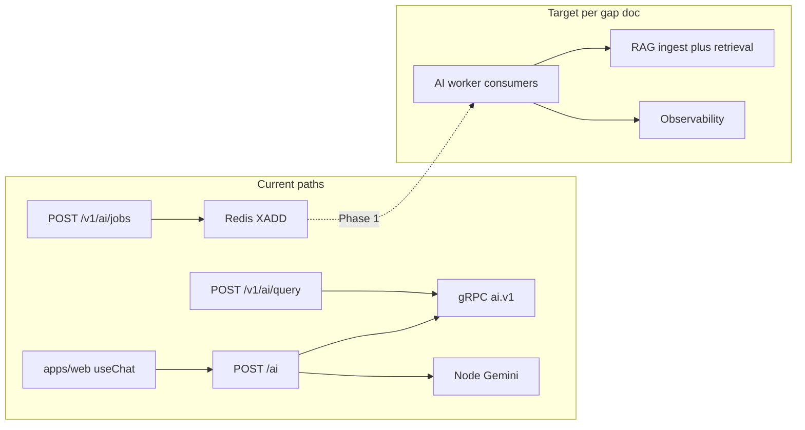

# Servexa Warranty AI — architecture gap execution plan

## Verified baseline (codebase vs document)

The gap report’s “foundation exists, production agentic stack missing” matches what is in the repo today.

| Area | In repo today | Gap vs document |
|------|----------------|-----------------|
| **Chat / LLM path** | [`apps/server/src/core/infra/bootstrap.ts`](d:/Github/GDGO-2026/GDGO-2026.Servexa-Warranty-AI/servexa-warranty-ai/apps/server/src/core/infra/bootstrap.ts) mounts `POST /ai` → [`bootstrap-ai-chat.helper.ts`](d:/Github/GDGO-2026/GDGO-2026.Servexa-Warranty-AI/servexa-warranty-ai/apps/server/src/modules/v1/ai/helpers/bootstrap-ai-chat.helper.ts): Gemini in Node **or** unary gRPC to Python when `AI_GRPC_HOST` is set. No RAG, tools, or memory in this handler. | Needs runtime abstraction, retrieval, agents, governance per §3.1 / §5.3. |
| **Versioned AI API** | [`apps/server/src/modules/v1/ai/router/route.ts`](d:/Github/GDGO-2026/GDGO-2026.Servexa-Warranty-AI/servexa-warranty-ai/apps/server/src/modules/v1/ai/router/route.ts): `POST /v1/ai/query`, `POST /v1/ai/jobs`, `GET /v1/ai/jobs/:jobId`. | Good boundary; still missing observability, evaluation, and full async worker story. |
| **Redis Streams (producer)** | [`AiJobStreamService`](d:/Github/GDGO-2026/GDGO-2026.Servexa-Warranty-AI/servexa-warranty-ai/apps/server/src/modules/v1/ai/services/ai-job-stream.service.ts): `XADD` to typed streams, optional idempotency, job meta in Redis. | Document asks for consumer groups, DLQ, retries, replay (§3.3 / §5.4) — **not** wired end-to-end for AI jobs yet. |
| **Redis consumer (Python)** | [`apps/ai-services/src/core/db/redis/consumers/inventory_consumer.py`](d:/Github/GDGO-2026/GDGO-2026.Servexa-Warranty-AI/servexa-warranty-ai/apps/ai-services/src/core/db/redis/consumers/inventory_consumer.py) + `xreadgroup` pattern. | Example consumer exists for inventory-style events, not for the Node `ai:*` job streams. |
| **gRPC** | [`packages/proto/ai/v1/ai_service.proto`](d:/Github/GDGO-2026/GDGO-2026.Servexa-Warranty-AI/servexa-warranty-ai/packages/proto/ai/v1/ai_service.proto) + [`ai-grpc.client.ts`](d:/Github/GDGO-2026/GDGO-2026.Servexa-Warranty-AI/servexa-warranty-ai/apps/server/src/core/infra/grpc/ai-grpc.client.ts). | Single RPC; no buf breaking-change policy, no multi-method service surface (§5.1 Contracts). |
| **FastAPI** | [`apps/ai-services/src/main.py`](d:/Github/GDGO-2026/GDGO-2026.Servexa-Warranty-AI/servexa-warranty-ai/apps/ai-services/src/main.py) — thin app shell. | “Skeleton only” in report is fair until gRPC impl + RAG/runtime live here. |
| **PostgreSQL / vectors** | Large domain schema in [`packages/db/prisma/schema/schema.prisma`](d:/Github/GDGO-2026/GDGO-2026.Servexa-Warranty-AI/servexa-warranty-ai/packages/db/prisma/schema/schema.prisma) (warranty/repair entities). **No** `vector`, `embedding`, or chunk models found in schema. | §5.1 / §5.2 pgvector + `tenant_id` / `embedding_version` / `chunk_hash` etc. still to add. |

---

## Phase 1 — Foundation stabilization (detailed)

**Goal (from doc §6):** Redis Streams architecture, pgvector production schema, AI runtime abstraction, ingestion foundation, protobuf governance.

1. **pgvector + RAG metadata schema (Prisma)**  
   - Extend [`packages/db/prisma/schema/schema.prisma`](d:/Github/GDGO-2026/GDGO-2026.Servexa-Warranty-AI/servexa-warranty-ai/packages/db/prisma/schema/schema.prisma) with document/chunk/embedding tables: `tenant_id`, `document_scope`, `chunk_hash`, `embedding_version`, `document_version`, indexes for retrieval.  
   - Enable pgvector in Docker Compose / migration strategy (align with existing `pnpm db:*` workflow in [CLAUDE.md](d:/Github/GDGO-2026/GDGO-2026.Servexa-Warranty-AI/servexa-warranty-ai/CLAUDE.md)).  
   - Update [`packages/env`](d:/Github/GDGO-2026/GDGO-2026.Servexa-Warranty-AI/servexa-warranty-ai/packages/env) if new URLs or flags are required.

2. **Redis Streams — close the loop for AI jobs**  
   - Define stream names, consumer groups, and message envelope contract (consider a small shared package, e.g. `packages/event-contracts` as suggested in doc §4, or typed TS module consumed by server + Python).  
   - Implement **Python worker** (or dedicated Node worker) that reads the **same** streams [`AiJobStreamService`](d:/Github/GDGO-2026/GDGO-2026.Servexa-Warranty-AI/servexa-warranty-ai/apps/server/src/modules/v1/ai/services/ai-job-stream.service.ts) writes to: `XREADGROUP`, `XACK`, retry counter, DLQ stream (reuse pattern from [`inventory_consumer.py`](d:/Github/GDGO-2026/GDGO-2026.Servexa-Warranty-AI/servexa-warranty-ai/apps/ai-services/src/core/db/redis/consumers/inventory_consumer.py)).  
   - Update job meta lifecycle (`queued` → `processing` → `completed` / `failed`) in Redis (or move durable state to Postgres if jobs must survive TTL).

3. **AI runtime abstraction (thin first slice)**  
   - Introduce a single interface used by `POST /ai` and `/v1/ai/query`: “sync completion from message + context → text (+ optional metadata)”.  
   - Implement two backends: existing Node Gemini path and gRPC path ([`bootstrap-ai-chat.helper.ts`](d:/Github/GDGO-2026/GDGO-2026.Servexa-Warranty-AI/servexa-warranty-ai/apps/server/src/modules/v1/ai/helpers/bootstrap-ai-chat.helper.ts), [`ai-sync.service.ts`](d:/Github/GDGO-2026/GDGO-2026.Servexa-Warranty-AI/servexa-warranty-ai/apps/server/src/modules/v1/ai/services/ai-sync.service.ts)).  
   - Defer multi-provider fallback and prompt versioning to Phase 1 stretch or Phase 4 as needed.

4. **Ingestion pipeline foundation**  
   - Minimal async path: upload or admin-trigger → enqueue ingestion job (reuse Redis job pattern) → worker extracts text (start with PDF or plain text) → chunk → embed → write to new Prisma tables.  
   - One vertical slice beats many loaders upfront.

5. **Protobuf / contract governance**  
   - Document and script codegen for [`packages/proto`](d:/Github/GDGO-2026/GDGO-2026.Servexa-Warranty-AI/servexa-warranty-ai/packages/proto) (versioning rules, compatibility).  
   - Keep duplicate [`apps/ai-services/.../ai_service.proto`](d:/Github/GDGO-2026/GDGO-2026.Servexa-Warranty-AI/servexa-warranty-ai/apps/ai-services/src/modules/v1/grpc/protos/ai_service.proto) in sync or replace with generated copy from single source of truth.

**Phase 1 exit criteria:** vectors persisted with tenant + version metadata; at least one ingestion path writing chunks; AI job messages consumed reliably with ack/retry/DLQ; runtime interface shared by chat and unary API.

---

## Phase 2 — Production RAG (summary + dependencies)

**Depends on:** Phase 1 schema + ingestion skeleton + worker loop.

- Hybrid retrieval (BM25 + vector), reranking, metadata filters, citation mapping, retrieval caching (doc §5.2).  
- Wire retrieval into the runtime used by `/v1/ai/query` and optionally `POST /ai` (tool-augmented or server-side context injection).  
- “Retrieval observability” minimal: structured logs + trace IDs (full Langfuse in Phase 4).

---

## Phase 3 — Agentic workflows (summary + dependencies)

**Depends on:** Phase 2 retrieval quality and Phase 1 job reliability.

- Workflow state machine + persistence (new module or adopt Workflow DevKit already referenced in repo skills — choose one and standardize).  
- Warranty-specific flows from doc §3.4 / §5.5 (claim intake, policy validation, escalation, etc.) as **definitions** atop the engine, not ad hoc prompts.  
- Planner / executor split and tool runtime (initial registry + timeouts) per §5.3 / §5.6.

---

## Phase 4 — Operational excellence (summary + dependencies)

**Depends on:** Phases 1–3 producing traceable steps (tools, retrieval, workflows).

- Langfuse and/or OpenTelemetry tracing for prompts, retrieval, tools, workflows (§3.5 / §5.7).  
- AI evaluation harness: retrieval + regression prompts + tool tests (§5.9).  
- Cost/token metrics and dashboards (§5.7 / §5.10).  
- Tool governance hardening: RBAC for tools, audit logs, approval paths (§5.6).

---

## Phase 5 — Advanced AI platform (summary + dependencies)

**Depends on:** stable observability + evaluation from Phase 4.

- Multi-agent coordination, richer memory (semantic/episodic), self-healing workflows, adaptive orchestration (doc §6 Phase 5).  
- Treat as research/product iteration once Phases 1–4 are in production use.

---

## Cross-cutting priorities (from doc §7)

Align engineering effort with the report’s ordering: **AI runtime core → event-driven architecture → workflow orchestration → observability → governance → evaluation** — ahead of broad frontend polish or unrelated CRUD expansion.

---

## Risk / alignment notes

- **Two chat surfaces:** [`apps/web/src/routes/ai.tsx`](d:/Github/GDGO-2026/GDGO-2026.Servexa-Warranty-AI/servexa-warranty-ai/apps/web/src/routes/ai.tsx) uses `POST /ai`; product features should converge on the same runtime and tenancy rules as `/v1/ai/*` to avoid split behavior.  
- **Prisma + pgvector:** confirm Prisma version and [unsupportedTypes](https://www.prisma.io/docs/orm/prisma-schema/postgresql-extensions) / raw SQL strategy for `vector` columns if the client generator lags native vector types.
