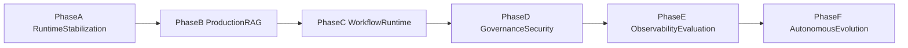

# Servexa Warranty AI — Next Execution Plan (Phase A+B Focus)

## Current baseline from codebase

The report’s maturity claims are directionally accurate; key foundations now exist:
- AI runtime + endpoints in [`d:/Github/GDGO-2026/GDGO-2026.Servexa-Warranty-AI/servexa-warranty-ai/apps/server/src/modules/v1/ai`](d:/Github/GDGO-2026/GDGO-2026.Servexa-Warranty-AI/servexa-warranty-ai/apps/server/src/modules/v1/ai)
- Redis stream worker path in [`d:/Github/GDGO-2026/GDGO-2026.Servexa-Warranty-AI/servexa-warranty-ai/apps/ai-services/src/core/db/redis/consumers/ai_job_consumer.py`](d:/Github/GDGO-2026/GDGO-2026.Servexa-Warranty-AI/servexa-warranty-ai/apps/ai-services/src/core/db/redis/consumers/ai_job_consumer.py)
- RAG schema + vector columns in [`d:/Github/GDGO-2026/GDGO-2026.Servexa-Warranty-AI/servexa-warranty-ai/packages/db/prisma/schema/models/ai-knowledge.prisma`](d:/Github/GDGO-2026/GDGO-2026.Servexa-Warranty-AI/servexa-warranty-ai/packages/db/prisma/schema/models/ai-knowledge.prisma)
- Coordinator/tools on Python side in [`d:/Github/GDGO-2026/GDGO-2026.Servexa-Warranty-AI/servexa-warranty-ai/apps/ai-services/src/modules/v1/agents`](d:/Github/GDGO-2026/GDGO-2026.Servexa-Warranty-AI/servexa-warranty-ai/apps/ai-services/src/modules/v1/agents)

Primary gap now is depth/reliability hardening rather than first-time scaffolding.

## Delivery objective for this plan

Deliver **Phase A (Runtime Stabilization)** and **Phase B (Production RAG Runtime)** as implementation-ready milestones. Keep Phase C–F as explicitly blocked backlog by dependency.

## Phase A — Runtime Stabilization (implementation-ready)

### A1. Redis stream reliability hardening
- Extend producer/consumer contracts between:
  - [`d:/Github/GDGO-2026/GDGO-2026.Servexa-Warranty-AI/servexa-warranty-ai/apps/server/src/modules/v1/ai/services/ai-job-stream.service.ts`](d:/Github/GDGO-2026/GDGO-2026.Servexa-Warranty-AI/servexa-warranty-ai/apps/server/src/modules/v1/ai/services/ai-job-stream.service.ts)
  - [`d:/Github/GDGO-2026/GDGO-2026.Servexa-Warranty-AI/servexa-warranty-ai/apps/ai-services/src/core/db/redis/consumers/ai_job_consumer.py`](d:/Github/GDGO-2026/GDGO-2026.Servexa-Warranty-AI/servexa-warranty-ai/apps/ai-services/src/core/db/redis/consumers/ai_job_consumer.py)
- Add/verify:
  - retry queue stream
  - DLQ schema normalization
  - visibility timeout via pending-entry claim logic
  - poison-message threshold + quarantine stream
  - replay command/API for ops
- Exit criteria:
  - failed jobs are replayable
  - retries are bounded and observable
  - no silent stuck jobs in pending list

### A2. Runtime abstraction contracts
- Consolidate unary execution contract around:
  - [`d:/Github/GDGO-2026/GDGO-2026.Servexa-Warranty-AI/servexa-warranty-ai/apps/server/src/modules/v1/ai/runtime/ai-completion-runtime.ts`](d:/Github/GDGO-2026/GDGO-2026.Servexa-Warranty-AI/servexa-warranty-ai/apps/server/src/modules/v1/ai/runtime/ai-completion-runtime.ts)
  - [`d:/Github/GDGO-2026/GDGO-2026.Servexa-Warranty-AI/servexa-warranty-ai/apps/server/src/modules/v1/ai/services/ai-sync.service.ts`](d:/Github/GDGO-2026/GDGO-2026.Servexa-Warranty-AI/servexa-warranty-ai/apps/server/src/modules/v1/ai/services/ai-sync.service.ts)
- Add model fallback policy object (provider, retry class, timeout class).
- Add structured output mode for internal orchestrator calls.
- Exit criteria:
  - `/ai` and `/v1/ai/query` share same validation/fallback strategy
  - failures classified into retryable vs non-retryable

### A3. Contract governance (proto + event)
- Keep proto source of truth in:
  - [`d:/Github/GDGO-2026/GDGO-2026.Servexa-Warranty-AI/servexa-warranty-ai/packages/proto`](d:/Github/GDGO-2026/GDGO-2026.Servexa-Warranty-AI/servexa-warranty-ai/packages/proto)
- Add event envelope package (new `packages/event-contracts`) with versioned types for stream payloads and DLQ payloads.
- Add schema evolution rules + compatibility checklist in repo docs.
- Exit criteria:
  - no duplicated proto definitions in app folders
  - typed stream payloads used by producer/consumer

## Phase B — Production RAG Runtime (implementation-ready)

### B1. Ingestion pipeline deepening
- Build ingestion runtime under server and/or ai-services using existing anchors:
  - [`d:/Github/GDGO-2026/GDGO-2026.Servexa-Warranty-AI/servexa-warranty-ai/apps/server/src/modules/v1/ai/services/knowledge-ingestion.service.ts`](d:/Github/GDGO-2026/GDGO-2026.Servexa-Warranty-AI/servexa-warranty-ai/apps/server/src/modules/v1/ai/services/knowledge-ingestion.service.ts)
  - [`d:/Github/GDGO-2026/GDGO-2026.Servexa-Warranty-AI/servexa-warranty-ai/apps/ai-services/src/modules/v1/rag/services/ingestion_service.py`](d:/Github/GDGO-2026/GDGO-2026.Servexa-Warranty-AI/servexa-warranty-ai/apps/ai-services/src/modules/v1/rag/services/ingestion_service.py)
- Implement first-class loaders (PDF, DOCX), recursive chunking, metadata extractor, ingest retries.
- Exit criteria:
  - ingestion jobs produce versioned chunks with deterministic metadata
  - re-index job can rebuild embeddings by version

### B2. Retrieval quality hardening
- Evolve current retrieval service:
  - [`d:/Github/GDGO-2026/GDGO-2026.Servexa-Warranty-AI/servexa-warranty-ai/apps/server/src/modules/v1/ai/services/knowledge-retrieval.service.ts`](d:/Github/GDGO-2026/GDGO-2026.Servexa-Warranty-AI/servexa-warranty-ai/apps/server/src/modules/v1/ai/services/knowledge-retrieval.service.ts)
- Add:
  - hybrid scoring policy abstraction
  - rerank stage
  - metadata filtering and citation mapping contract
  - contextual compression before prompt augmentation
- Exit criteria:
  - citations map to chunk/document IDs consistently
  - retrieval quality is measurable by test corpus

### B3. Vector + tenant semantics completion
- Confirm all runtime writes/reads use fields from:
  - [`d:/Github/GDGO-2026/GDGO-2026.Servexa-Warranty-AI/servexa-warranty-ai/packages/db/prisma/schema/models/ai-knowledge.prisma`](d:/Github/GDGO-2026/GDGO-2026.Servexa-Warranty-AI/servexa-warranty-ai/packages/db/prisma/schema/models/ai-knowledge.prisma)
- Enforce required filters (`tenant_id`, `document_scope`) in retrieval API/controller.
- Add dedup + hash collision handling policy.

## Backlog staging (Phase C–F)

### Phase C (workflow runtime) — start only after A+B exit
- Build persistent state machine runtime around:
  - [`d:/Github/GDGO-2026/GDGO-2026.Servexa-Warranty-AI/servexa-warranty-ai/apps/server/src/modules/v1/workflows`](d:/Github/GDGO-2026/GDGO-2026.Servexa-Warranty-AI/servexa-warranty-ai/apps/server/src/modules/v1/workflows)

### Phase D (governance/security)
- Expand from existing audit hook:
  - [`d:/Github/GDGO-2026/GDGO-2026.Servexa-Warranty-AI/servexa-warranty-ai/apps/server/src/modules/v1/ai/governance/ai-audit.ts`](d:/Github/GDGO-2026/GDGO-2026.Servexa-Warranty-AI/servexa-warranty-ai/apps/server/src/modules/v1/ai/governance/ai-audit.ts)

### Phase E (observability/evaluation)
- Expand from:
  - [`d:/Github/GDGO-2026/GDGO-2026.Servexa-Warranty-AI/servexa-warranty-ai/apps/server/src/core/observability/telemetry.ts`](d:/Github/GDGO-2026/GDGO-2026.Servexa-Warranty-AI/servexa-warranty-ai/apps/server/src/core/observability/telemetry.ts)
  - [`d:/Github/GDGO-2026/GDGO-2026.Servexa-Warranty-AI/servexa-warranty-ai/apps/server/src/modules/v1/ai/evaluation/runner.ts`](d:/Github/GDGO-2026/GDGO-2026.Servexa-Warranty-AI/servexa-warranty-ai/apps/server/src/modules/v1/ai/evaluation/runner.ts)

### Phase F (autonomous evolution)
- Expand from:
  - [`d:/Github/GDGO-2026/GDGO-2026.Servexa-Warranty-AI/servexa-warranty-ai/apps/server/src/modules/v1/ai/agents/multi-agent-coordinator.ts`](d:/Github/GDGO-2026/GDGO-2026.Servexa-Warranty-AI/servexa-warranty-ai/apps/server/src/modules/v1/ai/agents/multi-agent-coordinator.ts)

## Execution order and milestone gates

1. **Milestone M1 (Phase A complete)**
- Redis reliability controls working in staging
- Runtime and contract stabilization merged

2. **Milestone M2 (Phase B complete)**
- Production ingestion + retrieval quality baseline achieved

3. **Milestone M3 (Phase C kickoff)**
- Workflow persistence + transition guarantees begin

## Validation checklist for this planning window

- Runtime resilience tests for stream retries, timeout, replay
- RAG regression suite with fixed query corpus
- Tenant isolation tests on retrieval and ingestion endpoints
- Contract compatibility checks for proto and stream payload versions