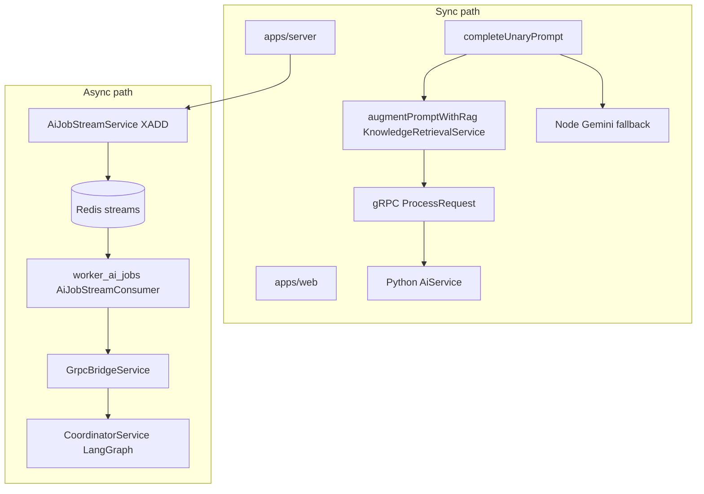

# Phase 1 + Phase 2 execution plan (master plan + revision report)

**Sources:** [servexa_warranty_ai_next_stage_execution_master_plan.md](d:\Github\GDGO-2026\GDGO-2026.Servexa-Warranty-AI\servexa-warranty-ai\servexa_warranty_ai_next_stage_execution_master_plan.md) (scope and sequencing), [servexa_warranty_ai_plan_revision_recommendations_report.md](d:\Github\GDGO-2026\GDGO-2026.Servexa-Warranty-AI\servexa-warranty-ai\servexa_warranty_ai_plan_revision_recommendations_report.md) (formalized policies and early observability—plan **tightened**, not rewritten).

## Where you are today (codebase vs document)

The architecture described in the master plan is largely present as **two paths**:

**Already implemented (do not re-build from scratch):**

| Master-plan theme | Evidence |
|-------------------|----------|
| Redis producer + meta + replay | [apps/server/src/modules/v1/ai/services/ai-job-stream.service.ts](d:\Github\GDGO-2026\GDGO-2026.Servexa-Warranty-AI\servexa-warranty-ai\apps\server\src\modules\v1\ai\services\ai-job-stream.service.ts) |
| Consumer groups, retry stream, XAUTOCLAIM, DLQ | [apps/ai-services/src/core/db/redis/consumers/ai_job_consumer.py](d:\Github\GDGO-2026\GDGO-2026.Servexa-Warranty-AI\servexa-warranty-ai\apps\ai-services\src\core\db\redis\consumers\ai_job_consumer.py) |
| Stream job envelope (Zod) | [packages/event-contracts/src/index.ts](d:\Github\GDGO-2026\GDGO-2026.Servexa-Warranty-AI\servexa-warranty-ai\packages\event-contracts\src\index.ts) |
| Unary gRPC contract | [packages/proto/ai/v1/ai_service.proto](d:\Github\GDGO-2026\GDGO-2026.Servexa-Warranty-AI\servexa-warranty-ai\packages\proto\ai\v1\ai_service.proto) |
| RAG storage + hybrid retrieval + ingestion/reindex APIs | [packages/db/prisma/schema/models/ai-knowledge.prisma](d:\Github\GDGO-2026\GDGO-2026.Servexa-Warranty-AI\servexa-warranty-ai\packages\db\prisma\schema\models\ai-knowledge.prisma), [apps/server/src/modules/v1/ai/services/knowledge-retrieval.service.ts](d:\Github\GDGO-2026\GDGO-2026.Servexa-Warranty-AI\servexa-warranty-ai\apps\server\src\modules\v1\ai\services\knowledge-retrieval.service.ts), [apps/server/src/modules/v1/ai/controllers/knowledge.controller.ts](d:\Github\GDGO-2026\GDGO-2026.Servexa-Warranty-AI\servexa-warranty-ai\apps\server\src\modules\v1\ai\controllers\knowledge.controller.ts) |
| LangGraph coordinator (Python) | [apps/ai-services/src/modules/v1/agents/services/coordinator_service.py](d:\Github\GDGO-2026\GDGO-2026.Servexa-Warranty-AI\servexa-warranty-ai\apps\ai-services\src\modules\v1\agents\services\coordinator_service.py) |
| Observability stub (metrics route) | [apps/ai-services/src/modules/v1/observability/routers.py](d:\Github\GDGO-2026\GDGO-2026.Servexa-Warranty-AI\servexa-warranty-ai\apps\ai-services\src\modules\v1\observability\routers.py) |

**Largest gaps (unchanged technical reality):**

1. **Orchestration fragmentation**: Node [multi-agent-coordinator.ts](d:\Github\GDGO-2026\GDGO-2026.Servexa-Warranty-AI\servexa-warranty-ai\apps\server\src\modules\v1\ai\agents\multi-agent-coordinator.ts) vs Python LangGraph; async path passes only `query` through [GrpcBridgeService](d:\Github\GDGO-2026\GDGO-2026.Servexa-Warranty-AI\servexa-warranty-ai\apps\ai-services\src\modules\v1\grpc\services\grpc_bridge_service.py).
2. **RAG corpus fragmentation**: Prisma `ai_knowledge_*` vs LangChain [PGVector](d:\Github\GDGO-2026\GDGO-2026.Servexa-Warranty-AI\servexa-warranty-ai\apps\ai-services\src\modules\v1\rag\vectorstores\pgvector_vectorstore.py).
3. **Worker hardening**: [worker_ai_jobs.py](d:\Github\GDGO-2026\GDGO-2026.Servexa-Warranty-AI\servexa-warranty-ai\apps\ai-services\src\worker_ai_jobs.py) loop; DLQ alignment with `aiJobDlqEnvelopeSchema`.
4. **Production ingestion**: sync HTTP path exists; async workers and loaders still needed at scale.

**Gaps the revision report adds (policy / contracts—not new mega-features):**

- Ambiguous **orchestration ownership** and **sync vs async** rules → formal policies below.
- Missing **structured outputs** and **tool execution metadata** → explicit contracts.
- **Observability** deferred too far → **lightweight hooks in Phase 1–2** (not full Langfuse/Phase 5).
- Unstated **memory** direction → **stateless-by-default** + ephemeral Redis only until workflow phase.

---

## Cross-cutting policies (revision report §3.1–3.2, §3.6)

### Runtime ownership policy (single authority)

| Layer | Responsibility |
|-------|----------------|
| **Node (`apps/server`)** | API gateway, authentication, request validation, **orchestration entrypoint only**, sync **lightweight** inference only when policy allows (e.g. Node Gemini fallback), publish to Redis, gRPC client to Python |
| **Python (`apps/ai-services`)** | **Single orchestration authority**: LangGraph execution, agent routing, retrieval orchestration (when invoked from coordinator), tool orchestration, async job execution body, future workflow steps |

Rule: **no second planner/executor graph in Node** once Python path carries full context—Node must not grow new orchestration logic beyond routing and I/O.

### Runtime mode policy (MUST async vs MAY sync)

**MUST use async runtime (Redis → worker → Python):**

- Document ingestion (large / multi-step)
- Multi-step workflows and long-running reasoning
- Report generation, summarization pipelines, bulk retrieval
- Background enrichment, orchestration-heavy workloads

**MAY use sync runtime (unary gRPC or short Node path):**

- Lightweight chat (short context)
- Autocomplete-style interactions
- Short retrieval-augmented Q&A
- Lightweight classification
- Low-latency interactions explicitly classified in the routing matrix

Encode this in one **routing matrix** module + env flags so developers cannot accidentally put long-running work on the sync path.

### Memory stance (revision report §3.6)

- **Default:** stateless request handling; no ad-hoc persistent conversational memory in Phase 1–2.
- **Allowed:** minimal **ephemeral** context in Redis (job meta, dedupe keys, optional short-lived session keys) with **documented TTLs** aligned to existing `86_400`-style usage.
- **Deferred:** durable memory runtime until workflow orchestration stabilizes (master plan Phase 3+).

---

## Phase 1 — Runtime stabilization (ordered)

### 1.1 Orchestration entrypoint + ownership (master §6.1 + revision §3.1)

- Inventory `completeUnaryPrompt` call sites (same files as before).
- Implement routing matrix with **runtime mode policy** above; keep [ai.controller.ts](d:\Github\GDGO-2026\GDGO-2026.Servexa-Warranty-AI\servexa-warranty-ai\apps\server\src\modules\v1\ai\controllers\ai.controller.ts) `allowAsync` behavior consistent with MUST-async list.
- **Collapse Node orchestration:** remove or delegate [multi-agent-coordinator.ts](d:\Github\GDGO-2026\GDGO-2026.Servexa-Warranty-AI\servexa-warranty-ai\apps\server\src\modules\v1\ai\agents\multi-agent-coordinator.ts) to the Python coordinator (single authority).

### 1.2 Execution context + proto (master §6.3)

- Extend [ai_service.proto](d:\Github\GDGO-2026\GDGO-2026.Servexa-Warranty-AI\servexa-warranty-ai\packages\proto\ai\v1\ai_service.proto) with additive fields (`request_version`, `job_id`, `job_type`, `execution_context` JSON, etc.).
- Regenerate stubs / update [ai-grpc.client.ts](d:\Github\GDGO-2026\GDGO-2026.Servexa-Warranty-AI\servexa-warranty-ai\apps\server\src\core\infra\grpc\ai-grpc.client.ts) and Python gRPC service.
- [GrpcBridgeService](d:\Github\GDGO-2026\GDGO-2026.Servexa-Warranty-AI\servexa-warranty-ai\apps\ai-services\src\modules\v1\grpc\services\grpc_bridge_service.py) passes **full envelope-derived context** into `CoordinatorService`.

### 1.3 Structured outputs (revision §3.3)

- **Python:** Pydantic models for planner output, routing decision, and tool invocation payloads inside the LangGraph coordinator path.
- **Node:** Zod schemas at HTTP/API boundaries for sync responses and job enqueue bodies where applicable.
- **Checklist:** typed planner outputs, typed routing outputs, structured tool payloads, schema validation for AI responses, execution payload validation (reject invalid graphs early).

### 1.4 Contract governance (master §6.3)

- Protobuf versioning + CI breaking-check strategy for [packages/proto](d:\Github\GDGO-2026\GDGO-2026.Servexa-Warranty-AI\servexa-warranty-ai\packages\proto).
- [packages/event-contracts](d:\Github\GDGO-2026\GDGO-2026.Servexa-Warranty-AI\servexa-warranty-ai\packages\event-contracts) remains stream source of truth; optional JSON Schema export / shared fixtures for Python parity.
- Align [ai_job_consumer.py](d:\Github\GDGO-2026\GDGO-2026.Servexa-Warranty-AI\servexa-warranty-ai\apps\ai-services\src\core\db\redis\consumers\ai_job_consumer.py) DLQ fields to `aiJobDlqEnvelopeSchema`.

### 1.5 Tool runtime contracts (master §6.4 + revision §3.4)

Beyond timeouts/retries/interfaces, every tool invocation records **standard metadata:**

`tool_name`, `tool_version`, `trace_id`, `tenant_id`, `execution_time`, `execution_status`, `error_type`, `retry_count`

**Checklist:** tool execution metadata, standardized tool tracing, tenant-aware execution, audit logs (structured), execution failure classification (retryable vs terminal).

### 1.6 Redis / worker hardening (master §6.2)

- SIGINT/SIGTERM graceful drain in [worker_ai_jobs.py](d:\Github\GDGO-2026\GDGO-2026.Servexa-Warranty-AI\servexa-warranty-ai\apps\ai-services\src\worker_ai_jobs.py).
- Heartbeats on job meta during long coordinator runs.
- Metrics: producer [AiJobStreamService](d:\Github\GDGO-2026\GDGO-2026.Servexa-Warranty-AI\servexa-warranty-ai\apps\server\src\modules\v1\ai\services\ai-job-stream.service.ts) + consumer; optional extension of [MetricsService](d:\Github\GDGO-2026\GDGO-2026.Servexa-Warranty-AI\servexa-warranty-ai\apps\ai-services\src\modules\v1\observability) / `/v1/observability/metrics`.
- Cancellation key pattern (`ai:job:cancel:{jobId}`) checked between coordinator steps where feasible.

### 1.7 Lightweight observability hooks (revision §3.5 — Phase 1–2, not deferred)

Minimal instrumentation **before** full Phase 5 stacks:

- Prompt snapshots (redact secrets; configurable sampling)
- Retrieval trace logs (tenant, query hash, top-k ids, scores)
- Routing trace logs (coordinator branch decisions)
- Tool execution trace logs (linked to §1.5 metadata)
- Latency instrumentation (gRPC, Redis publish, worker handle, coordinator)

**Phase 1 exit criteria (extended):** policies in §Cross-cutting documented in repo; single Python orchestration authority respected; sync/async matrix enforced; structured outputs on planner/router/tools; tool metadata + traces available; DLQ/retry/visibility verified; worker shutdown safe; early observability hooks emitting retrievable logs or metrics.

---

## Phase 2 — Production RAG runtime (master §7 + revision §Phase 2 additions)

### 2.1 Single corpus (master §7.4)

- Prisma `ai_knowledge_*` canonical; LangChain PGVector deprecated or isolated with explicit README.

### 2.2 Async ingestion + observability (master §7.1 + revision §Phase 2)

- Ingestion jobs on dedicated stream or extended typed jobs; worker with retry/DLQ.
- **Ingestion observability:** per-document progress, chunk counts, embedding timings, failure reasons (structured logs + optional metrics counters).

### 2.3 Loaders (master §7.1)

- PDF, DOCX, XLSX, HTML, OCR via [KnowledgeIngestionService](d:\Github\GDGO-2026\GDGO-2026.Servexa-Warranty-AI\servexa-warranty-ai\apps\server\src\modules\v1\ai\services\knowledge-ingestion.service.ts) / [knowledge.controller.ts](d:\Github\GDGO-2026\GDGO-2026.Servexa-Warranty-AI\servexa-warranty-ai\apps\server\src\modules\v1\ai\controllers\knowledge.controller.ts).

### 2.4 Chunking + retrieval quality + instrumentation (master §7.2–7.3 + revision)

- Recursive/semantic chunking behind flags; optional rerank after [hybridSearch](d:\Github\GDGO-2026\GDGO-2026.Servexa-Warranty-AI\servexa-warranty-ai\apps\server\src\modules\v1\ai\services\knowledge-retrieval.service.ts); citation IDs in `augmentPromptWithRag`.
- **Retrieval instrumentation:** log hybrid scores, cache hit/miss, filter dimensions (`tenantId`, `documentScope`).
- **Metadata governance:** validate document metadata at ingest (tenant, scope, source tracking); align with revision **Priority 4** foundations (tenant awareness, execution metadata) without building a full governance product.

### 2.5 Vector / DB maintenance (master §7.4–7.5)

- Index review; stale embedding cleanup; re-embedding when `embeddingVersion` changes.

**Phase 2 exit criteria (extended):** Phase 2 master criteria plus retrieval + ingestion observability signals suitable for later evaluation frameworks; metadata rules enforced at ingest.

---

## Recommended priorities (revision report §4)

1. **Runtime stabilization** — ownership policy, Redis hardening, execution contracts, structured outputs.
2. **Production RAG** — ingestion pipelines, chunking, corpus consolidation, retrieval quality.
3. **Lightweight observability foundations** — prompt / retrieval / routing / tool traces, latency (feeds future Phase 5; not a full observability product in Phase 1–2).
4. **Governance foundations (minimal)** — tenant-aware execution, tool/ingest audit metadata (revision §3.4 / Priority 4), without workflow/governance engines.

---

## Sequencing (milestones)

1. **Policies** — ownership + sync/async matrix + memory stance (docs + code comments + env).
2. **Proto + context** — unblock identical behavior sync vs async.
3. **Structured outputs + tool contracts** — harden coordinator and tools.
4. **Node coordinator removal** — delegate to Python authority.
5. **Worker hardening + observability hooks** — logs/metrics/traces baseline.
6. **RAG** — corpus consolidation → async ingest → loaders → quality + instrumentation.

---

## Out of scope (unchanged intent; revision report §5)

- Full workflow engine (Phase 3), governance UI (Phase 4), Langfuse-level tracing (Phase 5), autonomous planners (Phase 6), **durable memory runtime** — strategic only until Phase 1–2 exit criteria are green; do not overdesign.
