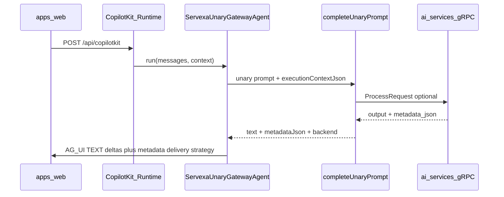

# Phase 1 — Agentic chat basic implementation

## Scope decisions (confirmed)

- **AI Command Center (proposal Step 10)** — **Deferred**. Work stays on right rail + gateway + shared contract + rendering layers only.
- **Shared contract** — **New workspace package** [`packages/ai-contracts`](packages/ai-contracts) with Zod + exported TS types, consumed by **both** [`apps/server`](apps/server) and [`apps/web`](apps/web).

## Current baseline (already in repo)

- **Web**: [`AuthenticatedCopilotProviders`](apps/web/src/features/ai-copilot/authenticated-copilot-providers.tsx) → CopilotKit v2 single endpoint; [`AICopilotRail`](apps/web/src/features/ai-copilot/ai-copilot-rail.tsx) with `CopilotChat`, `useAgent`, `useAgentContext`, suggestions; [`mock/types.ts`](apps/web/src/features/ai-copilot/mock/types.ts) duplicates shape similar to the proposal.
- **Server**: [`createCopilotKitRouter`](apps/server/src/modules/copilotkit/copilot-runtime.router.ts) mounts `/api/copilotkit`; [`ServexaUnaryGatewayAgent`](apps/server/src/modules/copilotkit/servexa-unary-gateway.agent.ts) calls [`completeUnaryPrompt`](apps/server/src/modules/v1/ai/runtime/ai-completion-runtime.ts) and streams AG-UI `TEXT_MESSAGE_*` deltas via [`chunkTextForDeltas`](apps/server/src/utils/chunk-text-for-deltas.ts).
- **AI services**: [`GrpcBridgeService.process_full`](apps/ai-services/src/modules/v1/grpc/services/grpc_bridge_service.py) returns `(output, metadata_json)` where metadata currently includes `route`, `toolResults`, trace/job fields—no Phase 1 “copilot envelope” yet.

## Metadata delivery strategy (implementation-critical)

CopilotKit today renders **plain assistant text** from streamed deltas. For Phase 1 **without** multi-agent orchestration or custom subgraph UI:

1. **During coding**, inspect `@ag-ui/client` `BaseEvent` variants shipped with catalog `@ag-ui/client` (^0.0.53) for an event that can carry **opaque structured payload** to the React runtime (e.g. custom / activity / state events). If supported and wired by `@copilotkit/react-core` v2, **prefer emitting normalized metadata once after `TEXT_MESSAGE_END`** (or alongside run lifecycle events).

2. **Fallback** if no usable client-side hook exists on schedule: append a **single machine-readable trailer** to the assistant stream (e.g. sentinel-delimited JSON or trailing fenced JSON block) and strip it in a thin wrapper hook/context **without** showing raw JSON to the user. Document the sentinel in `packages/ai-contracts` README comment only—avoid undocumented parsing.

## Workstream A — `packages/ai-contracts`

- Add workspace package `packages/ai-contracts` with:
  - Zod schema matching proposal (`answer`, optional `confidence`, `sources[]`, `suggestedActions[]`, optional `relatedEntities[]`; align IDs with proposal).
  - Export inferred TS types.
  - Optional **`normalizeCopilotPayload`** helpers: safe JSON parse of `metadataJson` from [`AiUnaryCompletionResult`](apps/server/src/modules/v1/ai/runtime/ai-completion-runtime.ts), merge with heuristics from grpc metadata (`toolResults`, `route`) into the canonical envelope (starts stub-friendly).
- Wire dependency from [`apps/server/package.json`](apps/server/package.json) and [`apps/web/package.json`](apps/web/package.json); extend root Turbo pipeline so `check-types` / build order respects the package.

## Workstream B — Server gateway normalization

- Under [`apps/server/src/modules/copilotkit/`](apps/server/src/modules/copilotkit/):
  - Add small **`normalize unary completion → CopilotResponse`** module using `@servexa-warranty-ai/ai-contracts` (exact filename optional; avoid leaking Gemini/Python shapes outside mapper).
  - Optionally add **`adapters/`** folder per proposal with minimal Phase 1 content:
    - **`metadata-json.adapter.ts`** — parse grpc/completion `metadataJson`.
    - **`fallback-plain-text.adapter.ts`** — when no structured fields: `answer = text`, empty sources/actions (or demo-safe placeholders behind `NODE_ENV`/explicit env flag only if you need hackathon polish—prefer honest empties).
  - Refactor **`ServexaUnaryGatewayAgent.run`** to:
    - Build normalized **`CopilotResponse`** from `completeUnaryPrompt` result.
    - Stream **`CopilotResponse.answer`** through existing chunk utility (unchanged streaming UX contract).
    - Emit structured metadata per strategy above (preferred AG-UI event vs sentinel fallback).

## Workstream C — AI services (minimal compatibility)

- **Phase 1 minimum**: no mandatory LangGraph change if Node normalization maps existing [`metadata`](apps/ai-services/src/modules/v1/grpc/services/grpc_bridge_service.py) fields into UI hints (e.g. derive suggested actions labels from `route` / known `toolResults` keys).
- **Stretch** (only if time permits): extend coordinator finalize output so **`output`** is user-facing prose instead of today’s debug-oriented string in [`CoordinatorService._finalize`](apps/ai-services/src/modules/v1/agents/services/coordinator_service.py)—coordinate separately because it changes demo UX broadly.

## Workstream D — Web rail UX

- Add [`apps/web/src/features/ai-copilot/hooks/use-operational-context.ts`](apps/web/src/features/ai-copilot/hooks/use-operational-context.ts):
  - Compose pathname from TanStack Router, optional future route params, and **auth-derived fields** (e.g. role/user id from existing [`useAuthStore`](apps/web/src/stores/auth-store.ts) if available).
  - Replace inlined `pageContext` construction in [`ai-copilot-rail.tsx`](apps/web/src/features/ai-copilot/ai-copilot-rail.tsx).
- Split presentation per proposal:
  - **`quick-prompt-grid.tsx`** — operational presets (align copy with proposal Step 3 + existing [`SUGGESTIONS`](apps/web/src/features/ai-copilot/ai-copilot-rail.tsx)).
  - **`evidence-panel.tsx`** — renders `sources` from `@servexa-warranty-ai/ai-contracts` type (replace placeholder collapsible copy-only section).
  - **`suggested-actions.tsx`** — clickable buttons emitting **`SERVEXA_COPILOT_QUICK_PROMPT_EVENT`** with action payload or navigating stub routes (clear TODO for workflow execution).
  - **Agent header strip** — agent name, simple status (idle/streaming/error via CopilotKit hooks if exposed), route/context summary from operational hook.
- **Streaming UX** (proposal Step 4 scope): rely on CopilotKit markdown/stream behavior where possible; add lightweight loading/error UI boundaries around chat subtree if hooks expose run state; avoid bespoke WebSocket layer.

## Workstream E — Reliability (proposal Step 11 — subset)

- Frontend: visible **error** state when agent run fails (`RUN_ERROR`), **retry** affordance where CopilotKit supports it or via “Retry last prompt” using stored last user text (minimal).
- Backend: keep existing timeouts/retry classification inside [`completeUnaryPrompt`](apps/server/src/modules/v1/ai/runtime/ai-completion-runtime.ts); ensure gateway surfaces readable `RUN_ERROR` messages (no stack traces to client).

## Explicitly out of scope (Phase 1)

- AI Command Center route/widgets (deferred).
- Full multi-agent orchestration, HITL interrupts, subgraph visualization, multimodal (per proposal exclusions).

## Verification

- Manual: authenticated page with rail → send prompt → streamed answer; confirm evidence/actions populate when metadata maps non-empty; `/api/copilotkit` stable (no `ERR_HTTP_HEADERS_SENT` regressions — [`request-context.middleware.ts`](apps/server/src/middlewares/request-context.middleware.ts) already guards header writes).
- Run monorepo `pnpm check-types` after wiring `packages/ai-contracts`.
