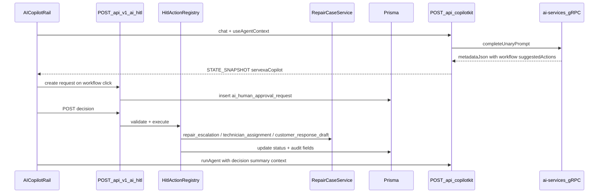

# Phase 2 — Human-in-the-Loop Implementation Plan

## Context (from codebase + your choices)

**Phase 1 foundation (done):** CopilotKit rail (`operations_intelligence`), unary gateway at [`apps/server/src/modules/copilotkit/servexa-unary-gateway.agent.ts`](apps/server/src/modules/copilotkit/servexa-unary-gateway.agent.ts), shared rail schemas in [`packages/ai-contracts/src/copilot-response.ts`](packages/ai-contracts/src/copilot-response.ts), web rail in [`apps/web/src/features/ai-copilot/`](apps/web/src/features/ai-copilot/).

**Phase 2 gaps (confirmed by search):** No HITL schemas, APIs, UI, or persistence; suggested actions are prompt-only ([`suggested-actions.tsx`](apps/web/src/features/ai-copilot/components/suggested-actions.tsx)); operational context is mostly `null` ([`use-operational-context.ts`](apps/web/src/features/ai-copilot/hooks/use-operational-context.ts)); CopilotKit route is unauthenticated and uses placeholder `userId: "copilot-user"` in the gateway.

**Your decisions:**
- **Persistence:** Prisma table(s) + migration (not in-memory)
- **Execution:** Real domain hooks for all three workflows (escalation, technician assign, customer draft)
- **ai-services:** Changes driven by the HITL **event contract** in `packages/event-contracts` (not LangGraph interrupts)

**Explicitly out of scope (per proposal):** `useInterrupt` / LangGraph checkpoint resume, autonomous multi-agent orchestration, auto-send customer messages, arbitrary LLM tool execution.

---

## Target architecture



**Safety invariant:** AI proposes → human decides via REST → server registry executes → audit logged. Frontend never calls domain mutation APIs for AI-suggested workflows directly.

---

## Prerequisite fix: CopilotKit `ERR_HTTP_HEADERS_SENT`

Logs show double `res.end` wrappers conflicting with CopilotKit’s fetch bridge after a **200** response.

- Harden [`apps/server/src/middlewares/request-context.middleware.ts`](apps/server/src/middlewares/request-context.middleware.ts): ensure **both** `requestContextMiddleware` and `requestLoggingMiddleware` never call `setHeader` when `res.headersSent` (logging wrapper currently only wraps `end`, which is fine; verify deployed code matches the guarded version).
- Consider **skipping** `X-Response-Time` mutation for streaming paths (`/api/copilotkit`) if errors persist.

This is a small, isolated change before HITL work so rail streaming stays stable during demos.

---

## Track 0 — Auth + user context for HITL audit

| Area | Change |
|------|--------|
| Web | Pass `Authorization: Bearer <token>` (and optional `X-Request-ID`) on `CopilotKitProvider` via `headers` prop in [`authenticated-copilot-providers.tsx`](apps/web/src/features/ai-copilot/authenticated-copilot-providers.tsx) using existing auth store |
| Server | Mount `authenticateMiddleware` on `/api/copilotkit` **or** validate JWT inside a thin wrapper around `createCopilotExpressHandler` |
| Gateway | Replace hard-coded `userId: "copilot-user"` with `req.user.id`, `tenantId`, `role` when calling [`completeUnaryPrompt`](apps/server/src/modules/v1/ai/runtime/ai-completion-runtime.ts) |

Without this, Prisma `created_by_user_id` / RBAC checks on HITL will be unreliable.

---

## Track 1 — Shared contracts

### [`packages/ai-contracts`](packages/ai-contracts)

Add [`packages/ai-contracts/src/hitl.ts`](packages/ai-contracts/src/hitl.ts) per proposal:

- `hitlRequestStatusSchema`, `hitlActionKindSchema`, `hitlApprovalOptionSchema`, `hitlRequestSchema`, `hitlDecisionSchema`
- Payload schemas per kind (narrow Zod objects for `repair_escalation`, `technician_assignment`, `customer_response_draft`)

Extend [`copilot-response.ts`](packages/ai-contracts/src/copilot-response.ts):

```ts
copilotSuggestedActionSchema.extend({
  kind: z.enum(["prompt", "workflow"]).default("prompt"),
  workflowKind: hitlActionKindSchema.optional(),
  requiresApproval: z.boolean().default(false),
  payload: z.record(z.string(), z.unknown()).optional(),
});
copilotRailMetadataSchema.extend({
  pendingApprovals: z.array(hitlRequestSchema).optional(),
});
```

Update [`normalize-unary.ts`](packages/ai-contracts/src/normalize-unary.ts):

- Parse `meta.copilot.suggestedActions` with backward-compatible defaults (`kind: "prompt"` when absent)
- Add **heuristic workflow actions** for `route === "operations"` (e.g. escalation / assign / draft) when AI does not yet return structured workflow actions

Export from [`packages/ai-contracts/src/index.ts`](packages/ai-contracts/src/index.ts).

### [`packages/event-contracts`](packages/event-contracts)

Add HITL event envelope(s) in [`packages/event-contracts/src/index.ts`](packages/event-contracts/src/index.ts) (or `hitl-events.ts`):

| Event | Purpose |
|-------|---------|
| `hitl.request.created` | Audit + optional async fan-out |
| `hitl.request.decided` | Carries `HitlDecision` |
| `hitl.action.executed` / `hitl.action.failed` | Post-execution telemetry |

Shape (example):

```ts
hitlEventEnvelopeSchema = z.object({
  version: z.literal("1.0"),
  event: z.enum([...]),
  requestId: z.string(),
  tenantId: z.string(),
  userId: z.string(),
  kind: hitlActionKindSchema,
  payload: z.record(z.string(), z.unknown()),
  traceId: z.string().optional(),
  createdAt: z.string(),
});
```

These schemas are the **contract boundary** for ai-services changes (publish/subscribe or log-only in Phase 2).

---

## Track 2 — Prisma persistence

Add model file e.g. [`packages/db/prisma/schema/models/ai-hitl.prisma`](packages/db/prisma/schema/models/ai-hitl.prisma):

**`AiHumanApprovalRequest`** (`@@map("ai_human_approval_request")`):

- `id`, `kind`, `status`, `title`, `description`
- `payloadJson`, `decisionJson` (nullable)
- `riskLevel`, `confidence`
- `repairCaseId` (nullable FK/index for access checks)
- `createdByUserId`, `decidedByUserId`
- `createdAt`, `decidedAt`, `executedAt`
- `errorMessage`

**`AiCustomerResponseDraft`** (`@@map("ai_customer_response_draft")`) for `customer_response_draft` execution (no auto-send):

- `id`, `repairCaseId`, `body`, `status` (`draft` | `archived`)
- `hitlRequestId` (unique), `createdByUserId`, timestamps

Run `pnpm db:migrate` from repo root after schema review.

---

## Track 3 — Server HITL module

New files under [`apps/server/src/modules/v1/ai/`](apps/server/src/modules/v1/ai/):

| File | Responsibility |
|------|----------------|
| `schemas/hitl.schema.ts` | Request/response Zod (import from `ai-contracts`) |
| `repositories/hitl-request.repository.ts` | Prisma CRUD + pending list by user/tenant |
| `hitl-action-registry.ts` | Allowlisted handlers only |
| `hitl/handlers/repair-escalation.handler.ts` | `RepairCaseService.update` → `priority: urgent`, optional `repairNotes` append, field history via existing update path |
| `hitl/handlers/technician-assignment.handler.ts` | `assignedTechnicianId` + `technicianName` via [`RepairCaseRepository.update`](apps/server/src/modules/v1/asc-center/repositories/repair-case.repository.ts) |
| `hitl/handlers/customer-response-draft.handler.ts` | Insert `AiCustomerResponseDraft` only |
| `services/hitl.service.ts` | State machine, policy checks, registry dispatch, audit |
| `controllers/hitl.controller.ts` | HTTP layer |
| `router/hitl.route.ts` | Routes |

Mount on [`route.ts`](apps/server/src/modules/v1/ai/router/route.ts):

```http
POST   /api/v1/ai/hitl/requests
GET    /api/v1/ai/hitl/requests?status=pending
GET    /api/v1/ai/hitl/requests/:id
POST   /api/v1/ai/hitl/requests/:id/decision
```

All routes: `authenticateMiddleware` + `requirePermissions` per kind (proposal mapping):

- `repair_escalation` → `repair_case:update`
- `technician_assignment` → `repair_case:assign` (confirm exact permission key in identity matrix; align with existing repair-case routes)
- `customer_response_draft` → `customer_response:create` (or nearest existing permission)

**State machine** (strict): `pending → approved → executed | failed`; `pending → rejected | edited → approved → executed`; `pending → expired` (TTL job optional later).

**Audit:** Extend [`ai-audit.ts`](apps/server/src/modules/v1/ai/governance/ai-audit.ts) with `hitl.*` events; include `userId`, `requestId`, `kind`, `repairCaseId`, before/after payload snippets.

**Copilot rail metadata (optional enhancement):** After HITL create/list, gateway or a small helper can attach `pendingApprovals` to `STATE_SNAPSHOT` in [`servexa-unary-gateway.agent.ts`](apps/server/src/modules/copilotkit/servexa-unary-gateway.agent.ts) by querying pending requests for `req.user.id` (requires auth on copilot route).

**Redis (optional Phase 2):** Publish `hitlEventEnvelope` on create/decide/execute for observability; not required for synchronous demo path.

---

## Track 4 — Web HITL UI + wiring

### Components ([`apps/web/src/features/ai-copilot/components/`](apps/web/src/features/ai-copilot/components/))

- `hitl-approval-card.tsx` — title, description, risk, confidence, entity label, evidence links, Approve / Reject / Edit
- `hitl-approval-list.tsx` — maps pending requests
- `hitl-edit-payload-dialog.tsx` — edit reason / technician override / draft text
- `hitl-decision-result.tsx` — executed/failed feedback

Use existing [`packages/ui`](packages/ui) `Button`, `Collapsible`, dialog patterns from evidence panel for visual consistency ([building-components](.agents/skills/building-components/SKILL.md)).

### Hook

[`hooks/use-hitl-requests.ts`](apps/web/src/features/ai-copilot/hooks/use-hitl-requests.ts):

- `useQuery` / `useMutation` against `/api/v1/ai/hitl/*` (match existing web API client patterns)
- State: `pending`, `decided`, `isSubmitting`, `error`
- `submitDecision(requestId, HitlDecision)`

### Rail layout ([`ai-copilot-rail.tsx`](apps/web/src/features/ai-copilot/ai-copilot-rail.tsx))

Reorder per proposal:

1. Chat (`ServexaCopilotChat`)
2. **Pending approvals** (`HitlApprovalList`)
3. Suggested actions
4. Evidence

### Suggested actions ([`suggested-actions.tsx`](apps/web/src/features/ai-copilot/components/suggested-actions.tsx))

```ts
if (action.kind === "workflow" || action.requiresApproval) {
  createHitlRequest({ kind: action.workflowKind, payload: action.payload, ... });
} else {
  dispatchCopilotActionPrompt(action.action);
}
```

### Chat continuation (Step 14)

After successful decision, dispatch continuation prompt (existing quick-prompt event or direct `agent.addMessage` + `copilotkit.runAgent`):

> The user approved `repair_escalation` for case RC-291. Summarize the outcome and suggest the next step.

Include `decisionResult` in `useAgentContext` for one run.

### Operational context (Phase 1 gap)

There is **no repair-case detail route** today—only list at [`repair-cases-management`](apps/web/src/routes/_authenticated/(GENERAL)/repair-cases-management/index.tsx).

Implement:

- [`context/operational-context-provider.tsx`](apps/web/src/features/ai-copilot/context/operational-context-provider.tsx) + React context
- Wire **repair-cases-management** table row selection / action dialog to `setOperationalContext({ repairCaseId, customerId, technicianId, productModel, warrantyStatus })`
- Update [`use-operational-context.ts`](apps/web/src/features/ai-copilot/hooks/use-operational-context.ts) to read provider + route

This unblocks context-aware approval cards (“RC-291”, not generic “Approve escalation”).

### Performance ([vercel-react-best-practices](.claude/skills/vercel-react-best-practices/SKILL.md))

- Keep `React.lazy` for rail (already in layout)
- Memoize `HitlApprovalCard` with stable props; avoid inline component definitions in list render

### Message feedback persistence (stretch)

If time permits: POST thumbs to a small `/api/v1/ai/feedback` or attach to HITL audit; replace local-only [`use-copilot-message-feedback.ts`](apps/web/src/features/ai-copilot/hooks/use-copilot-message-feedback.ts).

---

## Track 5 — ai-services alignment (event contract driven)

**No LangGraph `interrupt()` in Phase 2.** Changes limited to metadata + optional event emission:

| File | Change |
|------|--------|
| [`apps/ai-services/src/modules/v1/grpc/grpc_bridge_service.py`](apps/ai-services/src/modules/v1/grpc/grpc_bridge_service.py) (or coordinator output builder) | Include `copilot` object in `metadata_json`: `suggestedActions` with `kind: "workflow"`, `workflowKind`, `payload` seeded from `execution_context_json` (repair case id, route) |
| [`coordinator_service.py`](apps/ai-services/src/modules/v1/agents/services/coordinator_service.py) | Read `execution_context` keys (log → use for routing copy and payload defaults) |
| New small module e.g. `hitl_event_publisher.py` | Validate envelope against shared Zod-equivalent (Pydantic models mirroring `packages/event-contracts`) and publish to Redis stream **or** log structured event for Node to persist |

Python does **not** execute domain mutations; it only proposes structured workflow actions compatible with [`packages/ai-contracts`](packages/ai-contracts).

Node remains execution authority via HITL registry.

---

## Track 6 — Testing

| Layer | Tests |
|-------|--------|
| `packages/ai-contracts` | Schema parse, suggested-action backward compat, state transition helpers |
| `apps/server` | Registry rejects unknown kind; permission denied; happy path create → approve → execute for each handler (integration with test DB or prisma test utils) |
| `apps/web` | Approval card renders; approve calls API; reject captures reason; prompt actions unchanged |

---

## Implementation order

1. Prerequisite: CopilotKit headers + auth headers on provider
2. `ai-contracts` HITL + extended suggested action / rail metadata
3. `event-contracts` HITL envelopes
4. Prisma models + migration
5. Server HITL module + registry + three real handlers
6. Mount routes; wire audit
7. Web hook + approval UI + suggested-actions branch
8. Operational context provider + repair-cases-management integration
9. ai-services metadata + optional Redis HITL events
10. Gateway: real user context + optional `pendingApprovals` in snapshot
11. Tests + manual demo script

---

## Demo success criteria

1. User on repair-cases page with a selected case sees operational context in rail header.
2. AI returns a **workflow** suggested action (from Python metadata or heuristic).
3. Click creates a **pending** Prisma HITL request; approval card shows case-specific title.
4. **Approve** runs real domain mutation (priority/technician/draft table) and records audit.
5. Chat re-runs and summarizes outcome; request moves to `executed`.
6. **Reject** / **Edit** paths work; no auto-send of customer messages.

---

## Risks / notes

- **Permission keys** must be verified against the identity permission matrix before wiring `requirePermissions`.
- **Escalation** may map to `RepairCasePriority.urgent` + notes until a dedicated escalation field exists—document in handler.
- **Repair case access control** must mirror existing `RepairCaseController` checks (tenant/ASC scope) inside HITL service before execute.
- **CopilotKit `useInterrupt`** deferred; REST HITL is the Phase 2 UX path per proposal and [copilotkit-develop](.claude/skills/copilotkit-develop/SKILL.md) guidance.
