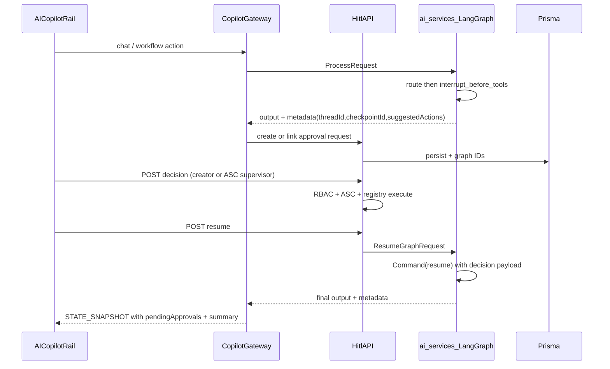

# Phase 2 HITL — Complete Checklist to Done

## User decisions (locked in)

| Decision | Choice |
|----------|--------|
| LangGraph | **Full** interrupt, Postgres checkpoint, Prisma graph IDs, `POST /resume`, proto/worker resume |
| Approvers | **Both**: creator always; supervisors with action permission + same ASC can approve others’ requests |

## Current baseline

~70% of checklist is done. Gaps cluster into: **security/policy**, **LangGraph runtime**, **gateway snapshot**, **web polish**, **tests**, **schema/indexes**.

Reference status tables: [phase_2_hitl_production_checklist_md.md](phase_2_hitl_production_checklist_md.md) lines 13–57.

---

## Target end-to-end flow



---

## Workstream 1 — Prisma and repository (Areas 2–3)

**Schema** — extend [packages/db/prisma/schema/models/ai-hitl.prisma](packages/db/prisma/schema/models/ai-hitl.prisma):

- Add `langGraphThreadId`, `langGraphRunId`, `langGraphCheckpointId` (nullable strings).
- Add indexes: `@@index([status])`, `@@index([kind])`, `@@index([createdAt])` (keep existing composite indexes).
- Optional FK: `repairCaseId` → `RepairCase.id` (onDelete SetNull) for integrity.
- New migration (resolve drift: baseline from [migrations/20260516012000_add_ai_hitl](packages/db/prisma/migrations/20260516012000_add_ai_hitl/) then `pnpm db:migrate`).

**Repository** — refactor [hitl-request.repository.ts](apps/server/src/modules/v1/ai/repositories/hitl-request.repository.ts):

- Add `IHitlRequestRepository` interface (match `ITechnicianRepository` pattern under `human-resources/interfaces/`).
- Rename implementation to `PrismaHitlRequestRepository` (or keep class, implement interface).
- Explicit methods: `saveDecision()`, `markExecuted()`, `markFailed()`, `updateCheckpoint()`, `listPendingForUser()` (creator + supervisor queue).
- Add `expireStalePending()` cron-ready helper for `pending → expired` (TTL configurable via env).

**Contracts** — extend [packages/ai-contracts/src/hitl.ts](packages/ai-contracts/src/hitl.ts) + `hitlRequestSchema` with optional graph ID fields; bump proto `request_version` handling if needed.

---

## Workstream 2 — Server RBAC, ASC scope, approver queue (Areas 4, 7)

**Permission map** (new `hitl-permissions.ts`):

```ts
repair_escalation → repair_case.update
technician_assignment → repair_case.assign
customer_response_draft → customer_response.create
```

Wire [require-permission.middleware.ts](apps/server/src/middlewares/require-permission.middleware.ts) on [hitl.route.ts](apps/server/src/modules/v1/ai/router/hitl.route.ts):

- `authenticateMiddleware` → `resolvePermissions` → route-level `requirePermissions` (create: any of workflow permissions; list/get: authenticated).

**Service policy** — [hitl.service.ts](apps/server/src/modules/v1/ai/services/hitl.service.ts):

- Replace `userCanActOnHitl` with:
  - **Creator path**: `createdByUserId === user.id`
  - **Supervisor path**: has `KIND_PERMISSIONS[kind]` AND `assertRepairCaseAscAccess(user, repairCaseId)`
- `assertRepairCaseAscAccess`: load `RepairCase.ascCenterId`; if `user.roleScope === 'asc_center'`, require `user.ascCenterId === repairCase.ascCenterId`; HQ/admin wildcard bypass.
- Enforce same checks on **create**, **get**, **decision**, **resume**.

**List API**: extend `GET /requests` to return pending for current user **or** ASC-scoped queue when caller has supervisor permissions (query param `scope=mine|asc|all` with RBAC gates).

---

## Workstream 3 — Workflow handlers hardening (Area 6)

| Handler | File | Completion work |
|---------|------|-----------------|
| Repair escalation | [repair-escalation.handler.ts](apps/server/src/modules/v1/ai/hitl/handlers/repair-escalation.handler.ts) | Re-check ASC on execute; write `RepairCaseStatusHistory` / field history for escalation (not only `priority` + notes); call `RepairCaseService.update` |
| Technician assignment | [technician-assignment.handler.ts](apps/server/src/modules/v1/ai/hitl/handlers/technician-assignment.handler.ts) | Resolve `TechnicianProfile` via [technician.service.ts](apps/server/src/modules/v1/human-resources/services/technician.service.ts); validate `isAvailable`, `maxConcurrentCases`, ASC alignment; map `technicianId` to profile id consistently |
| Customer draft | [customer-response-draft.handler.ts](apps/server/src/modules/v1/ai/hitl/handlers/customer-response-draft.handler.ts) | ASC scope re-check; keep no auto-send |

Extract shared `assertRepairCaseAccess(user, repairCaseId)` in `hitl/policy/repair-case-access.ts`.

---

## Workstream 4 — Full LangGraph HITL (Areas 9, 16, AI Services deliverables)

**Dependencies** — add `langgraph-checkpoint-postgres` to [apps/ai-services/requirements.txt](apps/ai-services/requirements.txt); configure `PostgresSaver` using same `DATABASE_URL` (or dedicated checkpointer schema).

**Graph** — refactor [coordinator_service.py](apps/ai-services/src/modules/v1/agents/services/coordinator_service.py):

- Compile graph **once** (module singleton) with `checkpointer=PostgresSaver(...)`.
- `configurable.thread_id` = `job_id` or generated `hitl-{uuid}`.
- Add `approval_gate` node after `route`, **before** `supply_chain` / `operations`:
  - Use `interrupt()` (or `interrupt_before` on tool nodes) when `execution_context` indicates workflow / `requiresApproval`.
  - Persist proposed action in graph state.
- On interrupt completion, return structured state: `status: awaiting_approval`, `proposed_action`, `thread_id`, `checkpoint_id`.

**Bridge** — [grpc_bridge_service.py](apps/ai-services/src/modules/v1/grpc/services/grpc_bridge_service.py):

- Detect interrupt in `coordinator.run` result; populate metadata:
  - `human_approval_required`, `thread_id`, `run_id`, `checkpoint_id`, `copilot.suggestedActions`
- Wire [publish_hitl_event_log](apps/ai-services/src/modules/v1/hitl/copilot_metadata.py) → Redis/event-contracts publish (align [hitl-events.ts](packages/event-contracts/src/hitl-events.ts)).

**Proto** — extend [ai_service.proto](packages/proto/ai/v1/ai_service.proto):

```protobuf
rpc ResumeGraph(ResumeGraphInput) returns (ProcessRequestOutput);

message ResumeGraphInput {
  string thread_id = 1;
  string checkpoint_id = 2;
  string approval_request_id = 3;
  string decision_json = 4;  // approved payload + decision type
}
```

Regenerate TS/Python stubs; add gRPC handler in ai-services; Node client in `apps/server` AI module.

**Resume path** — new `POST /api/v1/ai/hitl/requests/:id/resume`:

- Validates request is `approved` and has graph IDs.
- Calls `ResumeGraph` with `decisionJson`.
- Updates status → `executed` / `failed`; emits `hitl.graph.resumed` audit event.
- Returns agent output for gateway to stream.

**Policy note**: Update [documents/ai-runtime-policy.md](documents/ai-runtime-policy.md) with a scoped exception: HITL checkpoints are allowlisted durable state (not general conversational memory).

---

## Workstream 5 — Copilot gateway and metadata (Areas 10, 15)

**Gateway** — [servexa-unary-gateway.agent.ts](apps/server/src/modules/copilotkit/servexa-unary-gateway.agent.ts):

- After unary completion (and on rail refresh hook): `HitlService.listPendingForUser()` → set `rail.pendingApprovals`.
- On `human_approval_required` metadata from Python: auto-create HITL request (link graph IDs) if not already created for `thread_id`.
- Pass `thread_id` / `checkpoint_id` into `execution_context_json` on subsequent turns.

**Normalization** — [normalize-unary.ts](packages/ai-contracts/src/normalize-unary.ts):

- Parse LangGraph interrupt fields from `metadata_json`.
- `toRailMetadata()` includes `pendingApprovals`, `workflowExecutionStatus`, `lastDecision` when present.
- Add `normalizeLangGraphHitlMetadata()` helper.

**Audit** — ensure `hitl.graph.resumed` in [hitl-event-publisher.ts](apps/server/src/modules/v1/ai/governance/hitl-event-publisher.ts) on resume success/failure.

---

## Workstream 6 — Frontend completion (Areas 11–14)

**New files**:

- [hitl-status-badge.tsx](apps/web/src/features/ai-copilot/components/hitl-status-badge.tsx) — maps `HitlRequestStatus` to badge variants.
- [use-hitl-decision.ts](apps/web/src/features/ai-copilot/hooks/use-hitl-decision.ts) — extract approve/reject/edit + `submitDecision` from [use-hitl-requests.ts](apps/web/src/features/ai-copilot/hooks/use-hitl-requests.ts).
- [use-hitl-pending-count.ts](apps/web/src/features/ai-copilot/hooks/use-hitl-pending-count.ts) — `{ count, pending, refresh }`; use in [copilot-rail-header.tsx](apps/web/src/features/ai-copilot/components/copilot-rail-header.tsx).

**Rail** — [ai-copilot-rail.tsx](apps/web/src/features/ai-copilot/ai-copilot-rail.tsx):

- Prefer gateway `pendingApprovals`; keep REST poll as fallback.
- After decision: call `POST .../resume` when graph IDs present, else existing `runAgent` continuation.
- Retry on HITL API errors; optional optimistic UI for create/decision.

**Operational context**:

- Add route `repair-cases-management/$repairCaseId` (or `?caseId=`) with loader syncing [operational-context-provider.tsx](apps/web/src/features/ai-copilot/context/operational-context-provider.tsx).
- Wire [payment-pending-repair-cases](apps/web/src/routes) selection similarly.
- Split thin wrappers: `repair-case-context.tsx`, `selected-entity-context.tsx` re-exporting operational provider slices (satisfies checklist file names without duplicating state).

**API client** — [apps/web/src/libs/api/ai/hitl/api.ts](apps/web/src/libs/api/ai/hitl/api.ts): add `resumeRequest(id)`.

---

## Workstream 7 — Testing (Area 17)

| Layer | Tests to add |
|-------|----------------|
| `packages/ai-contracts` | Graph metadata parsing; extended `hitlRequestSchema` |
| `apps/server` | `hitl.service.test.ts` (RBAC, ASC, approver paths); supertest integration for create/approve/reject/execute/resume; handler tests with mocked `TechnicianService` |
| `apps/web` | Add vitest to [apps/web/package.json](apps/web/package.json); RTL tests for badge, approval card, `use-hitl-decision` |
| `apps/ai-services` | pytest: coordinator interrupt returns awaiting_approval; resume with `Command` |

CI: add `pnpm turbo -F server test` / `-F web test` / ai-services pytest to pipeline if not present.

---

## Workstream 8 — Checklist sign-off

After implementation, re-scan repo and update [phase_2_hitl_production_checklist_md.md](phase_2_hitl_production_checklist_md.md):

- Set all summary rows to **Done | 100%**.
- Flip every `- [ ]` to `- [x]` with brief evidence note.
- Remove or archive the “Production gaps” table (or mark all resolved).
- Re-run documented test commands and record pass counts in “Tests run during scan”.

---

## Suggested implementation order (minimizes rework)

1. Prisma + repository interface + contracts (graph ID fields)
2. RBAC/ASC/approver queue + handler hardening
3. Proto + resume RPC + Python checkpointer/interrupt
4. Server `POST /resume` + gateway snapshot + auto-persist
5. Web hooks/components + route context + resume UX
6. Tests (unit → integration → web)
7. Checklist 100% update + ai-runtime-policy amendment

**Estimated effort**: ~3–4 engineer-weeks (LangGraph + proto + dual approver queue is the bulk).

---

## Risks and mitigations

| Risk | Mitigation |
|------|------------|
| Sync gRPC blocks on long approval waits | Graph must **return immediately** on `interrupt()`; never hold unary call open |
| Migration drift from prior `db:push` | `prisma migrate diff` + baseline resolve before new migration |
| Permission keys not seeded | Add seed entries for `repair_case.update`, `repair_case.assign`, `customer_response.create` in identity seed/migration |
| `technicianId` ambiguity | Document + validate as `TechnicianProfile.id`; reject unknown IDs with `TECHNICIAN_NOT_FOUND` |
