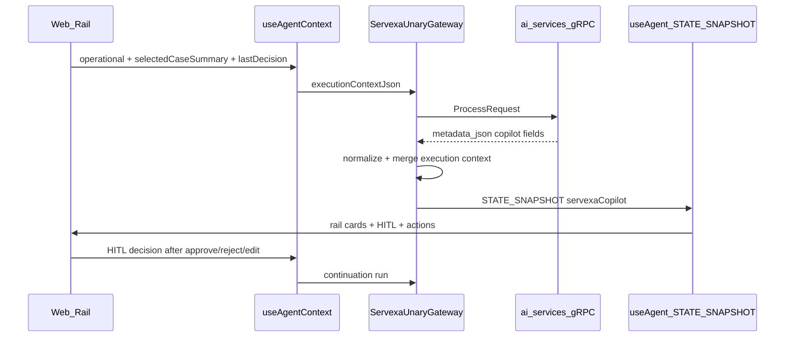

# Phase 3 — Shared State Implementation Plan

## Goal

Turn the copilot rail from **one-way context + text** into a **schema-driven agentic UI** where:

**In scope:** 8 shared states from [phase_3_shared_state_plan_servexa.md](phase_3_shared_state_plan_servexa.md). **Out of scope:** `STATE_DELTA`, LangGraph subgraph streaming, DB persistence of rail state, `warranty_exception` as executable workflow (your choice: **prompt-only**).

---

## Current baseline (verified in repo)

| Layer                        | What exists                                                                                                                                                                                                                                                                                                                                                                             | Gap                                                                   |
| ---------------------------- | --------------------------------------------------------------------------------------------------------------------------------------------------------------------------------------------------------------------------------------------------------------------------------------------------------------------------------------------------------------------------------------- | --------------------------------------------------------------------- |
| Web                          | `[use-operational-context.ts](apps/web/src/features/ai-copilot/hooks/use-operational-context.ts)`, `[use-servexa-copilot-panel.ts](apps/web/src/features/ai-copilot/hooks/use-servexa-copilot-panel.ts)` (`useAgentContext`), `[use-servexa-copilot-rail-metadata.ts](apps/web/src/features/ai-copilot/hooks/use-servexa-copilot-rail-metadata.ts)` (`useAgent` reads `servexaCopilot`) | No Phase 3 cards; no stale-state reset                                |
| Server                       | `[servexa-unary-gateway.agent.ts](apps/server/src/modules/copilotkit/servexa-unary-gateway.agent.ts)` emits `STATE_SNAPSHOT` only; `[flatten-copilot-context.ts](apps/server/src/utils/flatten-copilot-context.ts)`                                                                                                                                                                     | No `selectedCaseSummary` merge; `tenantId: ""` (unchanged this phase) |
| ai-services                  | `[copilot_metadata.py](apps/ai-services/src/modules/v1/hitl/copilot_metadata.py)` — `suggestedActions` only                                                                                                                                                                                                                                                                             | No `warrantyEligibility`, `diagnosisDraft`, evidence                  |
| Contracts                    | `[copilot-response.ts](packages/ai-contracts/src/copilot-response.ts)` — rail has sources/actions/HITL                                                                                                                                                                                                                                                                                  | Four new schemas missing                                              |
| proto / db / event-contracts | Opaque JSON carriers + HITL tables/events                                                                                                                                                                                                                                                                                                                                               | **No changes required** for Phase 3 MVP                               |

---

## Architecture decisions

1. **Single source of truth for rail UI:** `agent.state.servexaCopilot` (`CopilotRailMetadata`), validated via Zod at normalize time—not ad-hoc React-only copies for agent-produced fields.
2. **Immediate case card:** Also read `operational.repairCaseSnapshot` / normalized `selectedCaseSummary` from operational context **before** first agent run (plan Step 1 + better UX).
3. **Unary snapshot is enough:** Keep fake text chunking in gateway; defer `STATE_DELTA` to Phase 4/5 (plan Risk 5).
4. **Diagnosis (your choice):** Gemini/LLM emits structured `diagnosisDraft` → Zod validate → heuristic fallback from `errorPhenomena` if invalid/missing.
5. **Warranty eligibility MVP:** Deterministic rules in Python (and/or server fallback) before LLM-only logic.
6. **workflowProgress:** Derived on **web** from rail signals (plan Step 8); optionally echo in metadata later—not required from Python for DoD.
7. **Stale state control:** When `repairCaseId` changes, clear agent-dependent rail slices (`warrantyEligibility`, `diagnosisDraft`, `suggestedActions`, `workflowProgress`); scope `lastDecision` to same case (plan Risk 2).

---

## Implementation order

Follow the plan doc’s recommended sequence; do **not** introduce a generic state-manager refactor.

### 1. Contract foundation — `[packages/ai-contracts](packages/ai-contracts)`

**Files:** `[copilot-response.ts](packages/ai-contracts/src/copilot-response.ts)`, `[index.ts](packages/ai-contracts/src/index.ts)`, new `[copilot-response.test.ts](packages/ai-contracts/src/copilot-response.test.ts)`, `[normalize-unary.ts](packages/ai-contracts/src/normalize-unary.ts)`

- Add Zod schemas (all fields optional on rail):
  - `selectedCaseSummarySchema`
  - `warrantyEligibilitySchema`
  - `diagnosisDraftSchema`
  - `workflowProgressSchema`
- Extend `copilotRailMetadataSchema` with the four optional fields (keep existing `workflowExecutionStatus` separate from `workflowProgress`).
- Export inferred types from `index.ts`.
- Add helpers:
  - `parseSelectedCaseSummaryFromExecutionContext(flat: Record<string, unknown>)`
  - `parseDiagnosisDraft(raw)` with safe strip
  - `buildHeuristicDiagnosisDraft(snapshot)` for fallback
- Update `toRailMetadata()` / `normalizeUnaryToCopilotResponse()` to pass through parsed Phase 3 fields from `metadata_json.copilot` and merge `selectedCaseSummary` from execution context when absent in AI output.
- Unit tests: valid/invalid enums, missing optionals, backward compatibility with existing rail payloads.

### 2. UI → Agent: normalize selected case

**Files:** `[repair-cases-table.tsx](apps/web/src/features/(GENERAL)`/repair-cases-management/components/repair-cases-table.tsx), `[use-operational-context.ts](apps/web/src/features/ai-copilot/hooks/use-operational-context.ts)`, `[use-servexa-copilot-panel.ts](apps/web/src/features/ai-copilot/hooks/use-servexa-copilot-panel.ts)`

- Add `toSelectedCaseSummary(repairCaseSnapshot | operational)` using contract type (import from `@servexa-warranty-ai/ai-contracts`).
- Ensure row selection sets complete snapshot (already largely done); null-safe when no selection.
- Include `selectedCaseSummary` inside operational `useAgentContext` payload (or dedicated context entry) so server flattening sees stable field names.
- On `repairCaseId` change: reset local “continuation” state and rely on next `STATE_SNAPSHOT` for agent fields; document that rail meta from prior case must not display (clear via run or explicit reset hook in `use-servexa-copilot-rail-metadata` when operational id changes).

### 3. Backend metadata mapper

**Server files:** `[servexa-unary-gateway.agent.ts](apps/server/src/modules/copilotkit/servexa-unary-gateway.agent.ts)`, `[normalize-copilot-unary-completion.ts](apps/server/src/modules/copilotkit/normalize-copilot-unary-completion.ts)`

**Python files:** `[copilot_metadata.py](apps/ai-services/src/modules/v1/hitl/copilot_metadata.py)`, `[copilot_reply_service.py](apps/ai-services/src/modules/v1/agents/services/copilot_reply_service.py)` (prompt + parse LLM JSON block if used)

- **Always merge** `selectedCaseSummary` from flattened execution context into rail metadata before `STATE_SNAPSHOT` (minimum backend behavior per plan Step 3).
- **Warranty eligibility:** Add `build_warranty_eligibility(execution_ctx)` in Python with MVP rules (`warrantyForm` / `warrantyServiceType` → eligible / not_eligible / unknown + reason + confidence).
- **Diagnosis draft:** Extend Gemini/copilot reply to request JSON field `diagnosisDraft`; validate in Python or defer validation to Node `normalize-unary` using shared contract shapes; on failure call heuristic builder from snapshot fields.
- **Evidence:** Map existing sources if present in metadata; optional stub policy/repair_case sources from case id for demo.
- Keep `build_copilot_envelope()` aligned with `[hitlActionKindSchema](packages/ai-contracts/src/hitl.ts)` allowlist.

**Acceptance:** Invalid metadata never crashes gateway; unknown keys stripped by Zod.

### 4. Agent → UI: rail cards (React)

**New components** under `[apps/web/src/features/ai-copilot/components/](apps/web/src/features/ai-copilot/components/)`:

| Component                       | Data source                                                             |
| ------------------------------- | ----------------------------------------------------------------------- |
| `selected-repair-case-card.tsx` | `operational.selectedCaseSummary` **or** `railMeta.selectedCaseSummary` |
| `warranty-eligibility-card.tsx` | `railMeta.warrantyEligibility`                                          |
| `diagnosis-draft-card.tsx`      | `railMeta.diagnosisDraft`                                               |
| `workflow-progress-card.tsx`    | `deriveWorkflowProgress(railMeta, operational)`                         |

**Update:** `[servexa-copilot-side-panels.tsx](apps/web/src/features/ai-copilot/components/servexa-copilot-side-panels.tsx)` — render cards **above** HITL list when data exists; conditional render only (Vercel: `rerender-derived-state`, avoid extra subscriptions).

**UI patterns:**

- Use existing shadcn/ui from `@servexa-warranty-ai/ui`; match `[EvidencePanel](apps/web/src/features/ai-copilot/components/evidence-panel.tsx)` / HITL card density.
- Hide empty optional fields; support `eligible` / `not_eligible` / `unknown`.
- Extract static labels outside components where trivial (`rendering-hoist-jsx`).

**New util:** `apps/web/src/features/ai-copilot/lib/derive-workflow-progress.ts` — implement plan Step 8 signal table (`selectedCaseSummary`, `warrantyEligibility`, `diagnosisDraft`, `suggestedActions`, `pendingApprovals`, `lastDecision`, `workflowExecutionStatus`).

### 5. Suggested actions hardening

**Files:** `[suggested-actions.tsx](apps/web/src/features/ai-copilot/components/suggested-actions.tsx)`, `[build-hitl-request.ts](apps/web/src/features/ai-copilot/lib/build-hitl-request.ts)`, `[copilot_metadata.py](apps/ai-services/src/modules/v1/hitl/copilot_metadata.py)`

- Centralize **executable** workflow allowlist: `repair_escalation`, `technician_assignment`, `customer_response_draft`.
- `warranty_exception`: **prompt-only** — show in quick prompts if needed, but `kind: "workflow"` + `requiresApproval` must not create HITL for this kind.
- Ensure workflow payloads always include `repairCaseId` (+ `caseNumber` when available).
- Disable or downgrade unsupported actions to `kind: "prompt"` in UI when rail returns unknown `workflowKind`.

### 6. HITL continuation polish (P1)

**Files:** `[use-hitl-decision.ts](apps/web/src/features/ai-copilot/hooks/use-hitl-decision.ts)`, `[use-servexa-copilot-panel.ts](apps/web/src/features/ai-copilot/hooks/use-servexa-copilot-panel.ts)`, optional `last-decision-summary-card.tsx`

- Enrich `useAgentContext` last-decision blob: `requestId`, `kind`, `decision`, `status`, `repairCaseId`, short `summary`.
- After approve/reject/edit: keep `runContinuation()` but ensure operational context includes decision before next run.
- Optionally surface `railMeta.lastDecision` + local decision in a small summary card.
- Server: when normalizing, map latest HITL decision into `lastDecision` on rail if same `repairCaseId` (today only partial).

### 7. Tests and verification

| Area      | Action                                                                                             |
| --------- | -------------------------------------------------------------------------------------------------- |
| Contracts | `copilot-response.test.ts` (required)                                                              |
| Server    | Extend or add test for merge of `selectedCaseSummary` in normalize path                            |
| Python    | Tests for `build_warranty_eligibility`, diagnosis heuristic fallback                               |
| Web       | Light component tests for cards (empty arrays, unknown warranty status) — only high-value cases    |
| Manual    | Plan §6.4 checklist: select case → analyze prompt → cards → escalate HITL → approve → continuation |

**Commands (from repo root):** `pnpm check-types`, package-level tests for `@servexa-warranty-ai/ai-contracts`, `pytest` in ai-services for new helpers.

---

## Packages explicitly unchanged

| Package                                                | Reason                                                    |
| ------------------------------------------------------ | --------------------------------------------------------- |
| `[packages/proto](packages/proto)`                     | `execution_context_json` / `metadata_json` stay opaque    |
| `[packages/db](packages/db)`                           | HITL persistence already sufficient; rail state ephemeral |
| `[packages/event-contracts](packages/event-contracts)` | No copilot state events in MVP                            |

---

## Non-blocking follow-ups (document, do not block Phase 3 DoD)

- Fix LangGraph `checkpointId` on interrupt (`[coordinator_service.py](apps/ai-services/src/modules/v1/agents/services/coordinator_service.py)`) for more reliable HITL resume.
- Regenerate stale Python gRPC stubs for `ResumeGraph` in `[packages/proto/ai/v1/ai_service.proto](packages/proto/ai/v1/ai_service.proto)`.
- Pass `tenantId` on copilot path for RAG (separate from shared state).
- Remove dead adapters under `[apps/server/src/modules/copilotkit/adapters/](apps/server/src/modules/copilotkit/adapters/)`.

---

## Definition of done (from plan §9)

- Select repair case → shared context + **SelectedRepairCaseCard**
- Agent run → **warrantyEligibility** + **diagnosisDraft** cards (with safe fallbacks)
- Evidence + suggested actions still work
- Executable workflows limited to 3 supported kinds; `warranty_exception` prompt-only
- HITL approve/reject/edit → `lastDecision` in context → agent continuation
- **WorkflowProgressCard** updates from derived signals
- No crash on missing/invalid metadata; contract tests pass; manual demo flow passes

---

## Demo script (acceptance)

1. Open repair cases → select row → case card appears in rail.
  1. Ask: “Analyze this case and suggest next actions.”
2. See warranty + diagnosis + evidence + suggested actions + progress.
3. Click “Escalate repair case” → HITL pending.
4. Approve → `lastDecision` updated → ask “What happened?” → coherent summary.

This matches the plan’s recommended demo in §11 and fits the existing CopilotKit v2 + unary gateway stack without over-engineering.