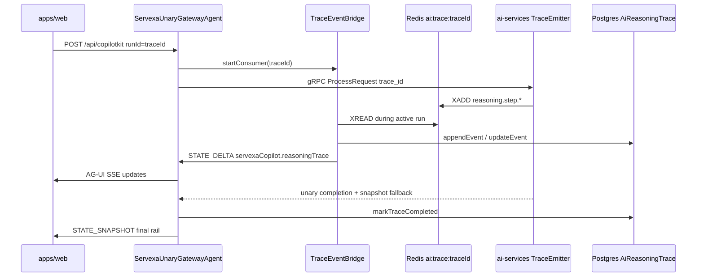

# Phase 5 — Reasoning Trace (Production / Realtime)

## Goal

Deliver an **enterprise operational reasoning timeline** (routing, RAG, tools, HITL, workflow, generation) that updates live during AI runs and persists for audit/debug — **without exposing raw chain-of-thought**.

Success = user sends a copilot question → trace appears immediately → steps update live → trace survives page refresh → failures are visible.

---

## Current State (verified in codebase)

| Layer | What exists | Gap |
|-------|-------------|-----|
| [apps/web](apps/web) | CopilotKit v2 chat, rail metadata via `useServexaCopilotRail`, `WorkflowProgressCard`, HITL cards | No `ReasoningTracePanel`; no `reasoningTrace` in rail state |
| [apps/server](apps/server) | `ServexaUnaryGatewayAgent` → unary gRPC → single `STATE_SNAPSHOT` at end | Blocks until Python returns; no `STATE_DELTA` for trace; no trace module |
| [apps/ai-services](apps/ai-services) | LangGraph coordinator, `routing_trace` / `tool_execution` **logs only** | No `TraceEmitter`, no Redis trace publisher |
| [packages/ai-contracts](packages/ai-contracts) | `CopilotRailMetadata`, HITL, workflow schemas | No `reasoning-trace.ts` |
| [packages/event-contracts](packages/event-contracts) | `aiJobEnvelopeSchema`, HITL event envelopes | No `reasoning.trace.*` stream envelope |
| [packages/proto](packages/proto) | Unary `ProcessRequest` only | No streaming RPC (deferred; Redis bridge preferred) |
| [packages/db](packages/db) | `ai-hitl.prisma`, Redis `xaddStream` on server | No trace tables; server cannot `XREAD` today |

**Primary bottleneck:** [`servexa-unary-gateway.agent.ts`](apps/server/src/modules/copilotkit/servexa-unary-gateway.agent.ts) awaits `completeUnaryPrompt()` then emits one snapshot:

```91:96:apps/server/src/modules/copilotkit/servexa-unary-gateway.agent.ts
          subscriber.next({
            type: "STATE_SNAPSHOT",
            snapshot: {
              servexaCopilot: rail,
            },
          } as BaseEvent);
```

[`copilotRailMetadataSchema`](packages/ai-contracts/src/copilot-response.ts) has no `reasoningTrace` / `latestReasoningEvent` fields yet.

---

## Target Architecture



**Transport choice (per proposal):** Redis Streams bridge `ai:trace:{traceId}` — aligns with existing job-stream pattern in [`ai-job-stream.service.ts`](apps/server/src/modules/v1/ai/services/ai-job-stream.service.ts) and [`ai_job_consumer.py`](apps/ai-services/src/core/db/redis/consumers/ai_job_consumer.py), decouples from HTTP lifecycle, supports replay.

**Runtime policy alignment:** Python remains orchestration authority ([`documents/ai-runtime-policy.md`](documents/ai-runtime-policy.md)); Node normalizes, persists, and fans out to AG-UI only.

---

## Two-Track Strategy

| Track | Purpose | Mechanism |
|-------|---------|-----------|
| **A — Snapshot** | Backward-compatible unary path | `metadataJson.reasoningTrace` → server normalizer → `STATE_SNAPSHOT` |
| **B — Realtime** | Production UX | Redis stream events → bridge → `STATE_DELTA` + persistence |

Track A ships first for UI validation; Track B makes the timeline live.

---

## Staged Rollout (recommended execution order)

### Stage 1 — Contracts + Snapshot UI (fast validation)

1. **Shared schemas** — new [`packages/ai-contracts/src/reasoning-trace.ts`](packages/ai-contracts/src/reasoning-trace.ts):
   - `reasoningTraceStepTypeSchema` (`run`, `routing`, `retrieval`, `rerank`, `tool`, `hitl`, `workflow`, `generation`, `finalization`, `error`)
   - `reasoningTraceStatusSchema` (`pending`, `running`, `completed`, `failed`, `skipped`, `waiting_for_human`)
   - `reasoningTraceEventSchema`, `reasoningTraceSchema`
   - Helpers: `upsertTraceStep`, `applyTraceStreamEvent`, `sanitizeReasoningSummary` (shared sanitizer rules)
   - Export from [`packages/ai-contracts/src/index.ts`](packages/ai-contracts/src/index.ts)

2. **Extend rail metadata** — add to [`copilot-response.ts`](packages/ai-contracts/src/copilot-response.ts):
   - `reasoningTrace?: ReasoningTrace`
   - `latestReasoningEvent?: ReasoningTraceEvent`
   - Update [`normalize-unary.ts`](packages/ai-contracts/src/normalize-unary.ts) to parse snapshot fallback from `metadataJson`

3. **Stream envelope** — new [`packages/event-contracts/src/reasoning-trace-events.ts`](packages/event-contracts/src/reasoning-trace-events.ts):
   - Event names: `reasoning.trace.started`, `reasoning.step.started`, `reasoning.step.delta`, `reasoning.step.completed`, `reasoning.step.failed`, `reasoning.trace.completed`, `reasoning.trace.failed`
   - `reasoningTraceStreamEventSchema` with `traceId`, `runId`, `threadId`, optional `step` / `trace`
   - Re-export from [`packages/event-contracts/src/index.ts`](packages/event-contracts/src/index.ts)

4. **Frontend UI (mock → snapshot)** — under [`apps/web/src/features/ai-copilot/components/`](apps/web/src/features/ai-copilot/components/):
   - `reasoning-trace-panel.tsx`, `reasoning-trace-timeline.tsx`, `reasoning-trace-step-card.tsx`, `reasoning-trace-status-badge.tsx`, `reasoning-trace-step-icon.tsx`
   - Mount in [`servexa-copilot-side-panels.tsx`](apps/web/src/features/ai-copilot/components/servexa-copilot-side-panels.tsx) **below** `WorkflowProgressCard` (proposal order: HITL → workflow → **trace** → suggested actions → evidence)
   - Extend [`use-servexa-copilot-rail-metadata.ts`](apps/web/src/features/ai-copilot/hooks/use-servexa-copilot-rail-metadata.ts) with reducer:
     - `TRACE_STARTED`, `STEP_UPSERT`, `TRACE_COMPLETED`, `TRACE_FAILED`
     - Handle out-of-order updates; reset on `onRunStartedEvent`

### Stage 2 — Persistence + Snapshot from Python

5. **Prisma models** — new [`packages/db/prisma/schema/models/ai-reasoning-trace.prisma`](packages/db/prisma/schema/models/ai-reasoning-trace.prisma):
   - Use `@default(uuid(7))` and `@map` naming to match [`ai-hitl.prisma`](packages/db/prisma/schema/models/ai-hitl.prisma) conventions (not `cuid` from proposal draft)
   - `AiReasoningTrace` + `AiReasoningTraceEvent` with indexes on `traceId`, `runId`, `threadId`, `userId`, `repairCaseId`
   - Run `pnpm db:migrate`

6. **Server module** — [`apps/server/src/modules/v1/ai/reasoning-trace/`](apps/server/src/modules/v1/ai/reasoning-trace/):
   - `reasoning-trace.repository.ts` + `prisma-reasoning-trace.repository.ts`
   - `reasoning-trace.service.ts`: `createTrace`, `appendEvent`, `updateEvent`, `markTraceCompleted`, `markTraceFailed`, `findByTraceId`, `listByRepairCase`
   - `reasoning-trace.controller.ts` + `reasoning-trace.route.ts`
   - REST (auth required):
     - `GET /api/v1/ai/reasoning-traces/:traceId`
     - `GET /api/v1/ai/reasoning-traces?repairCaseId=`
     - `GET /api/v1/ai/reasoning-traces/:traceId/events`
   - Wire route in [`apps/server/src/modules/v1/ai/router/route.ts`](apps/server/src/modules/v1/ai/router/route.ts)

7. **Python snapshot emitter** — [`apps/ai-services/src/modules/v1/agents/trace_emitter.py`](apps/ai-services/src/modules/v1/agents/trace_emitter.py):
   - `TraceEmitter` with `start_step`, `complete_step`, `fail_step`, `snapshot()`
   - `sanitize_reasoning_summary()` — enforce allowed/disallowed content from proposal Step 9
   - Integrate in [`coordinator_service.py`](apps/ai-services/src/modules/v1/agents/services/coordinator_service.py) + [`grpc_bridge_service.py`](apps/ai-services/src/modules/v1/grpc/services/grpc_bridge_service.py):
     - Emit route / generation / finalization steps at minimum
     - Attach `reasoningTrace` to `metadataJson` for Track A

8. **Server normalizer (snapshot path)** — in [`apps/server/src/modules/copilotkit/`](apps/server/src/modules/copilotkit/):
   - `reasoning-trace-normalizer.ts`: validate with ai-contracts, persist, build rail fields
   - Update [`normalize-copilot-unary-completion.ts`](apps/server/src/modules/copilotkit/normalize-copilot-unary-completion.ts) to merge trace into rail
   - On gateway completion: persist snapshot if stream was empty

### Stage 3 — Realtime Redis Bridge + Full Instrumentation

9. **Redis trace publisher (Python)** — extend `TraceEmitter`:
   - `XADD ai:trace:{trace_id}` with validated envelope from event-contracts
   - Emit on coordinator nodes: route, approval_gate, supply_chain, operations, finalize
   - Instrument [`tool_audit.py`](apps/ai-services/src/modules/v1/agents/tools/tool_audit.py) for tool steps
   - RAG module ([`apps/ai-services/src/modules/v1/rag/`](apps/ai-services/src/modules/v1/rag/)): retrieval/rerank steps with safe `safeDetails` (topK, sourceTypes — no embeddings)
   - HITL: connect to existing HITL metadata in [`copilot_metadata.py`](apps/ai-services/src/modules/v1/hitl/copilot_metadata.py) for `waiting_for_human` → completed/rejected transitions

10. **Redis trace consumer (Node)** — extend [`packages/db/src/ioredis/ioredis-service.ts`](packages/db/src/ioredis/ioredis-service.ts):
    - Add `xreadStream` / blocking read helper (mirror Python consumer patterns)
    - New [`reasoning-trace-event-bridge.ts`](apps/server/src/modules/copilotkit/reasoning-trace-event-bridge.ts):
      - Start consumer when Copilot run begins (`traceId = runId`)
      - Stop on `reasoning.trace.completed|failed` or run timeout
      - Persist each event; emit incremental rail via callback

11. **Gateway concurrent run** — refactor [`servexa-unary-gateway.agent.ts`](apps/server/src/modules/copilotkit/servexa-unary-gateway.agent.ts):
    - Start trace bridge **before** `completeUnaryPrompt`
    - Emit `STATE_DELTA` patches to `servexaCopilot.reasoningTrace` / `latestReasoningEvent` as events arrive
    - Keep existing text streaming + final `STATE_SNAPSHOT` for full rail merge
    - On error: emit failed trace step + `RUN_ERROR`

12. **HITL + workflow trace (server side)** — extend [`hitl.service.ts`](apps/server/src/modules/v1/ai/services/hitl.service.ts) / workflow controller to append trace events on approve/reject/execute (server-owned workflow steps)

13. **Web refresh path** — add [`apps/web/src/libs/api/ai/reasoning-trace/api.ts`](apps/web/src/libs/api/ai/reasoning-trace/api.ts):
    - Fetch persisted trace on mount / after reload when `traceId` known
    - Merge with live reducer state (live wins while `isRunning`)

14. **Observability** — structured logs + counters (trace duration, step counts, failures) in server bridge and Python emitter; optional metrics hook in [`metrics_service.py`](apps/ai-services/src/modules/v1/observability/services/metrics_service.py)

15. **Optional (defer if AG-UI sufficient):** `GET /api/v1/ai/reasoning-traces/:traceId/stream` SSE for non-Copilot consumers

---

## Safety Boundary (non-negotiable)

Implement sanitizers in **both** Python and Node:

- **Allow:** route selected, evidence retrieved, tool name + safe result summary, approval state, workflow outcome, recommendation basis
- **Block:** raw CoT, hidden prompts, credentials, unredacted PII, full tool payloads

Add contract tests that reject disallowed `safeDetails` keys and oversize summaries.

---

## Testing Plan

| Area | Tests |
|------|-------|
| **ai-contracts** | Schema validation, step upsert reducer, sanitizer rejects |
| **event-contracts** | Stream envelope round-trip |
| **server** | Normalizer, Prisma repo, bridge mock Redis, gateway STATE_DELTA emission, snapshot fallback |
| **ai-services** | TraceEmitter unit tests, coordinator integration (route/tool/HITL steps), sanitized summaries |
| **web** | Panel empty/running/completed/failed states, out-of-order STEP_UPSERT, collapse/expand |
| **E2E** | `/ai/gemini` question → live timeline → HITL approval updates trace → refresh loads persisted trace |

---

## Key Files Summary

**Create:**
- `packages/ai-contracts/src/reasoning-trace.ts`
- `packages/event-contracts/src/reasoning-trace-events.ts`
- `packages/db/prisma/schema/models/ai-reasoning-trace.prisma`
- `apps/server/src/modules/v1/ai/reasoning-trace/*`
- `apps/server/src/modules/copilotkit/reasoning-trace-normalizer.ts`
- `apps/server/src/modules/copilotkit/reasoning-trace-event-bridge.ts`
- `apps/ai-services/src/modules/v1/agents/trace_emitter.py`
- `apps/web/src/features/ai-copilot/components/reasoning-trace-*.tsx`
- `apps/web/src/libs/api/ai/reasoning-trace/api.ts`

**Modify:**
- `packages/ai-contracts/src/copilot-response.ts`, `normalize-unary.ts`, `index.ts`
- `packages/event-contracts/src/index.ts`
- `packages/db/src/ioredis/ioredis-service.ts`
- `apps/server/src/modules/copilotkit/servexa-unary-gateway.agent.ts`
- `apps/server/src/modules/v1/ai/router/route.ts`
- `apps/ai-services/src/modules/v1/agents/services/coordinator_service.py`
- `apps/ai-services/src/modules/v1/grpc/services/grpc_bridge_service.py`
- `apps/web/src/features/ai-copilot/components/servexa-copilot-side-panels.tsx`
- `apps/web/src/features/ai-copilot/hooks/use-servexa-copilot-rail-metadata.ts`

**Out of scope for Phase 5 (future):**
- gRPC server-streaming RPC changes to [`ai_service.proto`](packages/proto/ai/v1/ai_service.proto)
- Regenerating Python `ResumeGraph` stub (existing HITL tunnel continues to work)
- Legacy `POST /ai` AI SDK path (CopilotKit is primary product surface)

---

## Risks and Mitigations

| Risk | Mitigation |
|------|------------|
| Gateway still blocks answer text until unary returns | Trace timeline can update live via bridge even while answer pending; text deltas remain post-completion initially |
| Redis stream orphaned if run crashes | TTL on stream keys; gateway `finally` marks trace failed; REST fetch shows partial trace |
| Out-of-order step events | Shared `upsertTraceStep` reducer in ai-contracts used by server + web |
| Sanitizer bypass | Dual sanitization (Python emit + Node normalize); contract tests |
