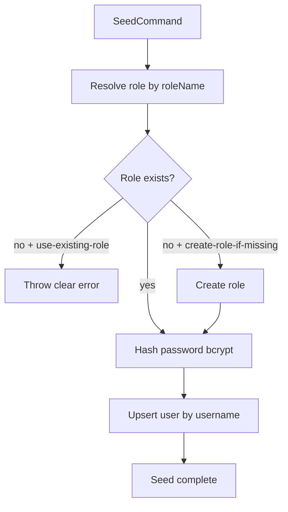

# Seed User Implementation Plan

## Goal
Create a production-safe seed in [`D:/Github/GDGO-2026/GDGO-2026.Servexa-Warranty-AI/servexa-warranty-ai/packages/db/src/seeds/identity/user.ts`](D:/Github/GDGO-2026/GDGO-2026.Servexa-Warranty-AI/servexa-warranty-ai/packages/db/src/seeds/identity/user.ts) that:
- upserts a single admin user by username
- hashes password with bcrypt
- supports role behavior via a flag:
  - use existing role only
  - create role if missing

## Constraints discovered from codebase
- `User` requires `username`, `fullName`, `password`, and `roleId` in [`identity.prisma`](D:/Github/GDGO-2026/GDGO-2026.Servexa-Warranty-AI/servexa-warranty-ai/packages/db/prisma/schema/models/identity.prisma)
- Login uses `username` + `bcrypt.compare`, and user must have at least one email (`companyEmail` or `personalEmail`) in [`auth.service.ts`](D:/Github/GDGO-2026/GDGO-2026.Servexa-Warranty-AI/servexa-warranty-ai/apps/server/src/modules/v1/identity/services/auth.service.ts)
- Existing seeds assume usernames like `admin`, `hcm_admin`, `hanoi_admin` in [`repair-cases.ts`](D:/Github/GDGO-2026/GDGO-2026.Servexa-Warranty-AI/servexa-warranty-ai/packages/db/src/seeds/asc-center/repair-cases.ts)
- Seed orchestration is currently missing because [`seeds/index.ts`](D:/Github/GDGO-2026/GDGO-2026.Servexa-Warranty-AI/servexa-warranty-ai/packages/db/src/seeds/index.ts) is empty

## Implementation Steps
1. **Implement admin seed in** [`packages/db/src/seeds/identity/user.ts`](D:/Github/GDGO-2026/GDGO-2026.Servexa-Warranty-AI/servexa-warranty-ai/packages/db/src/seeds/identity/user.ts)
   - Export `seedIdentityUser(options)`
   - Option shape:
     - `username`, `password`, `fullName`, `email`
     - `roleName` (default `admin`)
     - `roleMode: 'use-existing-role' | 'create-role-if-missing'`
   - Flow:
     - resolve role by `role.name`
     - if missing:
       - in `use-existing-role`: throw clear error
       - in `create-role-if-missing`: create role row
     - hash password (`bcrypt.hash`)
     - upsert user by `username` and set `companyEmail` (or `personalEmail`) so auth works

2. **Add identity seed barrel**
   - Create [`packages/db/src/seeds/identity/index.ts`](D:/Github/GDGO-2026/GDGO-2026.Servexa-Warranty-AI/servexa-warranty-ai/packages/db/src/seeds/identity/index.ts)
   - Re-export `seedIdentityUser`

3. **Wire root seeds entrypoint**
   - Update [`packages/db/src/seeds/index.ts`](D:/Github/GDGO-2026/GDGO-2026.Servexa-Warranty-AI/servexa-warranty-ai/packages/db/src/seeds/index.ts) to:
     - export seed functions (including identity)
     - optionally expose `runSeeds()` for simple local execution order

4. **Add seed run script(s)**
   - Update [`packages/db/package.json`](D:/Github/GDGO-2026/GDGO-2026.Servexa-Warranty-AI/servexa-warranty-ai/packages/db/package.json):
     - add `db:seed:identity-user`
     - add `db:seed` (optional aggregate)
   - Keep scripts simple and deterministic

5. **Add safe defaults for local dev**
   - Use one admin seed target (`username: 'admin'`) to match existing assumptions in repair-case seed logic
   - Ensure idempotent reruns via upsert

6. **Validation checks after implementation**
   - Type/lint check touched files
   - Dry-run expected behavior:
     - role exists + `use-existing-role` => success
     - role missing + `use-existing-role` => explicit failure
     - role missing + `create-role-if-missing` => creates role + user

## Data Flow (planned)

## Files to change
- [`D:/Github/GDGO-2026/GDGO-2026.Servexa-Warranty-AI/servexa-warranty-ai/packages/db/src/seeds/identity/user.ts`](D:/Github/GDGO-2026/GDGO-2026.Servexa-Warranty-AI/servexa-warranty-ai/packages/db/src/seeds/identity/user.ts)
- [`D:/Github/GDGO-2026/GDGO-2026.Servexa-Warranty-AI/servexa-warranty-ai/packages/db/src/seeds/identity/index.ts`](D:/Github/GDGO-2026/GDGO-2026.Servexa-Warranty-AI/servexa-warranty-ai/packages/db/src/seeds/identity/index.ts)
- [`D:/Github/GDGO-2026/GDGO-2026.Servexa-Warranty-AI/servexa-warranty-ai/packages/db/src/seeds/index.ts`](D:/Github/GDGO-2026/GDGO-2026.Servexa-Warranty-AI/servexa-warranty-ai/packages/db/src/seeds/index.ts)
- [`D:/Github/GDGO-2026/GDGO-2026.Servexa-Warranty-AI/servexa-warranty-ai/packages/db/package.json`](D:/Github/GDGO-2026/GDGO-2026.Servexa-Warranty-AI/servexa-warranty-ai/packages/db/package.json)