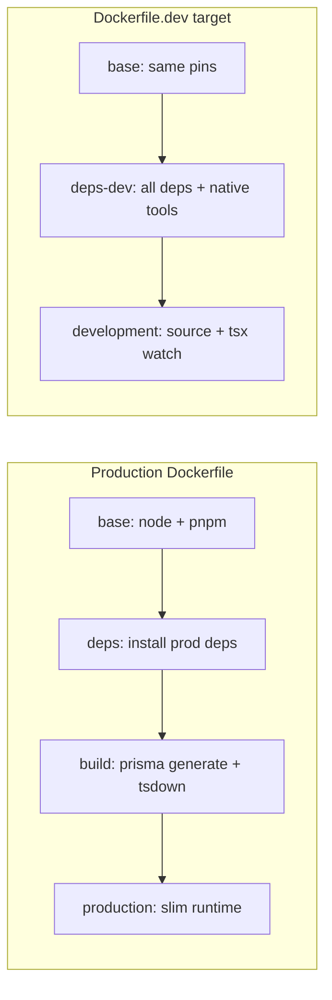

# Server Dockerfile Dev + Production Optimization Plan

## Current state

| File | Status |
|------|--------|
| [apps/server/Dockerfile](apps/server/Dockerfile) | Modern, OWASP-aligned: pinned digest, BuildKit cache mounts, pnpm hoisted monorepo install, multi-stage build, `dumb-init`, non-root, exec-form `CMD` |
| [apps/server/Dockerfile.dev](apps/server/Dockerfile.dev) | **Stale**: yarn + alpine, single-app layout, wrong paths (`yarn.lock`, `prisma/`), references missing `startup.sh` in build context, `/health` endpoint that does not exist |
| [.docker/server/docker-compose.dev.yml](.docker/server/docker-compose.dev.yml) | Postgres/Redis/pgAdmin only — **no server service**; broken init SQL path (`init-simple.sql` does not exist) |
| [.docker/server/startup.sh](.docker/server/startup.sh) | Runs `pnpm db:deploy` + `pnpm dev` (root turbo dev, not server-only) |

Production runtime still resolves workspace TS packages at runtime (`NODE_OPTIONS=--experimental-strip-types`); `dist/*.js` imports `@servexa-warranty-ai/{db,env,proto,ai-contracts,event-contracts}` — copying those packages into the final stage is required.



---

## Phase 1 — Extract shared foundation (both Dockerfiles)

Create a **shared ARG block** at the top of both files (keep in sync):

```dockerfile
ARG NODE_IMAGE=node:24.16.0-bookworm-slim
ARG NODE_DIGEST=sha256:242549cd46785b480c832479a730f4f2a20865d61ea2e404fdb2a5c3d3b73ecf
ARG PNPM_VERSION=10.28.1
```

Shared `base` stage (already in prod):

- Corepack + pnpm store at `/pnpm/store`
- `WORKDIR /app`

Shared **manifest COPY list** for Turborepo filter `server...` (from prod [lines 30–39](apps/server/Dockerfile)):

- Root: `package.json`, `pnpm-lock.yaml`, `pnpm-workspace.yaml`
- Packages: `ai-contracts`, `config`, `db`, `env`, `event-contracts`, `proto`
- App: `apps/server/package.json`

Shared **source COPY list** for build/dev:

- `apps/server`, all six workspace packages above

Use `.npmrc` with `node-linker=hoisted` in both images so runtime resolution from `/app/node_modules` matches production.

---

## Phase 2 — Rewrite `Dockerfile.dev` (bind-mount dev workflow)

Build from **repo root**:

```bash
docker build -f apps/server/Dockerfile.dev -t servexa-server:dev .
```

### Target structure

```dockerfile
# syntax=docker/dockerfile:1.7
FROM base AS deps-dev
# apt: python3, build-essential, openssl, ca-certificates (native: bcrypt, sharp, grpc-tools)
# pnpm install --frozen-lockfile --filter server...
#   (NO --ignore-scripts, NO prune — keep devDependencies for tsx/tsdown/vitest)

FROM deps-dev AS development
ENV NODE_ENV=development
ENV NODE_OPTIONS="--experimental-strip-types"
COPY <all source>
RUN pnpm --filter @servexa-warranty-ai/db db:generate
RUN mkdir -p apps/server/uploads apps/server/logs && chown nodejs
USER nodejs
WORKDIR /app
EXPOSE 3000 9229
HEALTHCHECK ... node fetch to /
ENTRYPOINT ["dumb-init", "--"]
CMD ["/app/.docker/server/startup.sh"]
```

Key differences from production:

| Concern | Production | Dev |
|---------|------------|-----|
| Dependencies | prod-only + `pnpm prune --prod` | full install incl. devDeps |
| Build step | `pnpm --filter server build` | skip — `tsx watch src/index.ts` |
| Source in image | compiled `dist/` only | full source (also bind-mounted at runtime) |
| `dumb-init` | yes | yes (signal forwarding for watch process) |
| Debug | no | expose `9229`, document `NODE_OPTIONS='--inspect=0.0.0.0:9229'` in compose |

### Fix [`.docker/server/startup.sh`](.docker/server/startup.sh)

Run from `/app` (repo root inside container):

```sh
#!/bin/sh
set -e
pnpm --filter @servexa-warranty-ai/db db:deploy
exec pnpm --filter server dev
```

Copy script in Dockerfile.dev:

```dockerfile
COPY --chown=nodejs:nodejs .docker/server/startup.sh /app/.docker/server/startup.sh
RUN chmod +x /app/.docker/server/startup.sh
```

---

## Phase 3 — Optimize production `Dockerfile`

### 3a. Layer/cache improvements (low risk)

- Add `turbo.json` to deps COPY layer (optional cache-key stability; not required at runtime).
- Replace direct build with Turborepo orchestration for dependency ordering:

  ```dockerfile
  RUN pnpm turbo run build --filter=server...
  ```

  Aligns with monorepo convention ([turbo.json](turbo.json) `build.dependsOn: ["^build"]`).

- In CI ([`.github/workflows/build-server-image.yml`](.github/workflows/build-server-image.yml)), enable BuildKit + GHA cache:

  ```yaml
  - uses: docker/build-push-action@v6
    with:
      context: .
      file: apps/server/Dockerfile
      cache-from: type=gha
      cache-to: type=gha,mode=max
  ```

### 3b. Security / OWASP hardening (production stage)

Already good: digest pin, multi-stage, non-root, exec CMD, `dumb-init`, `NODE_ENV=production`.

Add to `production` stage:

```dockerfile
ENV NODE_ENV=production
# already present
STOPSIGNAL SIGTERM
```

Optional (match [apps/server/docker-compose.production.yml](apps/server/docker-compose.production.yml) postgres hardening style):

- `init: true` in compose (not Dockerfile)
- Document read-only root + writable volumes for `uploads/`/`logs/` in compose comments

### 3c. Health check alignment (bug fix)

Server exposes **`/`** and **`GET ""`** returning OK ([bootstrap.ts](apps/server/src/core/infra/bootstrap.ts)); there is **no `/health`**.

- Update production `HEALTHCHECK` to hit `/` (already does via fetch).
- Fix [`.github/workflows/deploy-server.yml`](.github/workflows/deploy-server.yml) line 40: `curl -f http://127.0.0.1:3000/` (or add a dedicated `/health` route — prefer fixing deploy + dev healthchecks to match existing `/` unless you want a semantic health path).

### 3d. Compose build-context fix

[apps/server/docker-compose.production.yml](apps/server/docker-compose.production.yml) uses `context: .` (relative to compose file = `apps/server/`), but the Dockerfile expects **repo root**. Fix:

```yaml
build:
  context: ../..
  dockerfile: apps/server/Dockerfile
```

---

## Phase 4 — Wire bind-mount dev Compose

Extend [.docker/server/docker-compose.dev.yml](.docker/server/docker-compose.dev.yml) with a `server` service.

```yaml
services:
  server:
    build:
      context: ../..          # repo root
      dockerfile: apps/server/Dockerfile.dev
      target: development
    env_file:
      - ../../apps/server/.env
    ports:
      - "3000:3000"
      - "9229:9229"
    depends_on:
      postgres:
        condition: service_healthy
      redis:
        condition: service_healthy
    volumes:
      # Hot reload — mount source, not node_modules
      - ../../apps/server/src:/app/apps/server/src
      - ../../packages:/app/packages
      - server_node_modules:/app/node_modules
      - server_uploads:/app/apps/server/uploads
    user: "1001:1001"          # match nodejs UID from Dockerfile
    healthcheck:
      test: ["CMD", "node", "-e", "...fetch http://127.0.0.1:3000/..."]
```

Also fix existing compose issues in the same file:

- Postgres init volume: replace missing `./docker/postgres/init-simple.sql` with `../../packages/db/docker/postgres/init-vector.sql` (matches root [docker-compose.yml](docker-compose.yml)).
- Align Postgres image with root compose (`pgvector/pgvector:0.8.2-pg18-trixie`) or pin digest like production postgres compose.

Add root convenience script in [package.json](package.json):

```json
"dev:server:docker": "docker compose -f .docker/server/docker-compose.dev.yml up --build server"
```

(package-level script in `apps/server/package.json` is also fine; root delegation via `turbo run` only if a package script exists.)

---

## Phase 5 — `.dockerignore` updates

[`.dockerignore`](.dockerignore) already excludes `apps/web`, tests, docs. For dev target:

- **Do not** exclude `.docker/server/startup.sh` (ensure it is in build context).
- Keep excluding `**/dist` for prod builds; dev bind-mounts source so this is fine.
- Consider allowing `apps/server/.env.example` if documented; keep `.env` excluded.

---

## Phase 6 — Verification checklist

1. **Production build** (from repo root):

   ```bash
   docker build -f apps/server/Dockerfile -t servexa-server:test .
   docker run --rm -p 3000:3000 --env-file apps/server/.env servexa-server:test
   curl -f http://127.0.0.1:3000/
   ```

2. **Dev stack**:

   ```bash
   docker compose -f .docker/server/docker-compose.dev.yml up --build
   # Edit apps/server/src → confirm tsx watch restarts
   ```

3. **Native modules**: confirm `bcrypt`, `sharp`, `grpc-tools` load inside both images (install logs + server boot).

4. **Prisma**: `db:generate` at build; `db:deploy` at dev startup against compose Postgres on `5436`.

5. **CI**: run existing [server-ci.yml](.github/workflows/server-ci.yml) locally equivalent (`pnpm --filter server build`) after Dockerfile changes.

---

## Files to change

| File | Action |
|------|--------|
| [apps/server/Dockerfile.dev](apps/server/Dockerfile.dev) | Full rewrite aligned with prod |
| [apps/server/Dockerfile](apps/server/Dockerfile) | Turbo build, health/deploy alignment, minor hardening |
| [.docker/server/startup.sh](.docker/server/startup.sh) | Filter-scoped pnpm commands |
| [.docker/server/docker-compose.dev.yml](.docker/server/docker-compose.dev.yml) | Add `server` service + fix postgres init path |
| [apps/server/docker-compose.production.yml](apps/server/docker-compose.production.yml) | Fix build `context` |
| [.github/workflows/build-server-image.yml](.github/workflows/build-server-image.yml) | BuildKit GHA cache (optional but recommended) |
| [.github/workflows/deploy-server.yml](.github/workflows/deploy-server.yml) | Fix health URL `/` |
| [package.json](package.json) or [apps/server/package.json](apps/server/package.json) | `dev:server:docker` convenience script |

---

## Out of scope (optional follow-ups)

- Switch production base to `node:lts-alpine` (smaller but riskier for `sharp`/`bcrypt` native builds; current `bookworm-slim` is the safer choice).
- Add `/health` route in Express instead of fixing callers to use `/`.
- `pnpm deploy --filter=server` artifact layout to shrink production copy set (requires validating Prisma engine paths post-bundle).
