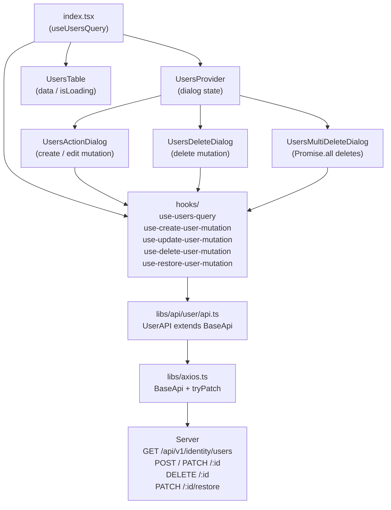

# User Management CRUD Plan

## Architecture



## Files to Modify

### 1. [`libs/axios.ts`](servexa-warranty-ai/apps/web/src/libs/axios.ts)
Add `tryPatch` to `BaseApi` (server uses `PATCH` for update and restore; currently only `tryPut` exists):
```typescript
protected async tryPatch<TReturn, TBody = unknown>(
  url: string, data: TBody, config?: RawAxiosRequestConfig
): Promise<TReturn | null> {
  const res = await this.#instance.patch<TReturn>(url, data, config)
  return res?.data ?? null
}
```

### 2. [`libs/api/user/data-transfer-object/index.ts`](servexa-warranty-ai/apps/web/src/libs/api/user/data-transfer-object/index.ts)
Replace auth-copy content with proper user DTOs aligned to `data/schema.ts` and `BaseApiResponse`:
- `RequestCreateUserDto` — `firstName`, `lastName`, `username`, `email`, `phoneNumber`, `role`, `password`
- `RequestUpdateUserDto` — `Partial<Omit<RequestCreateUserDto, 'password'>>` + optional `password`
- `RequestListUsersDto` — from `baseListQuerySchema` (`pageNumber`, `pageSize`, `searchTerm`, `sortBy`, `isDescending`)
- `ResponseUserDto` — matches `User` from `data/schema.ts`
- `ResponseUserListDto` — `{ items: ResponseUserDto[], pagination: BasePagination }`

### 3. [`libs/api/user/validations/index.ts`](servexa-warranty-ai/apps/web/src/libs/api/user/validations/index.ts)
Replace auth-copy content with user CRUD schemas (re-use `formSchema` logic from `users-action-dialog.tsx` as single source of truth).

### 4. [`libs/api/user/api.ts`](servexa-warranty-ai/apps/web/src/libs/api/user/api.ts)
Replace the `AuthAPI` copy with a proper `UserAPI`:
```typescript
class UserAPI extends BaseApi {
  findAll(params: RequestListUsersDto) { return this.tryGet<BaseApiResponse<ResponseUserListDto>>('/v1/identity/users', { params }) }
  findOneById(userId: string) { return this.tryGet<BaseApiResponse<ResponseUserDto>>(`/v1/identity/users/${userId}`) }
  createUser(data: RequestCreateUserDto) { return this.tryPost<BaseApiResponse<ResponseUserDto>, RequestCreateUserDto>('/v1/identity/users', data) }
  updateUser(userId: string, data: RequestUpdateUserDto) { return this.tryPatch<BaseApiResponse<ResponseUserDto>, RequestUpdateUserDto>(`/v1/identity/users/${userId}`, data) }
  deleteUser(userId: string) { return this.tryDelete<BaseApiResponse<boolean>>(`/v1/identity/users/${userId}`) }
  restoreUser(userId: string) { return this.tryPatch<BaseApiResponse<boolean>, object>(`/v1/identity/users/${userId}/restore`, {}) }
}
export const userAPI = new UserAPI()
```

### 5. [`features/.../user-management/api/api.ts`](servexa-warranty-ai/apps/web/src/features/(SYSTEM-ADMINISTRATION)/user-management/api/api.ts)
Replace the broken auth-copy with a re-export of `userAPI` from `@/libs/api/user/api`.
Also clean up the broken `api/validations/` and `api/data-transfer-object/` inside the feature to re-export from `@/libs/api/user/`.

## Files to Create

### 6. `features/.../user-management/hooks/query-keys.ts` *(new)*
Centralised query key factory:
```typescript
export const userQueryKeys = {
  all: ['users'] as const,
  lists: () => [...userQueryKeys.all, 'list'] as const,
  list: (params: RequestListUsersDto) => [...userQueryKeys.lists(), params] as const,
  detail: (id: string) => [...userQueryKeys.all, 'detail', id] as const,
}
```

### 7. `features/.../user-management/hooks/use-users-query.ts` *(new)*
```typescript
export const useUsersQuery = (params: RequestListUsersDto) =>
  useQuery({ queryKey: userQueryKeys.list(params), queryFn: () => userAPI.findAll(params) })
```

### 8. `features/.../user-management/hooks/use-create-user-mutation.ts` *(new)*
`useMutation` → `userAPI.createUser`, `onSuccess` → `queryClient.invalidateQueries(userQueryKeys.lists())` + `toast.success`.

### 9. `features/.../user-management/hooks/use-update-user-mutation.ts` *(new)*
`useMutation` → `userAPI.updateUser(userId, data)`, same cache invalidation.

### 10. `features/.../user-management/hooks/use-delete-user-mutation.ts` *(new)*
`useMutation` → `userAPI.deleteUser(userId)`, same cache invalidation.

### 11. `features/.../user-management/hooks/use-restore-user-mutation.ts` *(new)*
`useMutation` → `userAPI.restoreUser(userId)`, same cache invalidation.

## Files to Wire Up (components)

### 12. [`features/.../user-management/index.tsx`](servexa-warranty-ai/apps/web/src/features/(SYSTEM-ADMINISTRATION)/user-management/index.tsx)
- Remove `import { users } from './data/users'`
- Derive `RequestListUsersDto` params from `route.useSearch()` (pagination + filters)
- Call `useUsersQuery(params)` — pass `data?.data.items ?? []` and `isLoading` to `UsersTable`

### 13. [`components/users-action-dialog.tsx`](servexa-warranty-ai/apps/web/src/features/(SYSTEM-ADMINISTRATION)/user-management/components/users-action-dialog.tsx)
- Replace `showSubmittedData` + `onOpenChange(false)` in `onSubmit` with `useCreateUserMutation` / `useUpdateUserMutation` calls
- `isPending` from the mutation drives button `disabled` state

### 14. [`components/users-delete-dialog.tsx`](servexa-warranty-ai/apps/web/src/features/(SYSTEM-ADMINISTRATION)/user-management/components/users-delete-dialog.tsx)
- Replace `showSubmittedData` with `useDeleteUserMutation` — `onSuccess` closes dialog and fires `toast.success`

### 15. [`components/users-multi-delete-dialog.tsx`](servexa-warranty-ai/apps/web/src/features/(SYSTEM-ADMINISTRATION)/user-management/components/users-multi-delete-dialog.tsx)
- Replace `sleep(2000)` with `Promise.all(selectedIds.map(id => userAPI.deleteUser(id)))` (per `async-parallel` rule), then `queryClient.invalidateQueries` + `table.resetRowSelection()`

## Key Design Decisions

- **Server-side pagination**: `useUsersQuery` passes `pageNumber` / `pageSize` / `searchTerm` from URL search state; `UsersTable` switches to `manualPagination: true` so the server drives total pages.
- **Query cache**: all mutations share `userQueryKeys.lists()` invalidation so the table auto-refreshes.
- **No new `QueryClientProvider` needed** — confirm `@tanstack/react-query` `QueryClientProvider` is already set up in `main.tsx`; if not, wrap the app there first.
- **`async-parallel` rule** applied to bulk delete via `Promise.all`.
- **`rerender-memo` rule**: `UsersTable` already receives `data` and `isLoading` as props — keep it a pure presentational component, no hook calls inside.
