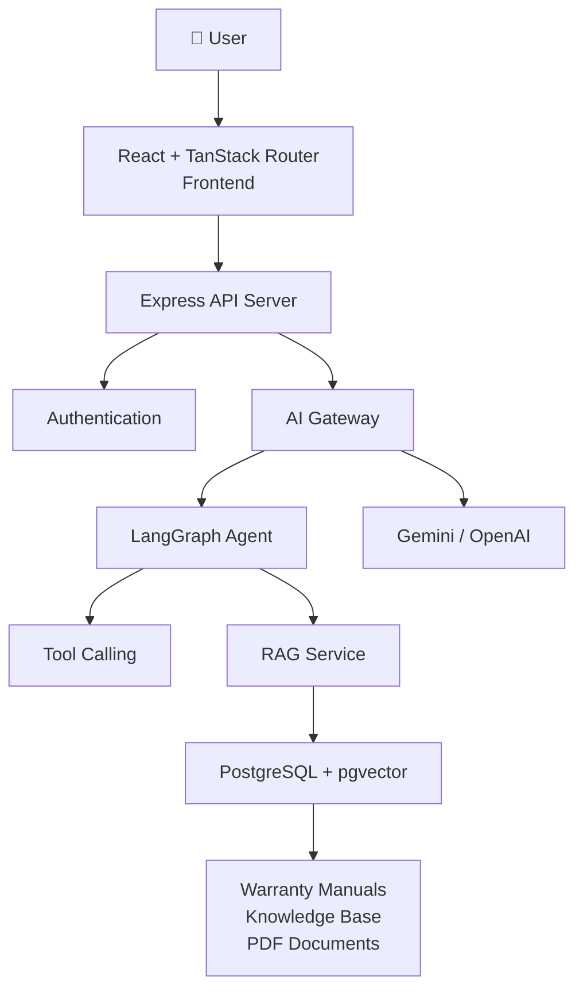

<p align="center">
  
</p>

<h1 align="center">
Servexa Warranty AI
</h1>

<p align="center">
AI-powered Warranty Intelligence Platform built with RAG, LangGraph and Agentic AI.
</p>

<p align="center">


[](https://www.openpolicyagent.org/)
[](https://github.com/quanngynx/servexa-warranty-ai)
[](https://github.com/quanngynx/servexa-warranty-ai)
[](https://github.com/quanngynx/servexa-warranty-ai)
[](https://github.com/quanngynx/servexa-warranty-ai)
[](https://github.com/quanngynx)

</p>

---

# Overview

Servexa Warranty AI is an AI-powered platform that helps customer support teams, and technicians quickly access warranty information, diagnose product issues, and retrieve technical knowledge from internal documentation using Retrieval-Augmented Generation (RAG) and AI Agents.

Instead of relying solely on Large Language Models, Servexa retrieves relevant information from proprietary manuals, warranty policies, and technical documents before generating accurate responses.

---

# The team

<table>
  <tr>
    <th>Member</th>
    <th>Role</th>
    <th>Key Contributions in Servexa Warranty AI</th>
  </tr>
  <tr>
    <td>
      <a href="https://github.com/quanngynx"><b>Nguyen Minh Quan</b></a>
    </td>
    <td>
      <b>Team Lead</b><br/>
      Full-Stack · System Design · System Architecture · DevOps
    </td>
    <td>
      Designed the end-to-end Servexa Warranty AI system architecture and drew all system design / GCP architecture diagrams. Built the AI Gateway, RAG Service, and integrated the multi-layer AI agent pipeline.
    </td>
  </tr>
  <tr>
    <td>
      <a href="https://github.com/teikv"><b>teikv</b></a>
    </td>
    <td>
      Supporting Developer · Pentest Support · Idea Presenter
    </td>
    <td>
      Contributed to frontend and backend development across the banking web portal and mobile app. Assisted in penetration testing campaigns covering OWASP Top 10 vulnerability demonstrations (SQLi, XSS, IDOR, parameter tampering). Presented the Aegis concept, threat model, and defensive philosophy to stakeholders and judges. Helped shape the platform's security narrative and user-facing documentation.
    </td>
  </tr>
</table>

# Problem Statement

Many companies face common challenges in after-sales support:

- Customers cannot easily determine warranty eligibility.
- Customer support repeatedly answers the same questions.
- Technicians spend significant time searching manuals.
- Knowledge is scattered across PDFs and internal documents.
- Traditional chatbots cannot answer organization-specific questions.

---

# Defense that reasons—and proves its work

# How Servexa Warranty AI works

### System Design — Full Platform Overview

Servexa Warranty AI combines:

- AI Agents
- Retrieval-Augmented Generation (RAG)
- Vector Search
- Knowledge Base
- Large Language Models

to provide:

- Warranty lookup
- Product troubleshooting
- Technical knowledge retrieval
- Repair recommendations
- Context-aware AI Assistant

### The decision path

### Contracts between the layers

# GCP Architecture

### Production Architecture

## The platform

# What makes the system different

# Key Features

## Customer

- Warranty lookup
- AI Chat Assistant
- Repair guidance
- Product troubleshooting
- Knowledge search

## Support Team

- AI Copilot
- Context-aware responses
- Document search
- Repair recommendations
- Case summarization

## AI Platform

- RAG Pipeline
- Vector Search
- Multi-Agent orchestration
- LangGraph workflows
- Tool Calling
- Streaming responses

---

# System Architecture



---

# AI Workflow

```text
User Question
      │
      ▼
Express API
      │
      ▼
AI Gateway
      │
      ▼
LangGraph Agent
      │
      ▼
Retrieve Relevant Documents
      │
      ▼
Vector Search (pgvector)
      │
      ▼
Prompt Construction
      │
      ▼
Gemini / OpenAI
      │
      ▼
Answer + Sources
```

---

# Technology Stack

| Layer           | Technology              |
| --------------- | ----------------------- |
| Frontend        | React 19                |
| Routing         | TanStack Router         |
| Backend         | Express                 |
| ORM             | Prisma                  |
| Database        | PostgreSQL              |
| Vector Database | pgvector                |
| AI Framework    | LangGraph               |
| LLM             | Gemini / OpenAI         |
| Cache           | Redis                   |
| Monorepo        | Turborepo               |
| Styling         | TailwindCSS + shadcn/ui |

---

# Project Structure

```
servexa-warranty-ai/
│
├── apps/
│   ├── web/
│   ├── server/
│   └── ai-services/
│
├── packages/
│   ├── ai-contracts/
│   ├── config/
│   ├── db/
│   ├── env/
│   ├── event-contracts/
│   ├── infra/
│   ├── proto/
│   ├── ui/
│   └── shared/
│
├── docs/                    # Canonical engineering handbook
├── documents/               # Preserved legacy/source material
├── postman/
│
└── scripts/
```

---

# Deployment choices

| Mode                     | Best for                                    | Included approach                                                                          |
| ------------------------ | ------------------------------------------- | ------------------------------------------------------------------------------------------ |
| Local Compose            | Demos, development, and purple-team labs    | One-command multi-service environment behind the Nginx gateway.                            |
| Kubernetes local overlay | Cluster validation and platform engineering | Kustomize base plus local patches for the complete control and data plane.                 |
| Helm                     | Configurable packaged deployment            | Aegis platform chart with service, policy, data-store, and secret configuration.           |
| AWS hackathon profile    | Cost-conscious cloud demonstrations         | Serverless-first and single-AZ choices where appropriate.                                  |
| AWS production profile   | Architecture study and hardened adaptation  | Multi-AZ networking, separated tiers, encryption, audit, observability, and edge controls. |

The production Terraform profile is an architectural starting point, not a certification. Organizations must apply their own threat model, data residency rules, banking regulations, identity model, key-management policy, disaster-recovery objectives, and change controls.

# Validation results

Aegis is validated as a security engineering system, not only as a set of services that boot. Public tests cover local behavior and safety contracts; a separate July 2026 source-assisted web/API plus AWS read-only posture review was used to triage hardening work without publishing sensitive evidence in this profile README.

| Validation area                     | What was checked                                                                                                                                                                              | Result and status                                                                                                                                                                                                                                                     |
| ----------------------------------- | --------------------------------------------------------------------------------------------------------------------------------------------------------------------------------------------- | --------------------------------------------------------------------------------------------------------------------------------------------------------------------------------------------------------------------------------------------------------------------- |
| Local 100-case adversarial run      | Authentication, authorization, JWT handling, input validation, XSS probes, HTTP method handling, malformed requests, SSRF-style probes, resilience, and gateway behavior against `localhost`. | Produced a dev-facing hardening backlog: 43 pass, 4 warn, 53 fail. Most failures were controlled by gateway/API routing instability (`502`) rather than confirmed exploit paths, so the recommended next step is to stabilize routing and rerun authenticated checks. |
| SOAR and policy safety              | Policy evaluation, playbook routing, action-worker dry runs, rollback behavior, rate limits, connector boundaries, secret handling, notifications, and audit integrity.                       | Covered by focused unit tests and safety checks in the SOAR engine. These tests support the core claim that response automation must pass policy, scope, execution, and audit gates.                                                                                  |
| SOC dashboard behavior              | Login flow, response center workflows, dashboard workbench interactions, and frontend component behavior.                                                                                     | Covered by React/Vitest-style component tests and Go backend handler tests.                                                                                                                                                                                           |
| Load and ingestion baseline         | Dashboard read load, SOAR ingestion stress, mixed read/write storms, and baseline latency scenarios.                                                                                          | k6 scenarios and result artifacts exist for local performance validation. These are baseline engineering checks, not production capacity claims.                                                                                                                      |
| Source and IaC review               | Banking web/API source, SOC source, deployment config, Terraform profiles, cloud logging/detection posture, IAM/network posture, and AWS K8s/AD discovery across enabled regions.             | 24 findings were triaged into a hardening backlog. The AWS K8s/AD evidence audit recorded 9/9 true positives and 0 false positives for that review set.                                                                                                               |
| Negative evidence from cloud review | EKS/Kubernetes objects, AWS Directory Service, Managed AD, AD Connector, EC2 Windows/domain-controller candidates, public AD ports, and public Kubernetes control-plane ports.                | No live EKS/AD objects or public K8s/AD control-plane exposure were identified in the reviewed AWS regions. Source/IaC review also did not find active EKS or AWS Directory Service definitions.                                                                      |

The combined security review intentionally separates confirmed evidence from assumptions. Items such as secret handling, lab-only vulnerable modes, transport configuration, IAM scoping, detection coverage, and default-network hygiene are treated as hardening backlog unless a retest proves closure.

Known coverage gaps remain: active authenticated browser/DAST testing, two-user authorization boundary tests, container image scanning, Prowler/ScoutSuite-style cloud posture scans, and deeper per-principal IAM analysis should be run before any production adaptation.

# Getting Started

## Prerequisites

| Requirement                                              | Minimum version                      | Purpose                                           |
| -------------------------------------------------------- | ------------------------------------ | ------------------------------------------------- |
| [Git](https://git-scm.com/)                              | 2.30+                                | Clone all repositories                            |
| [WSL 2](https://learn.microsoft.com/windows/wsl/install) | Windows only                         | Linux backend used by Docker Desktop              |
| [Docker Desktop](https://docs.docker.com/get-docker/)    | 24.0+                                | Container runtime + Compose V2 with WSL 2 backend |
| RAM                                                      | **8 GB minimum** (16 GB recommended) | 3-node Kafka cluster + AI agents + databases      |
| Disk                                                     | 10 GB+ free                          | Docker images, volumes, and build cache           |
| [Node.js](https://nodejs.org/)                           | 22.x LTS                             | Typescript + React + Build tools                  |
| [pnpm](https://pnpm.io/)                                 | 9.x                                  | Package manager                                   |
| [PostgreSQL](https://www.postgresql.org/)                | 15+                                  | Primary persistence                               |
| [Redis](https://redis.io/)                               | 7.x                                  | Cache + rate limiting + ephemeral storage         |

---

## Installation

```bash
git clone https://github.com/your-org/servexa-warranty-ai.git

cd servexa-warranty-ai

pnpm install
```

---

# Environment Variables

Create:

```
apps/server/.env
```

Example:

```env
DATABASE_URL=
REDIS_URL=

JWT_SECRET=

GEMINI_API_KEY=

OPENAI_API_KEY=

PORT=3000
```

---

# Database Setup

Generate Prisma Client

```bash
pnpm db:generate
```

Push schema

```bash
pnpm db:push
```

Or run migrations

```bash
pnpm db:migrate
```

---

# Running Locally

Start everything

```bash
pnpm dev
```

Frontend

```
http://localhost:5173
```

Backend

```
http://localhost:3000
```

---

# Available Scripts

| Command          | Description            |
| ---------------- | ---------------------- |
| pnpm dev         | Run all services       |
| pnpm build       | Production build       |
| pnpm check-types | Type checking          |
| pnpm db:generate | Generate Prisma client |
| pnpm db:push     | Push schema            |
| pnpm db:migrate  | Run migrations         |
| pnpm db:studio   | Prisma Studio          |

---

# Deployment

## Development

```bash
cd apps/web

pnpm alchemy dev
```

## Production

```bash
cd apps/web

pnpm deploy
```

## Troubleshooting

| Issue                                 | Solution                                                                         |
| ------------------------------------- | -------------------------------------------------------------------------------- |
| Containers keep restarting            | Run `docker compose logs <service>` to check errors.                             |
| `docker` command not found            | Install Docker Desktop, reopen PowerShell/Terminal, then run `docker --version`. |
| `Cannot connect to the Docker daemon` | Open Docker Desktop and wait until it says **Docker Desktop is running**.        |
| `docker compose` is not recognized    | Update Docker Desktop. Use `docker compose`, not the older `docker-compose`.     |
| WSL shows `VERSION 1`                 | Run `wsl --set-default-version 2`, then restart Docker Desktop.                  |
| Docker Desktop WSL error              | Run `wsl --update`, reboot Windows, then start Docker Desktop again.             |

---

# Validation philosophy

Aegis uses multiple validation layers because passing unit tests alone does not prove that a security control works across service boundaries.

- **Contract tests** validate Layer 1 and Layer 2 JSON schemas and required safety fields.
- **Unit tests** cover policy evaluation, playbook routing, rollback, rate limiting, secret handling, notifications, and audit integrity.
- **Integration tests** exercise Kafka, Redis, PostgreSQL verification, the staging sandbox, and connector behavior.
- **Platform tests** inspect container security, frontend protections, prompt behavior, and SOAR controls.
- **Adversarial suites** probe authentication, authorization, JWT handling, injection, XSS, event forgery, resilience, exposed services, secrets, and gateway behavior while preserving evidence per case.
- **CI security checks** provide repeatable repository-level quality gates; environment-specific results remain separate from this organization profile.

Security findings are not hidden behind a marketing badge. A failed check represents a control or configuration to investigate, while a blocked check means coverage was incomplete—not that the target passed.

# Roadmap

## Phase 1

- Authentication
- Warranty Lookup
- AI Chat
- RAG Search
- Knowledge Base

## Phase 2

- Human-in-the-loop
- Agent Memory
- Suggested Actions
- AI Copilot

## Phase 3

- Multi-Agent
- OCR
- Image Diagnosis
- Voice Assistant
- Multimodal AI

---

# Screenshots

> Coming soon

---

# Start where you work

| If you are a… | Begin with… | You can contribute… |
| ------------- | ----------- | ------------------- |

# Built for safe experimentation

Little Boy's Aegis is a research, education, and security-simulation project—not a certified banking product or a substitute for production security controls. Run offensive scenarios only in systems you own or are explicitly authorized to test. Validate policies, secrets, network boundaries, connectors, and rollback behavior before adapting any component to a real environment.

The project intentionally includes attack simulation and configurable vulnerable behaviors for defensive evaluation. Keep those modes isolated, use synthetic data, rotate every example credential, and never connect a lab control adapter to production infrastructure.

# Contributing

Contributions are welcome.

1. Fork repository
2. Create feature branch
3. Commit changes
4. Open Pull Request

---

# Open source

MIT License

---

<div align="center">

**Little Boy's Aegis — 1st Place, [Shinhan Bank Future Lab's Track](https://futureslab.com.vn) (Financial Services), [AABW 2026](https://aabw.genaifund.ai)**

**Intelligence at machine speed, control at human depth.**

[All repositories](https://github.com/orgs/Little-Boy-s-Aegis/repositories) | [Open source guide](#open-source) | [AABW Event](https://aabw.genaifund.ai) | [GenAI Fund](https://genaifund.ai) | [Shinhan Future's Lab](https://futureslab.com.vn)

</div>
