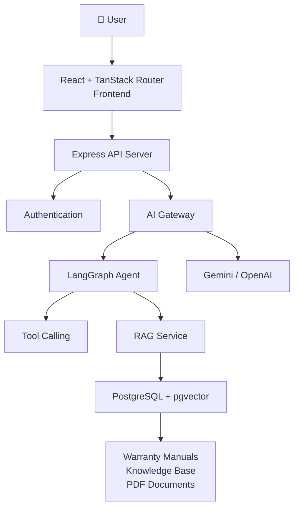

<p align="center">
  
</p>

<h1 align="center">
Servexa Warranty AI
</h1>

<p align="center">
AI-powered Warranty Intelligence Platform built with RAG, LangGraph and Agentic AI.
</p>

<p align="center">


[](https://www.openpolicyagent.org/)
[](https://github.com/quanngynx/servexa-warranty-ai)
[](https://github.com/quanngynx/servexa-warranty-ai)
[](https://github.com/quanngynx/servexa-warranty-ai)
[](https://github.com/quanngynx/servexa-warranty-ai)
[](https://github.com/quanngynx)

</p>

---

# Overview

Servexa Warranty AI is an AI-powered platform that helps customer support teams, and technicians quickly access warranty information, diagnose product issues, and retrieve technical knowledge from internal documentation using Retrieval-Augmented Generation (RAG) and AI Agents.

Instead of relying solely on Large Language Models, Servexa retrieves relevant information from proprietary manuals, warranty policies, and technical documents before generating accurate responses.

---

# Problem Statement

Many companies face common challenges in after-sales support:

- Customers cannot easily determine warranty eligibility.
- Customer support repeatedly answers the same questions.
- Technicians spend significant time searching manuals.
- Knowledge is scattered across PDFs and internal documents.
- Traditional chatbots cannot answer organization-specific questions.

---

# Solution

Servexa Warranty AI combines:

- AI Agents
- Retrieval-Augmented Generation (RAG)
- Vector Search
- Knowledge Base
- Large Language Models

to provide:

- Warranty lookup
- Product troubleshooting
- Technical knowledge retrieval
- Repair recommendations
- Context-aware AI Assistant

---

# Key Features

## Customer

- Warranty lookup
- AI Chat Assistant
- Repair guidance
- Product troubleshooting
- Knowledge search

## Support Team

- AI Copilot
- Context-aware responses
- Document search
- Repair recommendations
- Case summarization

## AI Platform

- RAG Pipeline
- Vector Search
- Multi-Agent orchestration
- LangGraph workflows
- Tool Calling
- Streaming responses

---

# System Architecture



---

# AI Workflow

```text
User Question
      │
      ▼
Express API
      │
      ▼
AI Gateway
      │
      ▼
LangGraph Agent
      │
      ▼
Retrieve Relevant Documents
      │
      ▼
Vector Search (pgvector)
      │
      ▼
Prompt Construction
      │
      ▼
Gemini / OpenAI
      │
      ▼
Answer + Sources
```

---

# Technology Stack

| Layer           | Technology              |
| --------------- | ----------------------- |
| Frontend        | React 19                |
| Routing         | TanStack Router         |
| Backend         | Express                 |
| ORM             | Prisma                  |
| Database        | PostgreSQL              |
| Vector Database | pgvector                |
| AI Framework    | LangGraph               |
| LLM             | Gemini / OpenAI         |
| Cache           | Redis                   |
| Monorepo        | Turborepo               |
| Styling         | TailwindCSS + shadcn/ui |

---

# Project Structure

```
servexa-warranty-ai/
│
├── apps/
│   ├── web/
│   ├── server/
│   └── ai-services/
│
├── packages/
│   ├── ai-contracts/
│   ├── config/
│   ├── db/
│   ├── env/
│   ├── event-contracts/
│   ├── infra/
│   ├── proto/
│   ├── ui/
│   └── shared/
│
├── documents/
├── postman/
│
└── scripts/
```

---

# Getting Started

## Prerequisites

- Node.js 22+
- pnpm
- PostgreSQL
- Redis

---

## Installation

```bash
git clone https://github.com/your-org/servexa-warranty-ai.git

cd servexa-warranty-ai

pnpm install
```

---

# Environment Variables

Create:

```
apps/server/.env
```

Example:

```env
DATABASE_URL=
REDIS_URL=

JWT_SECRET=

GEMINI_API_KEY=

OPENAI_API_KEY=

PORT=3000
```

---

# Database Setup

Generate Prisma Client

```bash
pnpm db:generate
```

Push schema

```bash
pnpm db:push
```

Or run migrations

```bash
pnpm db:migrate
```

---

# Running Locally

Start everything

```bash
pnpm dev
```

Frontend

```
http://localhost:5173
```

Backend

```
http://localhost:3000
```

---

# Available Scripts

| Command          | Description            |
| ---------------- | ---------------------- |
| pnpm dev         | Run all services       |
| pnpm build       | Production build       |
| pnpm check-types | Type checking          |
| pnpm db:generate | Generate Prisma client |
| pnpm db:push     | Push schema            |
| pnpm db:migrate  | Run migrations         |
| pnpm db:studio   | Prisma Studio          |

---

# Deployment

## Development

```bash
cd apps/web

pnpm alchemy dev
```

## Production

```bash
cd apps/web

pnpm deploy
```

---

# Roadmap

## Phase 1

- Authentication
- Warranty Lookup
- AI Chat
- RAG Search
- Knowledge Base

## Phase 2

- Human-in-the-loop
- Agent Memory
- Suggested Actions
- AI Copilot

## Phase 3

- Multi-Agent
- OCR
- Image Diagnosis
- Voice Assistant
- Multimodal AI

---

# Screenshots

> Coming soon

---

# Contributing

Contributions are welcome.

1. Fork repository
2. Create feature branch
3. Commit changes
4. Open Pull Request

---

# License

MIT License

---

# Acknowledgements

Built with:

- Better-T-Stack
- React
- Express
- Prisma
- PostgreSQL
- LangGraph
- Gemini
- OpenAI
- TailwindCSS
- shadcn/ui

# Open source