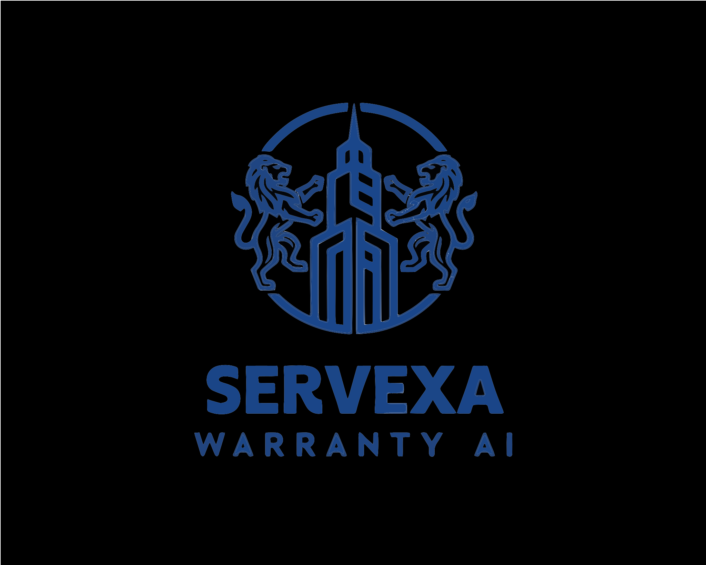
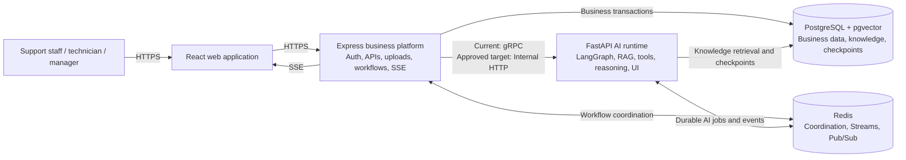

<p align="center">
  
</p>

<h1 align="center">Servexa Warranty AI</h1>

<p align="center">
  Evidence-driven AI decision support for warranty and after-sales operations.
</p>

<p align="center">
  <a href="https://github.com/quanngynx/GDGO-2026.Servexa-Warranty-AI/actions/workflows/server-ci.yml"></a>
  <a href="https://github.com/quanngynx/GDGO-2026.Servexa-Warranty-AI/actions/workflows/ai-services-ci.yml"></a>
  <a href="./LICENSE"></a>
</p>

Servexa Warranty AI is an AI-native warranty operations platform for support teams, technicians, and managers. It combines business data, internal knowledge, retrieval-augmented generation (RAG), and governed AI workflows to help people investigate cases, apply warranty policy, find evidence, and decide the next action.

It is designed as a collaborative copilot, not a generic chatbot or an autonomous replacement for warranty staff. High-risk business actions remain subject to Express authorization and human approval.

## Product Overview

Warranty teams often work across disconnected policies, manuals, customer records, product histories, and repair cases. Servexa brings those sources into one workflow so users can:

- inspect warranty, customer, product, repair, inventory, and knowledge context;
- retrieve relevant internal evidence with PostgreSQL and pgvector;
- use an AI copilot that preserves workflow context;
- receive suggested actions without bypassing business rules;
- review reasoning, evidence, and approval requests before consequential actions;
- follow long-running work through durable events and browser streaming.

The product follows five principles:

1. Answers should be grounded in evidence.
2. AI should operate with the current business context.
3. People retain control of risky decisions.
4. Business state and authorization remain outside the AI runtime.
5. Capabilities evolve through explicit roadmap gates.

See the [Product Vision](./documents/roadmap/PRODUCT_VISION.md) for the complete positioning and objectives.

## Capability Status

The handbook separates an architecture decision from its implementation maturity. `Current Decision` means an approved boundary; it does not mean every part is complete.

| Capability | Architecture horizon | Implementation status |
| --- | --- | --- |
| React, Express, and FastAPI service topology | Current Decision | Implemented |
| LangGraph runtime and human-in-the-loop approval flow | Current Decision | Implemented |
| Redis Streams producers, consumers, retry, and dead-letter foundations | Current Decision | Implemented |
| RAG and PostgreSQL/pgvector retrieval | Current Decision | Partial |
| Express SSE gateway | Current Decision | Partial |
| Redis shared-state projection and patch flow | Current Decision | Partial |
| Evidence, reasoning trace, fixed-schema generative UI, and subgraph streaming | Current Decision | Partial |
| Express-to-FastAPI Internal HTTP boundary | Current Decision | Planned; active gRPC paths are migration debt |
| Multimodal warranty workflows | Planned Evolution | Planned |

Detailed evidence and release gates are maintained in the [System Overview](./documents/architecture/SYSTEM_OVERVIEW.md) and [Development Phases](./documents/roadmap/DEVELOPMENT_PHASES.md).

## System Architecture

Servexa uses explicit responsibility boundaries: React renders authorized projections, Express owns business and security decisions, and FastAPI owns AI reasoning and orchestration.



*Component diagram — current service topology with the approved Express-to-FastAPI transport evolution.*

### Responsibility Boundaries

| Surface | Owns | Must not own |
| --- | --- | --- |
| React | Rendering, user interaction, local projections, SSE consumption | Authorization decisions, business rules, AI orchestration, direct Redis access |
| Express | Authentication, authorization, business APIs, transactions, uploads, workflow actions, SSE delivery | AI planning, RAG reasoning, generated UI decisions |
| FastAPI | LangGraph, context building, retrieval, planning, tool coordination, reasoning, generated UI | Business transaction authority, direct browser communication |
| PostgreSQL/pgvector | Durable business data, knowledge embeddings, AI checkpoints | Ephemeral workflow coordination |
| Redis | Cache, shared-state coordination, Redis Streams, notification fan-out | Authoritative business records |

Architecture details:

- [Technical Architecture Handbook](./documents/architecture/TECHNICAL_MASTER_PLAN.md)
- [AI Runtime](./documents/architecture/AI_RUNTIME.md)
- [Event Architecture](./documents/architecture/EVENT_ARCHITECTURE.md)
- [Shared State](./documents/architecture/SHARED_STATE.md)
- [Deployment Architecture](./documents/platform/DEPLOYMENT_ARCHITECTURE.md)

## Technology Stack

| Area | Current technologies |
| --- | --- |
| Frontend | React 19, TypeScript, Vite, TanStack Router and Query, Tailwind CSS, shadcn/ui |
| Business backend | Node.js, Express 5, Prisma |
| AI runtime | Python 3.11+, FastAPI, LangGraph |
| Persistence | PostgreSQL, pgvector |
| Coordination and events | Redis, Redis Streams, Redis Pub/Sub |
| Browser streaming | Server-Sent Events (SSE) through Express |
| Monorepo | pnpm workspaces, Turborepo |
| Delivery | Docker, Docker Compose, GitHub Actions, GHCR |
| Current web deployment configuration | Alchemy with Cloudflare |
| Approved platform direction | Containerized Cloud Run deployment |

Kubernetes, multi-region deployment, service mesh, distributed event buses, GitOps, and multi-cloud operation remain **Future Evolution**, not current dependencies.

## Repository Structure

```text
servexa-warranty-ai/
├── apps/
│   ├── web/             # React application
│   ├── server/          # Express business platform
│   ├── ai-services/     # FastAPI and LangGraph runtime
│   └── fumadocs/        # Separate documentation application
├── packages/
│   ├── ai-contracts/
│   ├── config/
│   ├── db/
│   ├── env/
│   ├── event-contracts/
│   ├── infra/
│   ├── proto/           # Active gRPC migration debt
│   └── ui/
├── documents/           # Canonical engineering handbook
├── openwiki/            # Generated recurring code documentation
├── postman/             # API collections
└── scripts/
```

## Local Development

### Prerequisites

| Tool | Version or requirement |
| --- | --- |
| Git | Current supported release |
| Node.js | 24 |
| pnpm | 10.28.1 |
| Python | 3.11 or newer |
| Docker | Docker Desktop or Docker Engine with Compose v2 |

PostgreSQL and Redis run through Docker Compose for local development.

### 1. Clone and Install

```bash
git clone https://github.com/quanngynx/GDGO-2026.Servexa-Warranty-AI.git
cd GDGO-2026.Servexa-Warranty-AI
pnpm install
```

Install the Python dependencies separately:

```powershell
cd apps/ai-services
python -m venv .venv
.\.venv\Scripts\Activate.ps1
python -m pip install -r requirements.txt
cd ../..
```

### 2. Configure the Environment

Local environment files are intentionally ignored by Git. The repository does not currently provide a complete shareable root environment template, so obtain development values through the project secret-management process.

| File | Configuration group |
| --- | --- |
| `.env` | Local PostgreSQL and Redis container settings |
| `apps/server/.env` | Database URL, CORS, authentication, Redis, AI transport, and provider settings |
| `apps/web/.env` | `VITE_SERVER_URL` and the client environment |
| `apps/ai-services/.env` | AI provider, Redis, database, gRPC, and internal service settings |

Never commit secrets. See the [server setup](./apps/server/README.md), [AI service setup](./apps/ai-services/README.md), and [development environment handbook](./documents/platform/DEVELOPMENT_ENVIRONMENT.md).

### 3. Start PostgreSQL and Redis

```bash
pnpm dev:docker-compose
```

The local Redis endpoint is `localhost:6381`. The PostgreSQL host port is controlled by `DATABASE_PORT` in the root `.env`.

### 4. Prepare the Database

The Express service owns the authoritative business schema:

```bash
pnpm --filter server db:generate
pnpm --filter server db:migrate
pnpm --filter server db:seed
```

### 5. Start the Applications

Run each command in a separate terminal:

```bash
pnpm dev:server
```

```bash
pnpm dev:web
```

```powershell
cd apps/ai-services
.\.venv\Scripts\Activate.ps1
fastapi dev --port 8081
```

The FastAPI process also starts the `ai.v1.AiService` gRPC server. Redis workers are separate processes; see [AI Services](./apps/ai-services/README.md) when testing asynchronous jobs.

### Local Endpoints

| Service | Default endpoint |
| --- | --- |
| React web application | `http://localhost:3001` |
| Express API | `http://localhost:3000` |
| Express health check | `http://localhost:3000/health` |
| FastAPI | `http://localhost:8081` |
| AI gRPC service | `localhost:50051` |
| Redis | `localhost:6381` |

## Common Commands

| Command | Purpose |
| --- | --- |
| `pnpm dev:web` | Start the React application |
| `pnpm dev:server` | Start the Express service |
| `pnpm dev:docker-compose` | Start local PostgreSQL and Redis |
| `pnpm build` | Build JavaScript and TypeScript workspaces |
| `pnpm check-types` | Run workspace type checks |
| `pnpm --filter web test` | Run frontend tests |
| `pnpm --filter server test` | Run server tests |
| `pnpm --filter server db:generate` | Generate the server Prisma client |
| `pnpm --filter server db:migrate` | Run development database migrations |
| `pnpm --filter server db:seed` | Seed server data |
| `pytest` from `apps/ai-services` | Run AI service tests |

## Delivery Status

| Delivery surface | Status | Repository evidence |
| --- | --- | --- |
| Express type-check, test, build, migration, and smoke-test workflow | Implemented | `.github/workflows/server-ci.yml` |
| FastAPI test workflow | Implemented | `.github/workflows/ai-services-ci.yml` |
| Express container build and GHCR publication | Implemented | `.github/workflows/build-server-image.yml` |
| Express VM deployment after a successful image build | Implemented | `.github/workflows/deploy-server.yml` |
| React deployment configuration with Alchemy and Cloudflare | Implemented configuration | `packages/infra/alchemy.run.ts` |
| Containerized Cloud Run platform | Planned Evolution / Partial | Approved target; production topology is not complete |

Operational procedures and known limitations are maintained in the [Deployment Runbook](./documents/runbooks/deployment.md), [Rollback Runbook](./documents/runbooks/rollback.md), and [Incident Response Runbook](./documents/runbooks/incident-response.md).

## Documentation

Start with the [Engineering Handbook Index](./documents/README.md).

| Need | Document |
| --- | --- |
| Product direction and phase status | [Roadmap Master](./documents/roadmap/ROADMAP_MASTER.md) |
| Architecture decisions and boundaries | [Technical Master Plan](./documents/architecture/TECHNICAL_MASTER_PLAN.md) |
| Delivery and operations direction | [DevOps Master Plan](./documents/platform/DEVOPS_MASTER_PLAN.md) |
| Architecture decision records | [ADRs](./documents/adr/) |
| Operational procedures | [Runbooks](./documents/runbooks/) |
| Canonical terminology | [Glossary](./documents/glossary/GLOSSARY.md) |
| Recurring code-oriented documentation | [OpenWiki Quickstart](./openwiki/quickstart.md) |

`documents/` is the maintained engineering knowledge base. `openwiki/` is generated by its scheduled workflow and should not be hand-edited.

## Roadmap

| Phase | Architecture horizon | Implementation status |
| --- | --- | --- |
| 0 — Foundation | Current Decision | Implemented |
| 1 — Agentic Chat | Current Decision | Implemented |
| 2 — Evidence and Suggested Actions | Current Decision | Partial |
| 3 — Shared State | Current Decision | Partial |
| 4 — Human-in-the-loop | Current Decision | Implemented |
| 5 — Reasoning Trace | Current Decision | Partial |
| 6 — Fixed-schema Generative UI | Current Decision | Partial |
| 7 — Subgraphs Streaming | Current Decision | Partial |
| 8 — Multimodal | Planned Evolution | Planned |

Implementation evidence does not by itself satisfy a roadmap gate. The [Development Phases](./documents/roadmap/DEVELOPMENT_PHASES.md) document is authoritative for prerequisites, exit criteria, and phase completion.

## Contributing, Security, and License

- Read [CONTRIBUTING.md](./CONTRIBUTING.md) before opening a change.
- Report vulnerabilities according to [SECURITY.md](./SECURITY.md).
- See the repository [contributors](https://github.com/quanngynx/GDGO-2026.Servexa-Warranty-AI/graphs/contributors).
- Servexa Warranty AI is available under the [MIT License](./LICENSE).
